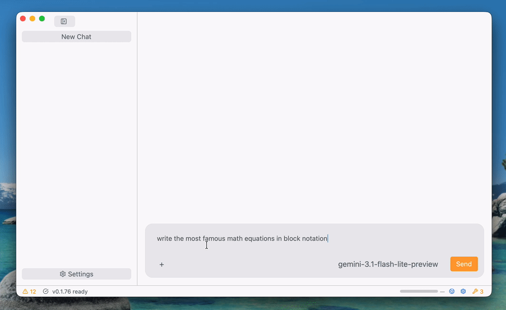
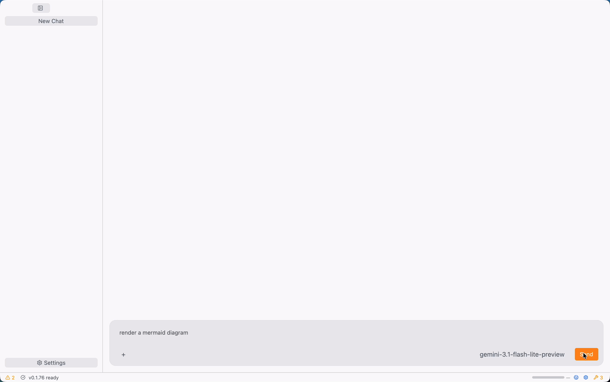
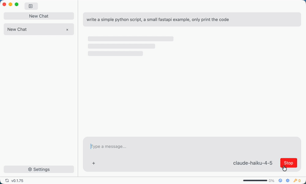
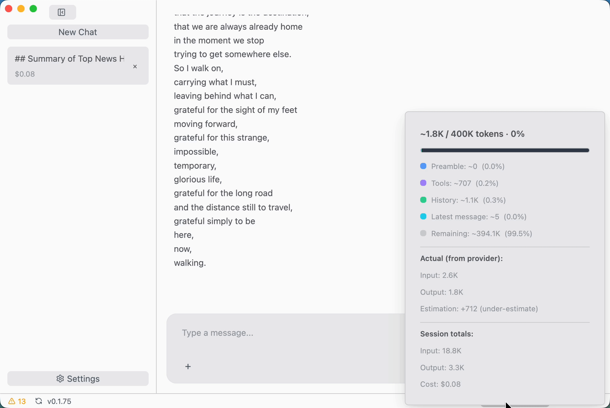
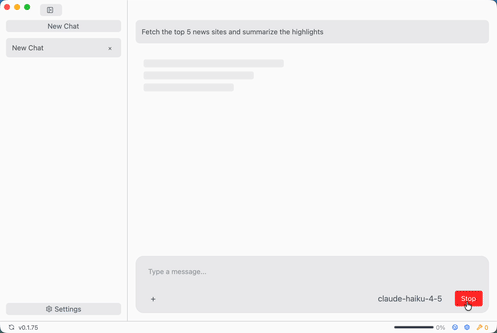
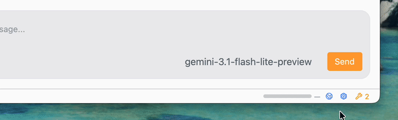

<p align="center">
  
</p>
  
<h1 align="center">Chatty</h1>
 
<p align="center">
  <strong>A desktop AI agent for real work — built with Rust. Run powerful multi-tool agents against your chosen LLM provider, with local storage and optional fully local workflows via Ollama. Also ships <code>chatty-tui</code>, a headless terminal agent for scripting, pipelines, and sub-agent orchestration.</strong>
</p>

<p align="center">
  <a href="#getting-started">Getting Started</a> &bull;
  <a href="#agents">Agents</a> &bull;
  <a href="#tools--mcp">Tools & MCP</a> &bull;
  <a href="#agent-memory--skills">Memory & Skills</a> &bull;
  <a href="#sub-agent-orchestration">Sub-Agents</a> &bull;
  <a href="#security--sandboxing">Security</a> &bull;
  <a href="#features">Features</a> &bull;
  <a href="#chatty-tui--terminal-interface">Terminal Interface</a> &bull;
  <a href="#development">Development</a>
</p>

---

<p align="center"></p>

## Getting Started

### 1. Download

Grab the latest release from [GitHub Releases](https://github.com/boersmamarcel/chatty2/releases):

| Platform | Format |
|:---------|:-------|
| macOS (Intel & Apple Silicon) | `.dmg` installer |
| Linux (x86_64) | `.tar.gz` archive |
| Windows (x86_64) | `.exe` installer |

### 2. Add a Provider

When you first launch Chatty, you'll need to connect at least one LLM provider.

1. Click the **gear icon** in the title bar to open Settings
2. Go to the **Providers** tab
3. Click **Add Provider** and select one (e.g., OpenRouter, Ollama, Azure OpenAI)
4. Paste your API key (not needed for Ollama — it connects to your local instance automatically)

### 3. Add a Model

After adding a provider, you need to tell Chatty which model(s) to use.

1. Still in Settings, go to the **Models** tab
2. Click **Add Model**
3. Pick a provider and enter a model ID (e.g., `gpt-4o`, `claude-sonnet-4-20250514`, `gemini-2.0-flash`)
4. Chatty auto-detects capabilities like vision and PDF support — no extra config needed

<p align="center"></p>

### 4. Start Chatting

Close Settings and type your first message. When you open a new conversation, a start screen displays your active capabilities — skills loaded, MCP servers, agents, file access, web tools, memory, and workspace status — so you can see at a glance what the agent can do before you send anything. You can switch between models using the model selector at the bottom of the chat.

Type `/` in the chat input to open the slash-command picker — use arrow keys to navigate and `Enter` to select. Available commands include `/clear`, `/new`, `/compact`, `/context`, `/copy`, `/cwd`, `/cd`, `/add-dir`, and `/agent`. Skills saved in your workspace (`.claude/skills/`) or global skills directory (`~/Library/Application Support/chatty/skills/` on macOS, `~/.local/share/chatty/skills/` on Linux) also appear in the picker with a `[skill]` badge — selecting one inserts `Use the 'skill-name' skill: ` so you can append context before sending.

Type `@` to open a file picker showing files in the current working directory. Continue typing to filter the list, use arrow keys to navigate, and press `Enter` to insert the file reference inline. Hidden files and common build directories (`.git`, `node_modules`, `target`, etc.) are excluded automatically.

### 5. Enable Agentic Tools

Chatty can give your LLM access to the filesystem, a sandboxed shell, MCP servers, and the ability to spawn sub-agents. This is off by default — enable it in **Settings > Code Execution**.

1. Set a **workspace directory** — the LLM can only access files inside this folder
2. Toggle **code execution** on
3. Choose an approval mode:
   - **Ask every time** — you approve each tool call (recommended to start)
   - **Auto-approve** — tools run without prompting, great for trusted agentic workflows
   - **Deny all** — tools are visible but blocked

You can also set a **per-chat working directory** to override the global workspace for a specific conversation. Click the folder icon in the chat input bar to open an OS directory picker — the selected folder name appears next to the icon. A `×` button lets you reset back to the global default. The override is saved with the conversation and takes effect immediately.

Optionally, enable **Docker Code Execution** to run agent-generated code in isolated Docker containers (Python, JavaScript, TypeScript, Rust, Bash). This requires Docker to be installed and running on your machine. Chatty auto-detects common socket locations (including rootless Docker and Docker Desktop). If your Docker socket is in a non-standard location, set the **Docker Host** field (e.g., `/run/user/1000/docker.sock`) to point Chatty at it directly.

**Fast Python execution (MontySandbox):** Simple Python scripts that use only the standard library are automatically run directly on the host interpreter (~5–50 ms) rather than spinning up a Docker container (200–500 ms cold start). Scripts that import third-party packages, or that fail with a module-not-found error, automatically fall back to Docker — no configuration needed. The fast path enforces a memory cap and runs with a minimal environment; it does not provide the same full isolation as Docker.

See [Tools & MCP](#tools--mcp) below for the full list of agent tools.

---

## Why Chatty?

**Designed for agentic work.** Chatty is built from the ground up for multi-turn agents, not just chat. Your LLM can autonomously chain dozens of tool calls — read files, run shell commands, query databases, browse the web, write and execute code, generate charts and documents, spawn sub-agents for parallel subtasks — and come back with a complete answer. The app runs locally under your control; network access depends on the provider and tools you enable.

**Your keys, your data.** No middleman, no subscriptions. Chatty talks directly to OpenRouter (which routes to Anthropic, OpenAI, Google, Mistral, and hundreds more), Azure OpenAI, your local Ollama instance, and any MCP/A2A services you configure. Conversations and settings are stored locally; prompts, attachments, and tool results may still be sent to the remote providers or services you choose to use.

**Native Rust performance.** Not another Electron wrapper — built on [GPUI](https://crates.io/crates/gpui), the GPU-accelerated framework behind the Zed editor. Instant startup, smooth scrolling, minimal memory footprint.

**One app, every model.** Access hundreds of models through OpenRouter (Claude, GPT-4, Gemini, Mistral, and more), Azure OpenAI, or a local Ollama instance — all from a single window. Switch models mid-conversation, compare answers, use the right model for the job.

**Real tool use, properly sandboxed.** Give your LLM filesystem access, a bash shell, and MCP servers — all within a workspace sandbox. On Linux, shell commands run inside [bubblewrap](https://github.com/containers/bubblewrap) with namespace isolation. On macOS, they use `sandbox-exec` with policy profiles that block access to `.ssh`, `.aws`, and other sensitive directories. You choose the approval mode: ask every time, auto-approve, or deny all.

**Privacy-aware by default.** Chatty does not run its own cloud relay or product telemetry, and conversations are stored in a local SQLite database. If you want a fully local setup, use local models like Ollama and avoid networked tools or services; otherwise, data is sent directly to the providers, websites, MCP servers, and update endpoints you enable.

---

## Agents

Chatty is not just a chat interface — it is an **agentic loop** that lets your LLM reason, act, observe, and iterate until the task is done.

### How the Agent Loop Works

Each time you send a message, Chatty builds a full agent with access to your configured tools and MCP servers, then starts a streaming multi-turn loop:

```
You send a message
       │
       ▼
  Agent reasons → decides to call a tool
       │
       ▼
  Tool executes (with your approval if required)
       │
       ▼
  Agent receives result → reasons again
       │
       ▼
  ...repeats up to the configured turn limit (10 by default, adjustable in Settings > Code Execution)...
       │
       ▼
  Agent produces final answer → streamed to you
```

You see every tool call, its inputs and outputs, and the agent's reasoning in real time — as collapsible trace blocks alongside the response.

### What Agents Can Do

With tools enabled, an agent can autonomously:

- **Explore and edit your codebase** — read files, navigate directories, apply diffs, rename and delete files
- **Execute shell commands** — run build systems, test suites, git operations, or arbitrary scripts inside a sandbox
- **Write and run code** — generate Python, JavaScript, TypeScript, Rust, or Bash scripts and execute them in isolated Docker containers
- **Query your data** — run SQL over Parquet, CSV, and JSON files using DuckDB; read and write Excel spreadsheets
- **Browse the web** — search via Tavily or Brave (API key required, configure in Settings > Search); falls back to DuckDuckGo lite automatically when no API key is configured; fetch and parse any URL
- **Generate and display outputs** — create charts (bar, line, pie, donut, area, candlestick), compile Typst documents to PDF, render diagrams, and display images inline in chat
- **Manage its own tools** — list available tools and configured MCP servers, discover new capabilities at runtime
- **Remember and learn** — store facts and reusable procedures across conversations via the built-in memory system
- **Delegate to sub-agents** — spawn independent headless agents with their own tool access to parallelize work

### Agentic Slash Commands

Type `/` in the chat input to access agentic commands:

| Command | What it does |
|:--------|:-------------|
| `/agent <prompt>` | Spawn a headless `chatty-tui` sub-agent with the given prompt |
| `/compact` | Summarize older conversation history to free up context for longer agent runs |
| `/context` | Show current token usage, context window fill, and working directory |
| `/add-dir <path>` | Expand the agent's workspace access to include an additional directory |
| `/cwd` / `/cd <path>` | Show or change the agent's current working directory |
| `/new` / `/clear` | Start a fresh agent conversation |
| `/copy` | Copy the latest agent response to the clipboard |
| `[skill name]` | Invoke a saved skill — the agent loads and follows the procedure |

### Extended Thinking

For models that support chain-of-thought reasoning (e.g., Claude with extended thinking), Chatty renders `<thinking>`, `<think>`, and `<thought>` blocks as collapsible sections alongside the agent's response — so you can inspect how it reasoned without it cluttering the conversation.

### Context Window Management

Long agent runs consume context fast. Chatty gives you full visibility and control:

- **Context window fill bar** — a segmented footer progress bar breaking down context usage by component (preamble, tool definitions, conversation history, latest message), color-coded green/amber/red
- **Token popover** — hover the bar to see estimated token counts per segment plus actual input/output counts returned by the provider
- **`/compact`** — summarize older messages to compress context when the window fills up, letting the agent continue without losing history
- **Per-model context budget** — set **Max Context Window** (tokens) on a model via Settings → Models → Advanced to enable the fill bar

Enable context tracking by setting the **Max Context Window** field on your model in Settings → Models → Advanced.

---

## Tools & MCP

### Built-in Agent Tools

When code execution is enabled in Settings, your LLM agent can use these tools. Most are scoped to your configured workspace directory; internet tools have a separate toggle in Settings > Search.

#### Filesystem & Code

| Tool | What the agent can do | Approval |
|:-----|:----------------------|:--------:|
| `read_file` | Read any text file in the workspace | — |
| `read_binary` | Read binary files as base64 (images, archives) | — |
| `list_directory` | List directory contents with metadata | — |
| `glob_search` | Find files using patterns like `**/*.rs` or `src/**/*.test.js` | — |
| `write_file` | Create or overwrite files | ✓ |
| `apply_diff` | Apply unified diff patches to existing files | ✓ |
| `create_directory` | Create new directories | ✓ |
| `delete_file` | Delete files or directories | ✓ |
| `move_file` | Move or rename files | ✓ |

#### Shell & Code Execution

| Tool | What the agent can do | Approval |
|:-----|:----------------------|:--------:|
| `bash` | Execute shell commands in a sandboxed environment with streaming output | ✓ |
| `execute_code` | Run Python, JavaScript, TypeScript, Rust, or Bash in an isolated Docker container | ✓ |

#### Data & Documents

| Tool | What the agent can do | Approval |
|:-----|:----------------------|:--------:|
| `query_data` | Run SQL queries over Parquet, CSV, and JSON files with DuckDB | — |
| `describe_data` | Inspect schema of Parquet, CSV, or JSON (columns, types, row count, size) | — |
| `read_excel` | Read Excel spreadsheets (.xlsx, .xls, .xlsm, .xlsb, .ods) as JSON | — |
| `write_excel` | Create Excel files with data, formatting, formulas, merged cells, auto-filters | ✓ |
| `edit_excel` | Modify existing Excel files (set cells, add sheets, delete rows, formulas) | ✓ |
| `pdf_to_image` | Convert PDF pages to PNG images and display them inline in chat (up to 20 pages) | — |
| `pdf_info` | Get metadata and structural information about a PDF | — |
| `pdf_extract_text` | Extract text from PDF pages (up to 50 pages) | — |
| `compile_typst` | Compile Typst markup into a PDF — headings, tables, math, code blocks, multi-page | ✓ |

#### Visuals & Output

| Tool | What the agent can do | Approval |
|:-----|:----------------------|:--------:|
| `add_attachment` | Display a generated image or PDF inline in the chat | — |
| `create_chart` | Create bar, line, pie, donut, area, or candlestick charts inline in chat | — |

#### Web & Internet

> These tools are available when **Internet Access** is enabled in Settings > Search.

| Tool | What the agent can do | Approval |
|:-----|:----------------------|:--------:|
| `search_web` | Search the web — configure Tavily or Brave in Settings > Search for best results; falls back to DuckDuckGo lite automatically when no API key is set | — |
| `fetch` | Fetch any URL and return its readable text content | — |
| `browser_use` | Automate real browser tasks using the [browser-use](https://browser-use.com) cloud service — describe what you want in natural language and a cloud browser agent executes it | — |
| `daytona_run` | Execute code in an isolated [Daytona](https://app.daytona.io) cloud sandbox — creates a secure ephemeral environment, runs the code, returns output, and cleans up automatically | ✓ |

> **browser_use** and **daytona_run** require API keys configured in **Settings > Search** (External Services section). Internet Access must also be enabled. Set the API key to activate the tool; use the toggle to disable it without removing the key.

#### Memory & Skills

| Tool | What the agent can do | Approval |
|:-----|:----------------------|:--------:|
| `remember` | Store a fact, insight, or preference in persistent memory | — |
| `search_memory` | Search past memories by natural-language query | — |
| `save_skill` | Save a reusable multi-step procedure under a memorable name | — |
| `read_skill` | Load the full instructions for a saved skill by name | — |

#### Agent Management

| Tool | What the agent can do | Approval |
|:-----|:----------------------|:--------:|
| `list_tools` | List all available tools and their schemas | — |
| `sub_agent` | Spawn a headless `chatty-tui` sub-agent with its own tools and return the result | ✓ |
| `publish_wasm_module` | Publish a WASM module to the Hive registry — provide the `.wasm` file path and a TOML manifest; the tool reads and encodes the binary automatically (available when a Hive MCP server is configured) | ✓ |

### Extensions & MCP Servers

Chatty has a unified **Extensions** page (**Settings > Extensions**) that consolidates MCP servers, A2A agents, and WASM agent modules in one place.

**Browse the Hive Marketplace** — discover and install community extensions directly from within Chatty:

1. Go to **Settings > Extensions**
2. Optionally sign in or register for a Hive account (top of the page)
3. Use the **Browse Marketplace** section to search for extensions and click **Install** — a progress bar shows download progress for WASM modules
4. Installed extensions appear in the **Installed** section where you can enable, disable, or uninstall them

Each installed extension displays a badge showing its type (**Agent**, **MCP**, **A2A**) and execution context:

| Badge | Meaning |
|:------|:--------|
| **• Local** | WASM agent module running on your machine |
| **☁ Cloud** | WASM agent module running on a cloud runner |
| **☁ Cloud Only** | Module available in cloud execution mode only |
| **↗ External** | MCP server or A2A agent connecting to an external URL |
| **Paid** | Module with a non-free pricing model |

**Switching execution mode** — for WASM agent modules that support both local and cloud execution, a **Switch to Local** / **Switch to Cloud** button appears next to the module. Cloud execution runs the module on a Hive runner without requiring a local WASM binary. Modules marked as cloud-only do not have this toggle.

**Built-in external integrations** — Chatty ships a curated catalog of well-known external MCP servers pre-loaded into the **Installed** section. All entries are disabled by default; click **Enable** to connect.

| Integration | What it provides | Auth |
|:------------|:-----------------|:-----|
| **Hugging Face** | Models, datasets, and Spaces via the Hub MCP server | Optional access token for private repos / higher rate limits |
| **Notion** | Search and edit pages, databases, and comments | OAuth — sign in with your Notion workspace |
| **Atlassian** | Search Jira issues and Confluence pages | OAuth — Atlassian Cloud sign-in in the browser |

> **Note:** Notion and Atlassian use Server-Sent Events (SSE). The built-in MCP client speaks streamable HTTP; connecting to those endpoints may require an SSE-capable transport bridge until native SSE support is added.

**Add a custom MCP server manually:**

1. Start your MCP server process separately (Chatty connects to it; it does not launch it)
2. Go to **Settings > Extensions** → **Add Custom Extension**
3. Click **Add MCP Server**
4. Enter the server **URL** and an optional **API key** (sent as `Authorization: Bearer <key>`)

The agent can also list configured MCP servers at runtime via the `list_mcp_services` tool call — API keys are masked so your secrets are never exposed to the agent.

<details>
<summary><strong>Recommended MCP Servers</strong></summary>

Here are MCP servers that pair well with Chatty agents. Since Chatty connects to already-running servers, start each server first and then add its URL via Settings > Extensions → Add Custom Extension.

#### GitHub (`@modelcontextprotocol/server-github`)
Search code, browse issues and PRs, read file contents from repos.
Start: `npx -y @modelcontextprotocol/server-github` (set `GITHUB_TOKEN` in your environment), then add its URL and your token as the API key.

#### Filesystem (`@modelcontextprotocol/server-filesystem`)
Advanced filesystem operations beyond Chatty's built-in tools.
Start: `npx -y @modelcontextprotocol/server-filesystem /path/to/dir`, then add its URL.

#### PostgreSQL (`@modelcontextprotocol/server-postgres`)
Run read-only SQL queries against your PostgreSQL databases.
Start: `npx -y @modelcontextprotocol/server-postgres` (set `POSTGRES_CONNECTION_STRING` in your environment), then add its URL.

#### Brave Search (`@modelcontextprotocol/server-brave-search`)
Give your agent access to web search for current events and documentation.
Start: `npx -y @modelcontextprotocol/server-brave-search` (set `BRAVE_API_KEY`), then add its URL and your Brave API key.

#### Memory (`@modelcontextprotocol/server-memory`)
Persistent key-value memory across conversations.
Start: `npx -y @modelcontextprotocol/server-memory`, then add its URL.

#### Puppeteer (`@modelcontextprotocol/server-puppeteer`)
Browser automation — navigate pages, take screenshots, extract content.
Start: `npx -y @modelcontextprotocol/server-puppeteer`, then add its URL.

#### Fetch (`@modelcontextprotocol/server-fetch`)
Fetch and convert web pages to markdown for the agent to read.
Start: `npx -y @modelcontextprotocol/server-fetch`, then add its URL.

#### Hugging Face (`https://huggingface.co/mcp`)
Hosted MCP server from Hugging Face — search and explore models, datasets, Spaces, papers, documentation, and selected community tools on the [Hugging Face Hub](https://huggingface.co). See the [official docs](https://huggingface.co/docs/hub/agents-mcp).

This is a remote server, so there is nothing to start locally. In Chatty, go to **Settings > Extensions → Add Custom Extension → Add MCP Server** and enter:

- **URL**: `https://huggingface.co/mcp`
- **API key**: a Hugging Face access token (create one at [huggingface.co/settings/tokens](https://huggingface.co/settings/tokens)) — Chatty sends it as `Authorization: Bearer <token>`. A token is recommended for higher rate limits and access to private repos; anonymous access works for public content but is rate-limited.

Once added, enable or disable it independently from any other MCP server using the toggle in the extensions list. **Common failure modes:** invalid/expired token (`401 Unauthorized`), network/firewall blocks to `huggingface.co`, or hitting anonymous rate limits — adding a token resolves the latter.
#### Atlassian (Jira + Confluence) — built in
Search and update Jira issues and Confluence pages via Atlassian's hosted remote MCP server (`https://mcp.atlassian.com/v1/sse`). No local server needs to be started — the entry is preconfigured in **Settings > Extensions** but **disabled by default**.

Enable it to trigger Atlassian's OAuth flow on first connect; you'll be redirected through your Atlassian SSO and the resulting token is cached locally. Access is scoped to whatever Jira and Confluence sites your Atlassian account can reach. Enterprise tenants may need an admin to approve the MCP app — see [Atlassian's remote MCP docs](https://www.atlassian.com/platform/remote-mcp-server) for the supported scopes and admin controls.

> **Tip:** You can write your own MCP servers in any language. See the [MCP specification](https://modelcontextprotocol.io/) for details.

</details>

---

## Agent Memory & Skills

Chatty includes a built-in **persistent memory system** that lets the agent accumulate knowledge across conversations. Memory is stored in a local binary file using [memvid-core](https://crates.io/crates/memvid-core). By default, memories are retrieved via full-text search; enable **Semantic Search** in Settings to add vector similarity search (requires a configured embedding provider).

### How Memory Works

The agent proactively calls `search_memory` when it determines that context from past conversations would help — recalling facts, user preferences, prior decisions, and project-specific conventions as needed.

The agent has two memory tools:

| Tool | What it does |
|:-----|:-------------|
| `remember` | Store a fact, note, or preference with optional title and tags |
| `search_memory` | Retrieve relevant memories via natural-language query |

Memory is stored per-platform:

| Platform | Path |
|:---------|:-----|
| macOS | `~/Library/Application Support/chatty/memory.mv2` |
| Linux | `~/.local/share/chatty/memory.mv2` |
| Windows | `%APPDATA%\chatty\memory.mv2` |

Memory is enabled by default and can be toggled in **Settings > Code Execution**. You can also:
- **Memory Browser** — browse, search, and inspect all stored memories in **Settings > Memory**; expand an entry to see its full content, or delete individual entries with the delete button
- **Purge All Memory** — permanently delete all stored memories
- **Semantic Search** — enable vector similarity search so the agent finds memories by meaning, not just keywords (requires a configured embedding provider)

### Skills — Reusable Agent Procedures

The agent can also save and recall **skills** — named, multi-step procedures for recurring tasks:

- Use `save_skill` to store a procedure under a memorable name (e.g., `"deploy-to-staging"`, `"write-unit-tests"`)
- The agent uses `search_memory` to discover relevant skills, then calls `read_skill` to load the full instructions before executing
- Skills appear directly in the `/` slash-command picker, so you can invoke them by name without typing a full prompt
- Workspace-specific skills can also live in `.claude/skills/` alongside your code

---

## Sub-Agent Orchestration

One of Chatty's most powerful agentic features is the ability to **spawn sub-agents** — independent headless `chatty-tui` instances that run in the background, complete a subtask, and return the result to the parent agent.

### Why Sub-Agents?

- **Parallelism** — delegate independent subtasks to sub-agents that run concurrently
- **Isolation** — each sub-agent has its own conversation context and tool access; mistakes don't pollute the parent conversation
- **Composition** — build pipelines where one agent's output feeds the next
- **Specialization** — direct each sub-agent with a focused prompt and specific toolset

### How to Use Sub-Agents

**From the chat UI**, type `/agent <your prompt>` to launch a headless sub-agent inline.

**Via the `sub_agent` tool**, the LLM can spawn sub-agents programmatically:

```
Agent receives task: "Refactor all modules and write tests for each one"

→ Agent calls sub_agent("Refactor the authentication module and write tests")
→ Agent calls sub_agent("Refactor the billing module and write tests")
→ Agent calls sub_agent("Refactor the notifications module and write tests")
→ Results returned and merged into a final summary
```

Each sub-agent is a full `chatty-tui --headless` process with access to the same configured tools and models. Sub-agents can themselves spawn further sub-agents for deeply nested workflows.

**From the terminal**, use `chatty-tui` directly:

```bash
# Single headless call
chatty-tui --headless -m "Summarize the changes in the last 5 commits"

# Pipe input to the agent
git diff HEAD~3 | chatty-tui --pipe

# Chain agents: first agent lists TODOs, second agent creates GitHub issues for them
chatty-tui --headless -m "List all TODO comments in src/" | \
  chatty-tui --pipe
```

---

## Security & Sandboxing

Agents are powerful — Chatty takes security seriously. Every layer of tool access is sandboxed.

### Workspace Sandboxing

All filesystem and bash tools are scoped to the workspace directory you configure. The agent cannot read or write files outside that boundary.

### Shell Sandboxing

Shell commands run inside OS-level sandboxes:

- **Linux** — [bubblewrap](https://github.com/containers/bubblewrap) with full namespace isolation: separate process, network, and mount namespaces. The agent cannot see your other processes or escape the workspace.
- **macOS** — `sandbox-exec` with policy profiles that block access to `.ssh`, `.aws`, `.gnupg`, and other sensitive directories.

Optional **network isolation** lets you block shell commands from making any network requests at all.

### Docker Isolation

When Docker Code Execution is enabled, agent-generated code runs inside ephemeral Docker containers — fully isolated from the host filesystem and network. **Exception:** simple Python scripts that use only the standard library run via MontySandbox (directly on the host interpreter) for speed. These scripts run with a memory cap and a stripped environment, then fall back to Docker automatically on any import error or unsupported syntax.

### Approval Flows

Every tool that has a side effect (file writes, shell commands, sub-agents) supports a configurable approval flow:

| Mode | Behavior |
|:-----|:---------|
| **Ask every time** | Chatty prompts you before each tool call — you see the exact command before it runs |
| **Auto-approve** | Tools run immediately — ideal for trusted agentic workflows |
| **Deny all** | Tools are listed in the context but blocked from executing |

### Secrets & Key Masking

- **API key masking** — MCP server API keys are never exposed to the agent; the agent can see whether a key is set (`has_api_key: true`) but never the value itself
- **User secrets** — environment variables added in Settings > Secrets are injected into shell sessions but their values are never revealed to the agent or logged in tool output
- **No product telemetry or hosted relay** — network traffic goes only to the providers, MCP/A2A services, websites, package registries, and update endpoints you explicitly configure or invoke

---

## Features

### Multi-Provider Support

Connect to multiple LLM providers from a single interface. Chatty auto-detects per-model capabilities (vision, PDF support, temperature) so the UI always shows the right options.

| Provider | Image Support | PDF Support | Temperature | Notes |
|:---------|:---:|:---:|:---:|:------|
| **OpenRouter** | Per-model | Per-model | Yes | Routes to Anthropic, OpenAI, Google, Mistral, and hundreds more |
| **Azure OpenAI** | Yes | Lossy | Yes | API Key or Entra ID auth |
| **Ollama** | Per-model | Per-model | — | Auto-detected capabilities, fully local |

### Rich Rendering

- **Markdown** with full formatting
- **Syntax-highlighted code blocks** (30+ languages via tree-sitter) with one-click copy
- **LaTeX math** — inline (`$...$`) and block (`$$...$$`) rendered to crisp SVGs via Typst

  

- **Mermaid diagrams** — ` ```mermaid ` code blocks rendered as SVG diagrams inline in chat, with theme-aware dark/light rendering. Copy the source or copy as PNG with a single click. Supports 23 diagram types (flowcharts, sequence diagrams, ER diagrams, Gantt charts, and more) via a pure Rust renderer — no browser required

  

- **Image and PDF** previews inline in chat

### Tool Call Traces

Every agent tool call is rendered as a collapsible trace block showing:

- **Tool name** and input arguments
- **Output** — the raw result returned to the agent
- **Duration** — how long the tool took to execute
- **Status** — success, error, or cancelled

For `apply_diff` tool calls, Chatty renders a **visual diff view** — additions in green, deletions in red, context lines around each change. Long runs of unchanged lines collapse automatically; large diffs show a preview with an expandable "Show N more lines" button.

### Conversations & Cost Tracking

- Persistent conversations saved locally in a SQLite database — Chatty does not sync them to a Chatty-hosted service
- Auto-generated conversation titles
- **Search conversations** — click the search icon in the title bar to open a live-filter dialog; type to narrow results by title and click any entry to jump straight to it
- **Export to Markdown** — click the `…` menu on any sidebar conversation and choose **Download** to save it as a `.md` file via your OS file picker
- **Per-conversation cost tracking** displayed in the sidebar — see running totals at a glance
- **Per-message token usage** — input and output token counts with cost breakdown
- Cost calculations use your model's actual pricing (cost per million input/output tokens)
- **Regeneration tracking** — original assistant responses are captured automatically when regenerated, creating DPO preference pairs for model fine-tuning

### Training Data Export — Build Your Own Agent

Chatty can export your agent conversations as training data, so the best runs become the foundation for the next generation of models.

#### ATIF (Agent Trajectory Interchange Format)

Export conversations in [ATIF](https://harborframework.com/docs/agents/trajectory-format), a structured JSON format designed for agent training pipelines:

- **Messages** — full user and agent steps
- **Tool calls** — function name, arguments, and output for every tool invocation
- **Reasoning** — chain-of-thought thinking blocks
- **Timestamps** — per-message Unix timestamps
- **Token metrics** — per-step and aggregate input/output counts with cost
- **Feedback** — thumbs up/down signals per assistant message
- **Regeneration pairs** — original (rejected) vs. replacement (chosen) responses for DPO fine-tuning

ATIF trajectories feed directly into Harbor Framework workflows and external training pipelines.

#### JSONL (Fine-Tuning APIs)

Export in JSONL format for direct use with fine-tuning APIs:

- **SFT** — conversations in ChatML format compatible with OpenAI, Anthropic, Together AI, and others
- **DPO** — preference pairs from regenerated responses for RLHF training
- **Automatic deduplication** — re-exported conversations replace previous entries
- **Tool call support** — include tool calls and results in ChatML format

SFT data is appended to `sft.jsonl` and DPO pairs to `dpo.jsonl`:

| Platform | Path |
|:---------|:-----|
| macOS | `~/Library/Application Support/chatty/exports/` |
| Linux | `~/.config/chatty/exports/` |
| Windows | `%APPDATA%\chatty\exports\` |

Enable auto-export in **Settings > Training Data**.

### Environment Secrets

Manage environment variables that are automatically injected into every agent shell session. Go to **Settings > Secrets** to add key-value pairs — the agent knows which variable names are available (e.g., `os.environ["API_KEY"]`) but never sees the actual values. Secrets are persisted locally and masked in tool output.

### Themes & UI

20+ themes with light and dark variants: Ayu, Catppuccin, Everforest, Flexoki, Gruvbox, Matrix, Solarized, TokyoNight, and more. Configurable font size.

### Auto-Updates

Background update checks against GitHub releases with one-click install. Downloads are verified with SHA-256 checksums before installation. On macOS, the update replaces the app bundle and relaunches automatically. On Linux, if `chatty-tui` was installed via the desktop app, it is automatically refreshed on the next launch after an update.

<details>
<summary><strong>More Feature Demos</strong></summary>

#### Syntax-Highlighted Code Blocks



#### Token & Cost Tracking



#### File Operations (Read, Write, Delete)


#### Shell Command Execution


#### Web Fetch



#### MCP Server Management


#### Internet Access Settings



</details>

---

## chatty-tui — Terminal Interface

`chatty-tui` is a lightweight terminal agent that shares the same provider and model configuration as the desktop app. It supports three modes:

| Mode | How to run | Description |
|:-----|:-----------|:------------|
| **Interactive** | `chatty-tui` | Full-screen TUI with scrollable chat, model picker, tool picker, and approval prompts |
| **Headless** | `chatty-tui --headless -m "your question"` | Send a single message; response printed to stdout — ideal for scripts and sub-agents |
| **Pipe** | `cat file.rs \| chatty-tui --pipe` | Read from stdin, send as a message, print the response — compose with shell pipelines |

### Zero-Config Quick Start

Connect directly to a running model server — no desktop app setup required:

```bash
# Ollama (auto-discovers models from localhost:11434)
chatty-tui --ollama
chatty-tui --ollama --model llama3.2

# vllm / llama.cpp / LM Studio (any OpenAI-compatible server)
chatty-tui --openai-compat-url http://localhost:8000
chatty-tui --openai-compat-url http://localhost:8000 --model my-model --api-key sk-...
```

### Installing chatty-tui

**From the desktop app** — the easiest option. Open Chatty's menu and choose **Install CLI**. On macOS, the menu is in the system menu bar at the top of the screen. On Linux and Windows, it appears as a dropdown in the app's title bar. This copies the bundled `chatty-tui` binary to `/usr/local/bin` (macOS/Linux) or your user bin directory.

**From releases** — download the same release package as the desktop app; `chatty-tui` is included.

**From source:**

```bash
cargo install --path crates/chatty-tui
```

### Welcome Screen & Status Bar

When you launch `chatty-tui` in interactive mode with an empty conversation, a welcome screen summarizes your current setup: active model and context window size, workspace directory, git branch, enabled tools (shell, fs-read/write, git, docker), internet capabilities (fetch, search, browser-use, daytona, MCP), and runtime features (memory, modules, remote agents). The TUI appears instantly — MCP servers, memory, and embedding services load in the background. While they are initializing, affected badges on the welcome screen show a `⟳` spinner (e.g., `[MCP ⟳]`) and the status bar displays `● loading services…`; both update automatically once services are ready. The status bar at the bottom always shows the app version, current working directory (truncated to fit), and git branch when inside a git workspace. A hint footer below the input bar shows the most useful shortcuts at a glance and updates to show `Ctrl+C stop` while the agent is streaming. A scrollbar appears on the right side of the chat area when content overflows; scrolling up unpins the viewport from the bottom (new content continues to stream in the background), and pressing `End` or scrolling back down re-pins it.

### Interactive Mode Keybindings

| Key | Action |
|:----|:-------|
| `Enter` | Send message |
| `/` | Open slash-command picker (use `↑/↓` to select, `Tab` or `Enter` to apply) |
| `@` | Open file picker — type to filter, `↑/↓` to navigate, `Enter` to insert file reference |
| `--enable tool1,tool2` / `--disable tool1,tool2` | Override tool availability at launch |
| `PageUp` / `PageDown` or `Shift+↑` / `Shift+↓` or mouse wheel | Scroll chat view |
| `End` | Jump to bottom and resume auto-scroll |
| `y` / `n` | Approve / deny a tool execution prompt |
| `Ctrl+C` | Stop streaming response (or quit if idle) |
| `Ctrl+Q` | Quit immediately |

### Slash Commands

| Command | Action |
|:--------|:-------|
| `/model [query]` | Switch model (`/model` opens picker) |
| `/tools [name]` | Toggle tool groups (`/tools` opens picker) |
| `/modules [show\|enable\|disable\|dir <path>\|port <n>]` | Show or update module runtime settings (enable/disable runtime, set module directory, set gateway port) |
| `/add-dir <directory>` | Expand agent workspace access to include a directory |
| `/agent <prompt>` | Launch a headless `chatty-tui` sub-agent with a prompt |
| `/clear`, `/new` | Clear conversation history and start fresh |
| `/compact` | Summarize older messages to reduce context usage for longer agent runs |
| `/context` | Show token/context usage and current working directory |
| `/copy` | Copy the latest agent response to system clipboard |
| `/update` | Trigger CLI auto-update (Linux: refreshes `~/.local/bin/chatty-tui` from the running binary) |
| `/cwd`, `/cd [directory]` | Show or change the agent's working directory |

> **Note:** `chatty-tui` reads providers and models from the same config files as the desktop app (`~/.config/chatty/` or platform equivalent). Run the desktop app once to set up your providers and models, then use `chatty-tui` anywhere — in scripts, CI, or as a sub-agent. Alternatively, use `--ollama` or `--openai-compat-url` to skip configuration entirely and connect directly to a running server.

---

## Development

Built with:
- **[GPUI](https://crates.io/crates/gpui)** — Zed's GPU-accelerated UI framework (desktop app)
- **[Ratatui](https://crates.io/crates/ratatui)** — Terminal UI framework (chatty-tui)
- **[rig-core](https://crates.io/crates/rig-core)** — Multi-provider LLM integration with streaming tool calls
- **[rmcp](https://crates.io/crates/rmcp)** — Model Context Protocol support
- **[memvid-core](https://crates.io/crates/memvid-core)** — Persistent agent memory with hybrid vector + full-text search
- **[Typst](https://crates.io/crates/typst)** — LaTeX math rendering and document compilation
- **[mermaid-rs-renderer](https://crates.io/crates/mermaid-rs-renderer)** — Native Mermaid diagram rendering (pure Rust, no browser)
- **[tree-sitter](https://crates.io/crates/tree-sitter)** — Syntax highlighting (via gpui-component)
- **[DuckDB](https://crates.io/crates/duckdb)** — In-process SQL over Parquet, CSV, and JSON
- **[bubblewrap](https://github.com/containers/bubblewrap)** — Linux sandbox for shell commands
- **Tokio** — Async runtime
- **serde** — Serialization/persistence

### Workspace Structure

Chatty is organized as a Cargo workspace:

```
crates/
├── chatty-core/              # UI-agnostic: models, services, tools, settings, persistence
├── chatty-gpui/              # GPUI desktop frontend
├── chatty-tui/               # Terminal frontend (Ratatui) + headless/pipe agent modes
├── chatty-wasm-runtime/      # Wasmtime-based runtime for executing WASM agent modules
├── chatty-module-registry/   # Module discovery, loading, and lifecycle (hot-reload)
├── chatty-protocol-gateway/  # HTTP gateway exposing WASM modules via OpenAI, MCP, and A2A protocols
└── chatty-module-sdk/        # SDK for building WASM agent modules (standalone, not in workspace)
```

### Building WASM Modules

The repository includes a reference implementation at [`modules/echo-agent/`](modules/echo-agent/) — a minimal module covering every SDK feature in ~130 lines. Use it as a starting point or study it alongside the instructions below.

To scaffold a new module from the included template:

```sh
cargo generate --path templates/module --name my-agent
cd my-agent
cargo build --target wasm32-wasip2 --release
cp target/wasm32-wasip2/release/my_agent.wasm .
```

Once built, place your module in the platform-native modules directory so Chatty can discover and load it:

| Platform | Default modules directory |
|:---------|:--------------------------|
| macOS | `~/Library/Application Support/chatty/modules/` |
| Linux | `~/.local/share/chatty/modules/` |
| Windows | `%APPDATA%\chatty\modules\` |

```
<modules-dir>/
└── my-agent/
    ├── module.toml   # manifest (name, version, capabilities)
    └── my_agent.wasm
```

You can view or change the modules directory and other runtime settings in **Settings > Extensions**. The panel also lets you enable/disable the module runtime and configure the gateway port (default 3000).

`chatty-module-sdk` is a standalone crate (not part of the main workspace) that lets you build custom agent modules compiled to `wasm32-wasip2`. It provides the `ModuleExports` trait, `export_module!` macro, and typed host import wrappers for LLM completion, config lookup, and structured logging.

```toml
# In your module's Cargo.toml — point to the SDK crate
[dependencies]
chatty-module-sdk = { path = "/path/to/chatty/crates/chatty-module-sdk" }
```

```rust
use chatty_module_sdk::*;

#[derive(Default)]
struct MyAgent;

impl ModuleExports for MyAgent {
    fn chat(&self, req: ChatRequest) -> Result<ChatResponse, String> {
        let resp = llm::complete("claude-sonnet-4-20250514", &req.messages, None)?;
        Ok(ChatResponse { content: resp.content, tool_calls: vec![], usage: resp.usage })
    }
    fn invoke_tool(&self, _name: String, _args: String) -> Result<String, String> {
        Err("no tools".into())
    }
    fn list_tools(&self) -> Vec<ToolDefinition> { vec![] }
    fn get_agent_card(&self) -> AgentCard {
        AgentCard { name: "my-agent".into(), display_name: "My Agent".into(),
                    description: "Demo".into(), version: "0.1.0".into(),
                    skills: vec![], tools: vec![] }
    }
}

export_module!(MyAgent);
```

See [docs/architecture-overview.md](docs/architecture-overview.md) for the full module breakdown and data flow.

### Build Commands

```bash
cargo build            # Debug build
cargo build --release  # Release build
cargo test             # Run tests
cargo fmt --check      # Check formatting
cargo clippy -- -D warnings  # Lint
```

### Packaging

```bash
./scripts/package-macos.sh        # macOS (.app + .dmg)
./scripts/package-linux.sh        # Linux (.tar.gz)
./scripts/package-windows.ps1     # Windows (.exe installer, run in PowerShell)
```

### CI/CD & Releasing

PRs to `main` run CI automatically (tests, formatting, clippy, AI code review). Cargo dependencies are cached across runs.

**To release a new version**, add a label to your PR before merging:

| Label | Effect |
|:------|:-------|
| `release:patch` | Bump `0.1.52` → `0.1.53` |
| `release:minor` | Bump `0.1.52` → `0.2.0` |
| `release:major` | Bump `0.1.52` → `1.0.0` |

Merging the PR triggers the full pipeline: version bump → changelog generation → git tag → GitHub Release → cross-platform builds (Linux AppImage, macOS DMG, Windows EXE).

You can also trigger a release manually from **Actions → Prepare Release → Run workflow**.

### Architecture

- **Event-driven** reactive UI with GPUI's global state system
- **Centralized stream lifecycle** via `StreamManager` entity with cancellation tokens and decoupled event-driven UI updates
- **Streaming** LLM responses with interleaved tool calls rendered in real time
- **Optimistic updates** for instant UI feedback with async persistence
- **SQLite** database for conversations; **JSON-based** local storage for settings and configuration
- **LaTeX to SVG** pipeline with theme-aware caching

See [CLAUDE.md](CLAUDE.md) for detailed architecture documentation and coding patterns.

---

## License

MIT
<!-- release-flow-test -->
