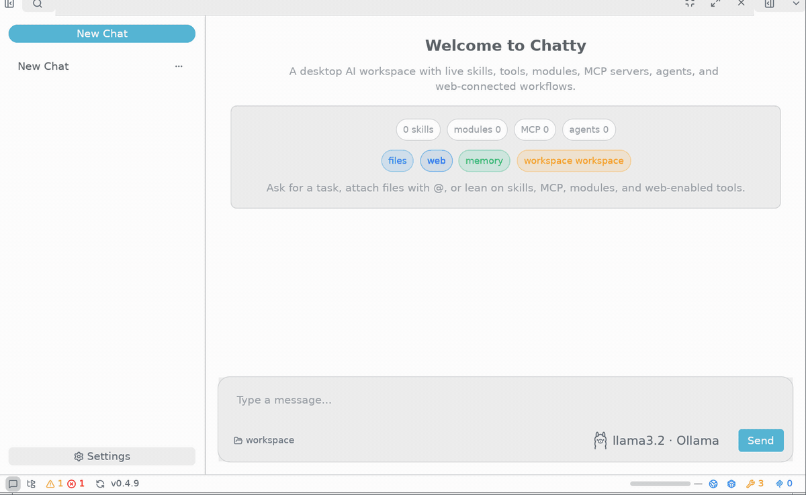
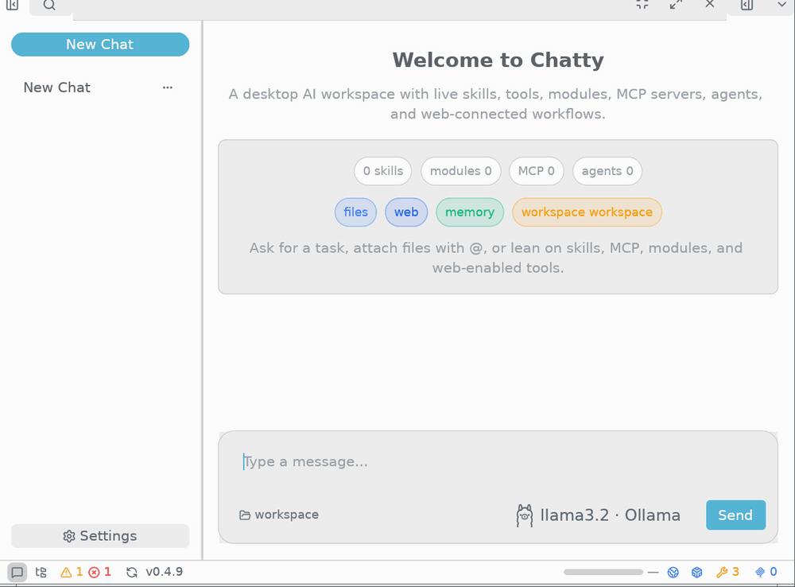
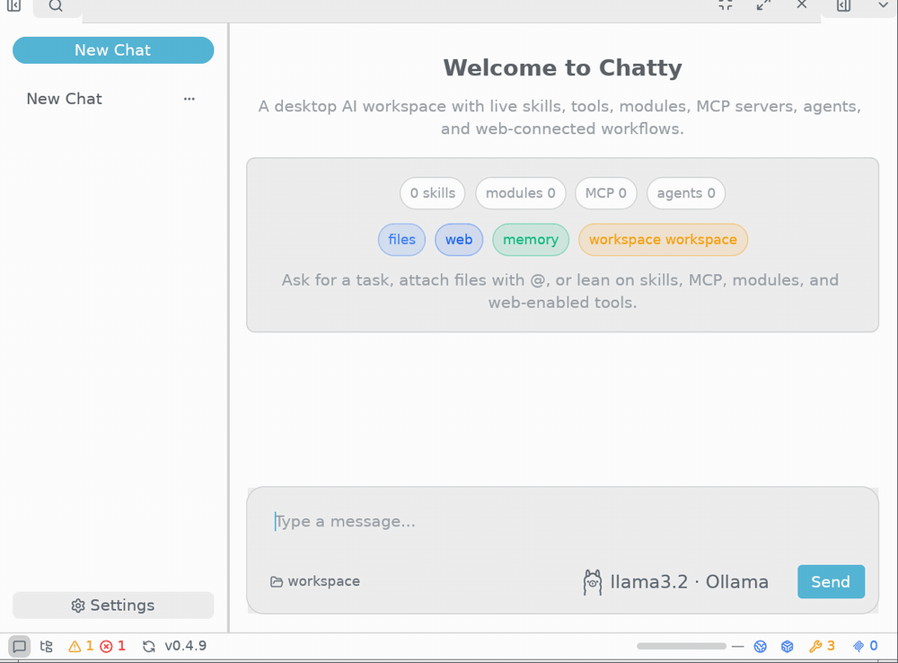

<p align="center">
  
</p>

<h1 align="center">Chatty</h1>

<p align="center">
  <strong>An open-source AI agent for the desktop and the terminal that shows its work. Written in Rust.</strong><br>
  Every command runs in a shell you can watch, every edit is a diff, and results are checked before they're called done.
  It works with any model (OpenRouter, Azure OpenAI, Ollama or any OpenAI-compatible server), with no account and no telemetry.
</p>

<p align="center">
  <a href="https://github.com/boersmamarcel/chatty2/releases/latest"></a>
  <a href="https://github.com/boersmamarcel/chatty2/actions/workflows/ci.yml"></a>
  <a href="LICENSE"></a>
</p>

<p align="center">
  <a href="https://boersmamarcel.github.io/chatty/">Website</a> &bull;
  <a href="https://boersmamarcel.github.io/chatty2/">Docs</a> &bull;
  <a href="https://github.com/boersmamarcel/chatty2/releases">Releases</a> &bull;
  <a href="CONTRIBUTING.md">Contributing</a> &bull;
  <a href="AGENTS.md">Workspace map</a>
</p>

<p align="center"></p>

## Try it

**Desktop app:** download the `.dmg` (macOS), `.AppImage` (Linux) or `.exe` (Windows) from
[Releases](https://github.com/boersmamarcel/chatty2/releases/latest), then add a provider and a model in
Settings ([Getting started](https://boersmamarcel.github.io/chatty2/user/getting-started.html)).

**A team of agents:** [From one agent to a team](https://boersmamarcel.github.io/chatty2/user/tutorial-swarm.html)
asks a lead, an analyst and a reviewer why revenue fell in a sales export. You watch the live
agent tree, approve the file a worker writes, read the bill per model and mix a local model
into the team. Agent teams are supported and experimental.

**Terminal, in one line:** `chatty-tui` needs no config to talk to a model server you already run:

```bash
chatty-tui --ollama                                     # local models via Ollama
chatty-tui --openai-compat-url http://localhost:8000    # vLLM, llama.cpp, LM Studio, …
git diff main | chatty-tui --pipe                       # stdin in, answer on stdout
```

`chatty-tui` ships with the desktop app (**Install CLI…**) or builds with `cargo build --release -p chatty-tui`.
**In your editor:** `chatty-tui acp` speaks the [Agent Client Protocol](https://boersmamarcel.github.io/chatty2/user/terminal.html#use-chatty-as-an-agent-in-zed-or-vs-code), so Zed can use Chatty as its agent.

## What it does

- **Works on your machine.** It uses files, a persistent shell, git, SQL over CSV/Parquet/Excel (DuckDB), web search and fetch, and a real Chrome it drives and you can take over. The shell runs in a sandbox on Linux (bubblewrap) and macOS (sandbox-exec), and approval modes gate every side effect.
- **Lets you watch.** A terminal dock under the chat pins the agent's own shell as a tab you can type into. Edits render as diffs, multi-step work as a live to-do plan, and every reply shows its token cost.
- **Produces files.** It typesets PDFs with Typst, draws charts and query tables, and reads and writes Word, Excel and PowerPoint, all rendered in a panel beside the chat.
- **Checks sub-agents instead of trusting them.** In a git repository, each worker runs in its own worktree. Chatty runs your verification command itself and attaches the result to the worker's answer. Roles (`coordinator`, `coder`, `reviewer`) and `--team` presets are declared in files you commit.
- **Uses what you already have.** It reads `AGENTS.md` / `CLAUDE.md`, `SKILL.md` skills, and MCP servers.
- **Stays local-first.** Conversations are stored in SQLite and memory in a local file. There's no telemetry: traffic goes only to the providers and services you configure, plus GitHub for update checks. It runs fully offline with Ollama.

<table align="center">
  <tr>
    <td></td>
    <td></td>
  </tr>
  <tr>
    <td></td>
    <td></td>
  </tr>
</table>

## How it's built

A Cargo workspace where the desktop app, the terminal app and the editor server all drive one agent core, so they behave the same:

- **`chatty-core`**: the agent: turn loop on [rig](https://crates.io/crates/rig-core), tools, sandbox, memory, settings, persistence.
- **`chatty-gpui`**: the desktop app (`chatty`) on [GPUI](https://crates.io/crates/gpui), the GPU-accelerated UI framework from Zed.
- **`chatty-tui`**: the terminal app on Ratatui: interactive, `--headless`, `--pipe`, and `acp`.
- **`chatty-terminal`**: the PTY and terminal emulation behind the dock and the agent's shell.
- **WASM modules**: agents as `wasm32-wasip2` components (Wasmtime runtime, module SDK, and an OpenAI/MCP/A2A gateway).

Full map: [AGENTS.md](AGENTS.md) · [workspace crates](https://boersmamarcel.github.io/chatty2/dev/crates.html) · [system overview](https://boersmamarcel.github.io/chatty2/dev/architecture/system-overview.html).

## Build from source

```bash
make setup                          # Linux system deps + wasm32-wasip2 target (once)
make build
cargo run -p chatty-gpui            # desktop app
cargo run -p chatty-tui -- --ollama # terminal app against a local model
make test-fast                      # chatty-core unit tests
make ci                             # what CI runs for Rust PRs
```

A full test build needs about 16 GiB of `target/` ([why](docs/build-disk-usage.md)).
Walkthrough: [Build and run in 10 minutes](https://boersmamarcel.github.io/chatty2/dev/start/build-and-run.html).

## Contributing and extending

- **First change:** [add a tool](https://boersmamarcel.github.io/chatty2/dev/start/first-change.html), then [contributing patterns](https://boersmamarcel.github.io/chatty2/dev/contributing-patterns.html). PR flow and docs rules are in [CONTRIBUTING.md](CONTRIBUTING.md).
- **Without touching the core:** plug in an [MCP server](https://boersmamarcel.github.io/chatty2/user/extensions.html), write a [skill](https://boersmamarcel.github.io/chatty2/user/memory-and-skills.html#skills), or [build a WASM agent module](https://boersmamarcel.github.io/chatty2/dev/guides/build-wasm-module.html).
- **Coding agents welcome:** [AGENTS.md](AGENTS.md) is the workspace map for humans and coding agents alike.
- Bugs and ideas: [issues](https://github.com/boersmamarcel/chatty2/issues).

## License

MIT
