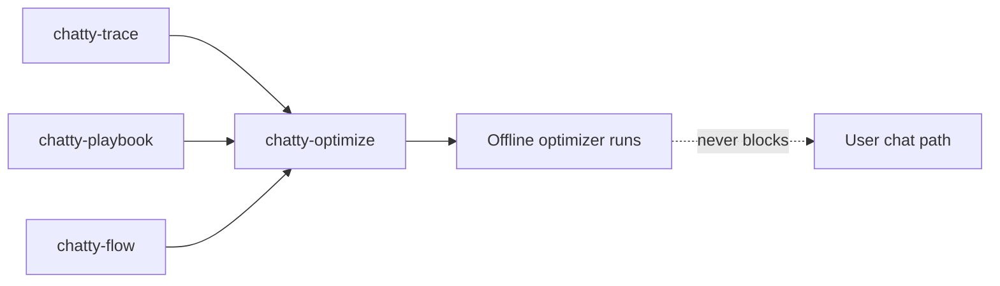

# chatty-optimize

Research crate: GEPA/AFlow optimization drivers, paired statistics, and QA loaders.

## Role in the system

**Test-time / offline only** — optimizer runs must not block the interactive chat path.

## Boundaries

Reserved symbols in [`RESERVED.md`](../../RESERVED.md).

## Related docs

- [cost-model](../../docs/research/cost-model.md)
