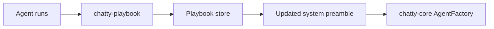

# chatty-playbook

Research crate: ACE-style playbook memory for evolving agent instructions.

## Role in the system

Part of **Self-improving chatty2** — optimizes real preambles inside Chatty, not a
parallel lab.

## Boundaries

Reserved functions listed in [`RESERVED.md`](../../RESERVED.md). Agents scaffold tests
only around `todo!("human: …")` markers.

## Related docs

- [crate-promises-chatty-playbook](../../docs/research/crate-promises-chatty-playbook.md)
