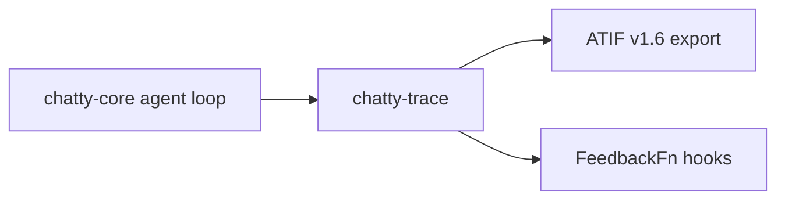

# chatty-trace

Research crate: trace capture, ATIF export, and feedback hooks for the
**Self-improving chatty2** project.

## Role in the system

- Consumes agent run data from the production ReAct loop (via rig hooks / rig-tap)
- Does **not** replace `chatty-core` exporters — extends research workflows

## Boundaries

Some symbols are **reserved for human implementation** — see [`RESERVED.md`](../../RESERVED.md).
Do not implement `todo!("human: …")` markers.

## Related docs

- [crate-promises-chatty-trace](../../docs/research/crate-promises-chatty-trace.md)
- Linear: **Self-improving chatty2**
