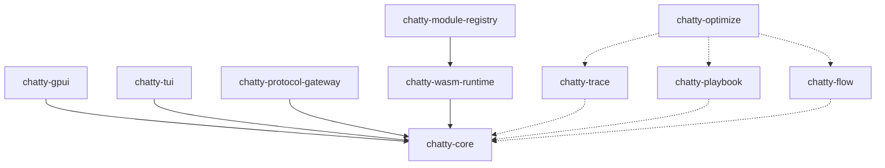

# Workspace crates

**When to read this:** You need a one-glance map of the 13 workspace crates and where to dive deeper.

Each crate has a README synced into this site on `make docs-sync`. Edit the source at `crates/<name>/README.md`, not the built copy under `dev/crates/`.

None of the workspace crates are published to [crates.io](https://crates.io) / [docs.rs](https://docs.rs) today. Research crates set `publish = false`. Until a crate is published, use the README on this site and `cargo doc -p <crate> --open` locally — do not add docs.rs badge URLs (they 404 and fail the link checker).

| Crate | crates.io / docs.rs | Local rustdoc |
|-------|---------------------|---------------|
| Application + WASM + Hive crates | Unpublished | `cargo doc -p <crate> --open` |
| `chatty-trace`, `chatty-playbook`, `chatty-flow`, `chatty-optimize` | `publish = false` | `cargo doc -p <crate> --open` |

When a crate is published, add a docs.rs badge here and on its README, and keep the crate-level `//!` docs complete enough for docs.rs.

## Application crates

| Crate | Purpose | README |
|-------|---------|--------|
| [chatty-core](./crates/chatty-core.md) | UI-agnostic agent core: models, services, tools, settings, sandbox | `crates/chatty-core/` |
| [chatty-gpui](./crates/chatty-gpui.md) | GPUI desktop app — ships the `chatty` binary | `crates/chatty-gpui/` |
| [chatty-tui](./crates/chatty-tui.md) | Ratatui terminal app — interactive, headless, and pipe modes | `crates/chatty-tui/` |

## WASM modules & protocols

| Crate | Purpose | README |
|-------|---------|--------|
| [chatty-wasm-runtime](./crates/chatty-wasm-runtime.md) | Wasmtime embedding and host-side WIT interfaces | `crates/chatty-wasm-runtime/` |
| [chatty-module-registry](./crates/chatty-module-registry.md) | Module discovery, manifest, and lifecycle | `crates/chatty-module-registry/` |
| [chatty-protocol-gateway](./crates/chatty-protocol-gateway.md) | HTTP gateway: OpenAI / MCP / A2A protocol surfaces | `crates/chatty-protocol-gateway/` |
| [chatty-module-sdk](./crates/chatty-module-sdk.md) | SDK for authoring `wasm32-wasip2` agent modules | `crates/chatty-module-sdk/` |

## Research crates (Self-improving chatty2)

Reserved symbols and human-only entry points are listed in [`RESERVED.md`](https://github.com/boersmamarcel/chatty2/blob/main/RESERVED.md). Linear project: [Self-improving chatty2](https://linear.app/agents-research/project/self-improving-chatty2).

| Crate | Purpose | README |
|-------|---------|--------|
| [chatty-trace](./crates/chatty-trace.md) | Trace capture, ATIF export, feedback hooks (M0) | `crates/chatty-trace/` |
| [chatty-playbook](./crates/chatty-playbook.md) | ACE-style playbook memory for evolving instructions (M4) | `crates/chatty-playbook/` |
| [chatty-flow](./crates/chatty-flow.md) | AFlow workflow representation and IR (M2) | `crates/chatty-flow/` |
| [chatty-optimize](./crates/chatty-optimize.md) | GEPA/AFlow optimizers, paired stats, QA loaders (M3) | `crates/chatty-optimize/` |

## Hive integration

| Crate | Purpose | README |
|-------|---------|--------|
| [hive-client](./crates/hive-client.md) | Open-source client for the Hive module registry | `crates/hive-client/` |
| [hive-billing-sdk](./crates/hive-billing-sdk.md) | Publisher SDK for Hive billing in WASM modules (separate `Cargo.lock`) | `crates/hive-billing-sdk/` |

## Dependency direction

`chatty-core` never depends on a UI crate. Research crates integrate with production code but optimizer runs must not block the interactive chat path.

## Related docs

- [Workspace crate split](./architecture/workspace-crate-split.md) — why the split exists
- [Component map](./architecture/component-map.md) — diagrams of how crates connect
- [Research pipeline](./adrs/paper-to-product-pipeline.md) — paper → experiment → product flow
