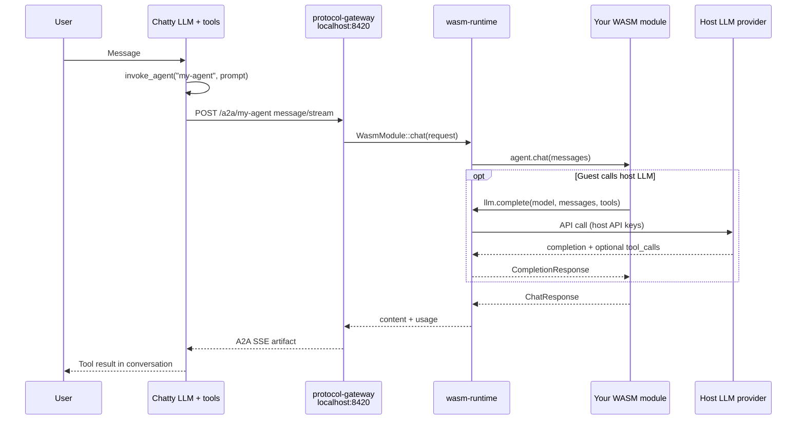
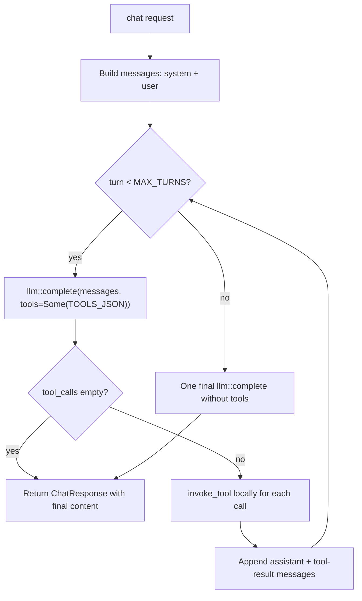

# Build a WASM plugin

**When to read this:** You want to ship a local agent module that Chatty loads
as a WASM plugin and exposes via the protocol gateway (OpenAI / MCP / A2A).

## What you get

A WASM module is a sandboxed guest that implements the [`ModuleExports`](https://github.com/boersmamarcel/chatty2/blob/main/crates/chatty-module-sdk/src/lib.rs)
trait. The host (Chatty) provides three imports only:

| Import | Purpose |
|--------|---------|
| `llm::complete` | Call the host-managed LLM (API keys, routing, rate limits stay on the host) |
| `config::get` | Read per-module key/value config from the manifest / settings |
| `logging::log` | Emit structured logs (shown in host traces and A2A progress streams) |

Everything else — tools, business logic, multi-turn loops — runs **inside your
WASM guest**. See the [WIT reference](../architecture/wit-reference.md) for
the full contract.

## Five-minute quick start

```sh
# One-time: WASM target
rustup target add wasm32-wasip2

# Scaffold from the repo template (from a clone)
cargo generate --path templates/module --name my-agent

# Or from GitHub without cloning
# cargo generate --git https://github.com/boersmamarcel/chatty2 --name my-agent templates/module
cd my-agent

# Build
cargo build --target wasm32-wasip2 --release
cp target/wasm32-wasip2/release/my_agent.wasm .

# Install (Linux example)
mkdir -p ~/.local/share/chatty/modules/my-agent
cp -r . ~/.local/share/chatty/modules/my-agent/
```

In Chatty: **Settings → Modules** → enable modules, set the module directory
if needed, restart or reload. The gateway serves the module on
`http://localhost:8420` (default port).

Reference layout and manifest fields:
[`templates/module/`](https://github.com/boersmamarcel/chatty2/tree/main/templates/module)
and [`docs/a2a-and-wasm-modules.md`](../architecture/a2a-and-wasm-modules.md).

## How Chatty reaches your module

When the main Chatty agent calls `invoke_agent("my-agent", …)`, local modules
use the **same A2A client path** as remote agents — via the protocol gateway:



Design consequence: your module is **not** linked into `chatty-core` directly.
External HTTP clients can also call `localhost:8420` without going through the
desktop UI.

## Calling the host LLM from WASM

Pass an empty model string (`""`) to use the host default, or a model id that
matches a model configured in Chatty settings:

```rust
use chatty_module_sdk::{llm, Message, Role};

let messages = vec![
    Message { role: Role::System, content: "You are helpful.".into() },
    Message { role: Role::User, content: user_prompt.into() },
];

// Simple completion — no tools
let resp = llm::complete("", &messages, None)?;
let text = resp.content;

// With tool definitions (JSON array string) — see benford tutorial
let resp = llm::complete("", &messages, Some(TOOLS_JSON))?;
for tc in resp.tool_calls {
    // Execute tc.name / tc.arguments locally, append results, call complete again
}
```

The host translates tool JSON to provider-specific formats (Anthropic, OpenAI,
Gemini, etc.). Your guest never sees API keys.

### Agentic loop pattern

For modules that drive their own ReAct loop (LLM → local tools → LLM), follow
the benford-agent pattern:



Tutorial walkthrough:
[Tutorial: benford-agent](./tutorial-benford-agent.md).

## Module manifest (`module.toml`)

Minimum fields for conversational agents invocable from Chatty:

```toml
[module]
name = "my-agent"
version = "0.1.0"
description = "What it does"
wasm = "my_agent.wasm"

[capabilities]
tools = ["my_tool"]   # optional tool names
chat = true
agent = true

[protocols]
openai_compat = true
mcp = true
a2a = true            # required for invoke_agent / list_agents

[resources]
max_memory_mb = 64
max_execution_ms = 300000
```

Set `[protocols].a2a = true` so the module appears in `list_agents` and can be
invoked with `invoke_agent`.

## Project structure

```
my-agent/
├── Cargo.toml              # cdylib; standalone [workspace]
├── .cargo/config.toml      # default target = wasm32-wasip2
├── module.toml             # registry manifest
├── src/lib.rs              # impl ModuleExports + export_module!
└── my_agent.wasm           # built artifact (next to module.toml)
```

SDK dependency (path from `modules/`):

```toml
[dependencies]
chatty-module-sdk = { path = "../../crates/chatty-module-sdk" }
```

## Tutorials

| Tutorial | What you learn | Source |
|----------|----------------|--------|
| [echo-agent](./tutorial-echo-agent.md) | SDK basics: chat echo, tools, optional host LLM, logging | [`modules/echo-agent/`](https://github.com/boersmamarcel/chatty2/tree/main/modules/echo-agent) |
| [benford-agent](./tutorial-benford-agent.md) | Full agentic loop: `llm::complete` + local tools | [`modules/benford-agent/`](https://github.com/boersmamarcel/chatty2/tree/main/modules/benford-agent) |

## Test your module

```sh
# From repo root — builds echo-agent WASM if needed
make wasm-modules
cargo test -p chatty-protocol-gateway echo_agent
```

Manual smoke test (gateway must be running via Settings → Modules):

```sh
curl -s http://localhost:8420/a2a/echo-agent \
  -H "Content-Type: application/json" \
  -d '{"jsonrpc":"2.0","id":1,"method":"message/send",
       "params":{"message":{"parts":[{"type":"text","text":"hello"}]}}}'
```

## Further reading

| Topic | Doc |
|-------|-----|
| Gateway routes, invoke_agent flow | [A2A and WASM modules](../architecture/a2a-and-wasm-modules.md) |
| WIT types and versioning | [WIT reference](../architecture/wit-reference.md) |
| Crate stack diagram | [Component map](../architecture/component-map.md) |
| End-user: enabling modules | [Agentic tools — Extensions](../../user/agentic-tools.md) |
| SDK rustdoc | [`chatty-module-sdk`](https://github.com/boersmamarcel/chatty2/tree/main/crates/chatty-module-sdk) |
