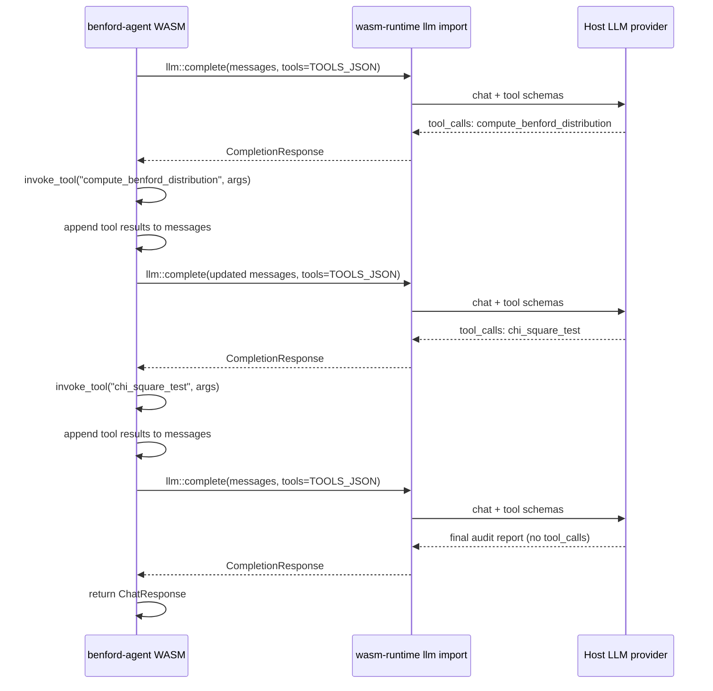

# Tutorial: benford-agent

**When to read this:** You want a WASM plugin that runs its **own agentic loop**
— calling the host LLM, executing local tools, feeding results back, and
returning a final report.

**Full source:**
[`modules/benford-agent/`](https://github.com/boersmamarcel/chatty2/tree/main/modules/benford-agent)
(~650 lines including unit tests). Also see
[`modules/benford-agent/README.md`](https://github.com/boersmamarcel/chatty2/blob/main/modules/benford-agent/README.md)
for curl examples across OpenAI, MCP, and A2A protocols.

## What it demonstrates

Given a list of financial numbers, the agent:

1. Calls `llm::complete` with two tool definitions in JSON
2. Executes `compute_benford_distribution` locally when the LLM requests it
3. Executes `chi_square_test` with the returned counts
4. Appends tool results to the message history and calls the LLM again
5. Returns a professional audit report when the LLM stops requesting tools

The host does **not** orchestrate this loop — it only services individual
`llm::complete` calls. All tool execution stays in WASM.



## Step 1 — Tool schemas for the LLM

Define tools once as a JSON array string. The host passes this to the
configured provider:

```rust
const TOOLS_JSON: &str = r#"[
  {
    "name": "compute_benford_distribution",
    "description": "Compute first-digit frequencies vs Benford's Law …",
    "parameters": {
      "type": "object",
      "properties": {
        "numbers": { "type": "array", "items": { "type": "number" } }
      },
      "required": ["numbers"]
    }
  },
  {
    "name": "chi_square_test",
    "description": "Chi-square goodness-of-fit test …",
    "parameters": { /* … */ }
  }
]"#;
```

[Full `TOOLS_JSON` → `src/lib.rs`](https://github.com/boersmamarcel/chatty2/blob/main/modules/benford-agent/src/lib.rs)

## Step 2 — The agentic loop in `chat`

Core pattern (simplified from the source):

```rust
const MAX_TURNS: usize = 6;

fn chat(&self, req: ChatRequest) -> Result<ChatResponse, String> {
    let mut messages = vec![
        Message { role: Role::System, content: SYSTEM_PROMPT.into() },
        Message { role: Role::User, content: last_user_message(&req) },
    ];

    for _turn in 0..MAX_TURNS {
        let resp = chatty_module_sdk::llm::complete("", &messages, Some(TOOLS_JSON))?;

        if resp.tool_calls.is_empty() {
            return Ok(ChatResponse {
                content: resp.content,
                tool_calls: vec![],
                usage: resp.usage,
            });
        }

        // Record what the LLM requested
        messages.push(/* assistant message summarising tool calls */);

        // Execute each tool locally
        let mut results = Vec::new();
        for tc in &resp.tool_calls {
            let out = self.invoke_tool(tc.name.clone(), tc.arguments.clone())?;
            results.push(format!("[{}] → {}", tc.name, out));
        }

        // Feed results back as a user message
        messages.push(Message {
            role: Role::User,
            content: format!("Tool results:\n{}", results.join("\n\n")),
        });
    }

    // Fallback if max turns exceeded
    let final_resp = chatty_module_sdk::llm::complete("", &messages, None)?;
    Ok(ChatResponse { content: final_resp.content, /* … */ })
}
```

[Full loop with logging and fallbacks → `src/lib.rs`](https://github.com/boersmamarcel/chatty2/blob/main/modules/benford-agent/src/lib.rs#L134-L255)

## Step 3 — Pure-Rust tool implementations

Tools parse JSON args with `serde_json` and return JSON strings. No host
imports beyond logging:

```rust
fn invoke_tool(&self, name: String, args: String) -> Result<String, String> {
    match name.as_str() {
        "compute_benford_distribution" => compute_benford_distribution(&args),
        "chi_square_test" => chi_square_test(&args),
        _ => Err(format!("unknown tool: {name}")),
    }
}
```

Unit tests for the statistical functions run on the **host** target (no WASM
required):

```sh
cd modules/benford-agent
cargo test
```

## Step 4 — Three ways callers reach the same logic

The gateway exposes one WASM module on three protocol surfaces:

| Protocol | Endpoint | Agentic loop? |
|----------|----------|---------------|
| OpenAI-compat | `POST /v1/benford-agent/chat/completions` | Yes — full report in `choices[0].message.content` |
| A2A | `POST /a2a/benford-agent` | Yes — same narrative in `result.message.parts` |
| MCP | `POST /mcp/benford-agent` | No — raw `tools/call` only; caller orchestrates |

From Chatty's main agent (requires `[protocols].a2a = true`):

```text
/agent benford-agent Analyze these invoice amounts: 1234 4521 891 2340 567 8901
```

Or via curl (gateway running):

```sh
curl -X POST http://localhost:8420/a2a/benford-agent \
  -H "Content-Type: application/json" \
  -d '{
    "jsonrpc": "2.0",
    "id": 1,
    "method": "message/send",
    "params": {
      "message": {
        "parts": [{
          "type": "text",
          "text": "Analyze these invoice amounts: 1234 4521 891 2340 567 8901 234 456 789"
        }]
      }
    }
  }'
```

More examples (MCP step-by-step, response shapes):
[benford-agent README — Protocol comparison](https://github.com/boersmamarcel/chatty2/blob/main/modules/benford-agent/README.md#protocol-comparison).

## Build and load

```sh
cd modules/benford-agent
cargo build --target wasm32-wasip2 --release
cp target/wasm32-wasip2/release/benford_agent.wasm .
cp -r . ~/.local/share/chatty/modules/benford-agent/
```

Enable the module in **Settings → Modules**.

## Design notes

- **Reuse `invoke_tool` inside `chat`** — MCP callers and the agentic loop share
  the same tool implementations.
- **Empty model string** — `llm::complete("", …)` uses the host default model.
- **Message history** — append assistant turns (with tool-call summaries) and
  user turns (with tool results) so the LLM has full context on the next call.
- **Progress visibility** — `log::info` lines appear in A2A `message/stream`
  progress events when invoked through the gateway.

## Prerequisites

Complete [Tutorial: echo-agent](./tutorial-echo-agent.md) or
[Build a WASM plugin](./build-wasm-module.md) first if you are new to
`ModuleExports` and `module.toml`.

## Further reading

- [Build a WASM plugin](./build-wasm-module.md) — sequence diagram for
  `invoke_agent` → gateway → `llm::complete`
- [WIT reference — `llm` import](../architecture/wit-reference.md)
- [A2A and WASM modules](../architecture/a2a-and-wasm-modules.md)
