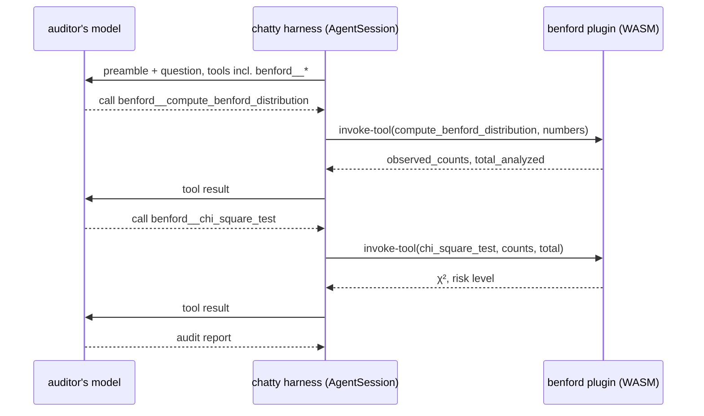

# Tutorial: give an agent the plugin (benford)

**When to read this:** you have a plugin (or want one) and want an agent that
uses it: a preamble that tells the model what to do, and the plugin's tools
to do it with.

**Full source:** the plugin in
[`modules/benford/`](https://github.com/boersmamarcel/chatty2/tree/main/modules/benford)
and the agent spec below, which you write yourself (no preset ships it).

## Prerequisites

Complete [Tutorial: write a plugin](./tutorial-echo-agent.md) first if you
are new to the `Plugin` trait and `module.toml`. You need the `wasm32-wasip2`
target (`make setup` installs it) and a configured model provider.

## The split: the loop is the agent's, the tools are the plugin's

A Benford audit is "compute the first-digit distribution, test it, write a
report". Two parts of that are arithmetic, one is judgement:

- **The plugin** (`benford`) does the arithmetic, deterministically, in the
  WASM sandbox: `compute_benford_distribution` and `chi_square_test`.
- **The agent** (`auditor`) is chatty's own harness: a spec with a
  forensic-auditor preamble and `plugins = [benford]`. Its model decides when
  to call each tool and writes the report, with everything a chatty agent
  has: approvals, trace, usage and budgets.

The plugin never calls the model and never loops:



## Step 1 — The plugin's tools

`benford` is a plugin like `echo`: two tools, each parsing its JSON
arguments and returning JSON. It requests no capability.

```rust
fn invoke_tool(call: ToolCallRequest) -> Result<ToolResult, ToolError> {
    let run = match call.name.as_str() {
        "compute_benford_distribution" => compute_benford_distribution,
        "chi_square_test" => chi_square_test,
        other => return Err(ToolError::unknown_tool(other)),
    };
    run(&call.arguments_json)
        .map(ToolResult::text)
        .map_err(ToolError::invalid_arguments)
}
```

[Full source → `src/lib.rs`](https://github.com/boersmamarcel/chatty2/blob/main/modules/benford/src/lib.rs)

Unit tests for the statistical functions run on the **host** target. The
crate's `.cargo/config.toml` defaults the build target to `wasm32-wasip2`,
so pass the host target explicitly:

```sh
cd modules/benford
cargo test --target x86_64-unknown-linux-gnu   # or your host's triple
```

## Step 2 — Build and install the plugin

One command, from the repo root, builds the plugin and installs it into the
module directory the desktop app scans by default:

```sh
make example-plugin-benford
```

Set `MODULE_DIR` to install somewhere else, e.g. a workspace-local
`.chatty/modules/benford`. Without `make` (or on Windows), do the same two
steps by hand:

```sh
cd modules/benford
cargo build --target wasm32-wasip2 --release
mkdir -p ~/.local/share/chatty/modules/benford
cp target/wasm32-wasip2/release/benford.wasm ~/.local/share/chatty/modules/benford/
cp module.toml ~/.local/share/chatty/modules/benford/
```

## Step 3 — The agent spec

An agent is a spec (TOML): who it is, what it is told, what it may use.
Write this one to `.chatty/agents/auditor.toml` in a workspace (or
`<data_dir>/chatty/agents/auditor.toml`):

```toml
[agent]
name = "auditor"
description = "Audits a list of amounts against Benford's Law with a chi-square test"
preamble = "You are a forensic auditor. Call benford__compute_benford_distribution with the numbers, then benford__chi_square_test with its observed_counts, and total_analyzed as total. Report the risk level, the chi-square statistic and the digits that deviate most. Every number comes from the tools, never from your own arithmetic."

[tools]
profile = "reviewer"
disable = ["shell"]

[[plugins]]
module = "benford"
version = "^0.2"
```

- `preamble` is the system prompt. It names the tools the way the model
  sees them: `<plugin>__<tool>`.
- `[tools]` narrows the native tools: a reviewer, and no shell.
- `[[plugins]]` loads the plugin into this agent (one instance per agent),
  resolved by name in the module directory; `version` is a semver range. The
  spec is the plugin's allow-list: a tool profile does not hide plugin tools.
- No `grants`: the plugin only computes, so it needs nothing beyond logging,
  which is always on.

## Step 4 — Run it

```sh
chatty-tui --agent auditor --headless \
  -m "Analyze these invoice amounts: 1234 4521 891 2340 567 8901 234 456 789"
```

The first digits are 1, 4, 8, 2, 5, 8, 2, 4, 7, so the plugin answers
χ² ≈ 10.49 on 8 degrees of freedom: under the 15.507 critical value, risk
`LOW`, digit 1 the most deviant. With nine numbers, that is the expected
verdict; the report should say the sample is too small to show an anomaly.

`crates/chatty-tui/tests/plugins_headless.rs`
(`a_spec_with_the_benford_plugin_gives_the_chi_square_verdict`) runs exactly
this spec against a scripted model and checks the verdict the plugin hands back.

## Step 5 — Other ways in

- **Over MCP**, for an external client, the plugin's tools alone:
  `POST /mcp/benford` on the desktop's protocol gateway (`[protocols] mcp =
  true`). The caller orchestrates; there is no report. See the
  [benford README](https://github.com/boersmamarcel/chatty2/blob/main/modules/benford/README.md).
- There is no OpenAI or A2A route for the plugin: it is not an agent. The
  agent is the spec.

## Design notes

- **Deterministic work in the plugin, judgement in the agent.** The model
  never does the statistics; the preamble tells it to take the χ² and the
  risk level from the tool.
- **Typed errors.** Bad arguments come back as `invalid-arguments: …`, which
  the model reads and can correct on its next call.
- **Nothing to re-implement.** Before PL-U3 the module ran its own six-turn
  loop and fed tool results back as user messages; now the harness does the
  loop, so compaction, approvals, trace and budgets apply for free.

## Further reading

- [Build a WASM plugin](../guides/build-wasm-module.md) — quick start,
  project layout, testing your plugin
- [WIT reference](../architecture/wit-reference.md) — the
  `chatty:plugin@0.3.0` contract
