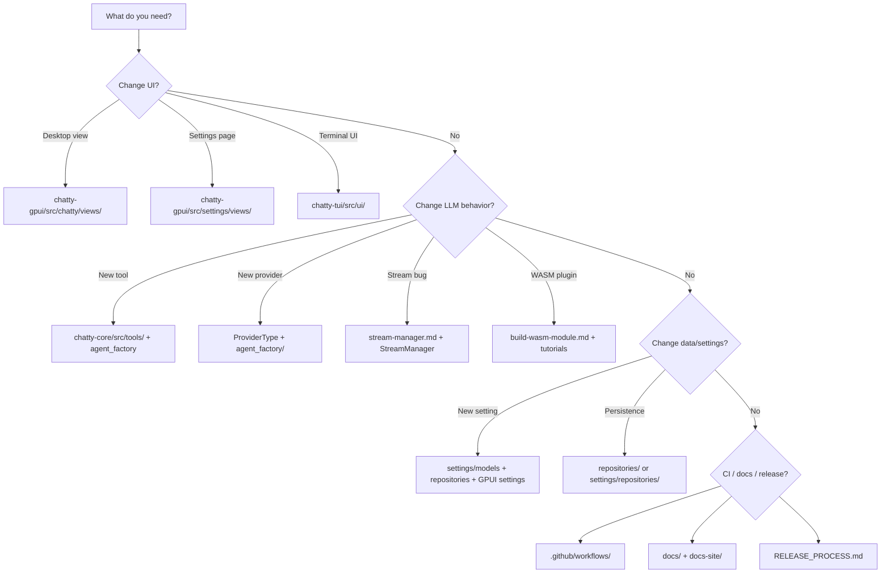

# Where do I…?

**When to read this:** You know the task but not which file or doc to open.

## Cheat sheet

| I want to… | Open |
|------------|------|
| Read the user manual | [getting-started.md](../user/getting-started.md) · [user guides](../user/overview.md) |
| Understand the big picture | [system-overview.md](./architecture/system-overview.md) |
| See component diagrams | [component-map.md](./architecture/component-map.md) |
| Find a workspace crate | [crates.md](./crates.md) |
| Build a WASM plugin | [build-wasm-module.md](./guides/build-wasm-module.md) · [echo tutorial](./guides/tutorial-echo-agent.md) · [benford tutorial](./guides/tutorial-benford-agent.md) |
| Add an LLM tool | [add-tool.md](./guides/add-tool.md) |
| Add a provider | [add-provider.md](./guides/add-provider.md) |
| Add a slash command | [add-slash-command.md](./guides/add-slash-command.md) |
| Add a GPUI view | [add-gpui-view.md](./guides/add-gpui-view.md) |
| Look up a persisted setting | [settings-schema.md](./reference/settings-schema.md) |
| Fix stream/cancel bugs | [stream-manager.md](./architecture/stream-manager.md) |
| Fix rendering/layout | [debug_ui.md](./architecture/debug_ui.md) |
| Look up a tool name | [tools-catalog.md](./reference/tools-catalog.md) |
| Run tests like CI | `make ci` · [agents.md](./agents.md) |
| Research / reserved code | [RESERVED.md](https://github.com/boersmamarcel/chatty2/blob/main/RESERVED.md) |

## Agent reading order

1. [agents.md](./agents.md) (5 min)
2. [doc-index.md](./doc-index.md) (scan tables)
3. [component-map.md](./architecture/component-map.md) (diagrams)
4. Specific architecture page for your task
