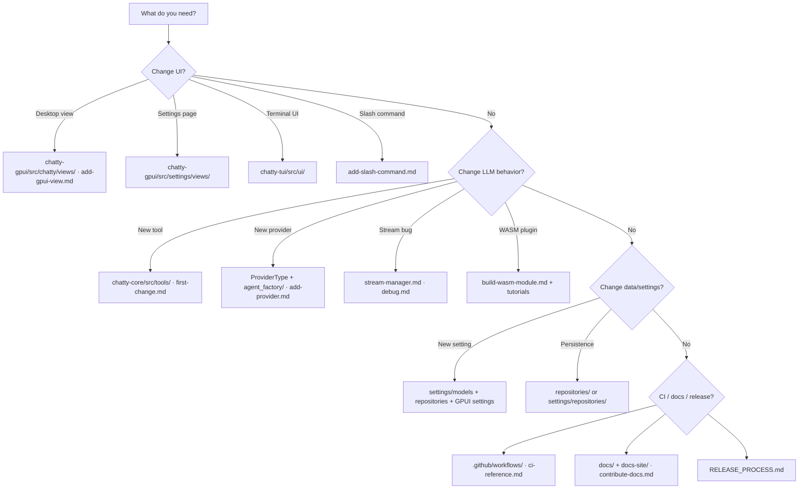

# Where do I…?

**When to read this:** You know the task but not which file or doc to open. This page is the index of the how-to guides; each guide follows the same shape (goal, prerequisites, steps, verify, checklist, common mistakes).

## How-to guides

| Guide | Use it when |
|-------|-------------|
| [Add an LLM provider](./guides/add-provider.md) | A new `ProviderType`, or deciding whether an OpenAI-compatible endpoint even needs one |
| [Add a slash command](./guides/add-slash-command.md) | A new `/command` in the desktop and terminal pickers |
| [Add a desktop GPUI view](./guides/add-gpui-view.md) | A panel, dialog or widget in `chatty-gpui` |
| [Build a WASM plugin](./guides/build-wasm-module.md) | A sandboxed agent module served by the protocol gateway |
| [Test](./guides/test.md) | Which tests to run, goldens, mocks, the `--test-threads=1` footgun |
| [Debug](./guides/debug.md) | Logs, the render overlay, stalled streams, tool failures, cache hits |
| [Build & package](./guides/build-package.md) | Local CI and platform packages |
| [Release process](./architecture/RELEASE_PROCESS.md) | Cutting a version |
| [Contribute to the docs](./guides/contribute-docs.md) | Editing this site |
| [For AI agents](./agents.md) | The workspace map coding agents read first |

Tutorials (learn by building) live under [Start here](./start/build-and-run.md): [your first change](./start/first-change.md), [echo-agent](./start/tutorial-echo-agent.md), [benford-agent](./start/tutorial-benford-agent.md).

## Cheat sheet

| I want to… | Open |
|------------|------|
| Read the user manual | [Getting started](../user/getting-started.md) and the other user pages |
| Build the workspace for the first time | [Build and run](./start/build-and-run.md) |
| Understand the big picture | [System overview](./architecture/system-overview.md) |
| See component diagrams | [Component map](./architecture/component-map.md) |
| Find a workspace crate | [Reference: crates](./crates.md) |
| Build a WASM plugin | [Build a WASM plugin](./guides/build-wasm-module.md) · [echo tutorial](./start/tutorial-echo-agent.md) · [benford tutorial](./start/tutorial-benford-agent.md) |
| Add an LLM tool | [Your first change: add a tool](./start/first-change.md) |
| Add a provider | [Add an LLM provider](./guides/add-provider.md) |
| Add a slash command | [Add a slash command](./guides/add-slash-command.md) |
| Add a GPUI view | [Add a desktop GPUI view](./guides/add-gpui-view.md) |
| Look up a persisted setting | [Settings schema](./reference/settings-schema.md) |
| Fix stream/cancel bugs | [Stream lifecycle](./architecture/stream-manager.md) · [Debug](./guides/debug.md) |
| Fix rendering/layout | [Debug](./guides/debug.md) · [Rendering pipeline](./architecture/rendering-system.md) |
| Look up a tool name | [Tools catalog](./reference/tools-catalog.md) |
| Run tests like CI | [Test](./guides/test.md) · [Make targets & CI workflows](./ci-reference.md) |
| Look up a term | [Glossary](./glossary.md) |
| Research / reserved code | [RESERVED.md](https://github.com/boersmamarcel/chatty2/blob/main/RESERVED.md) |
| Report or fix a stale page | [Contribute to the docs](./guides/contribute-docs.md) · [CONTRIBUTING.md](https://github.com/boersmamarcel/chatty2/blob/main/CONTRIBUTING.md) |
