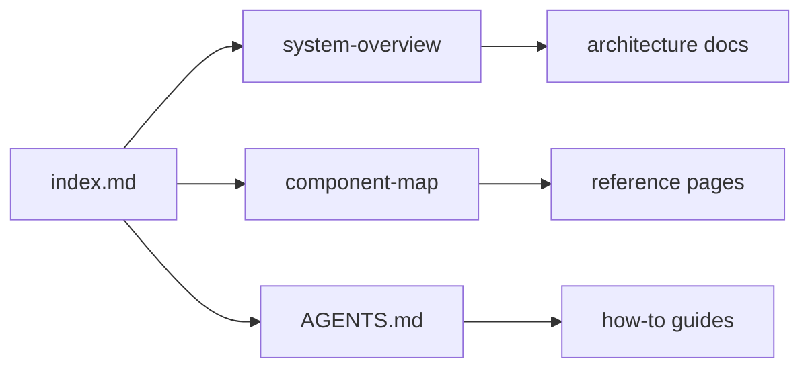

# Chatty Developer Documentation

Welcome to the **developer documentation** for [Chatty](https://github.com/boersmamarcel/chatty2) —
a Rust desktop and terminal AI agent framework.

<div class="hero-links">
  <a href="dev/architecture/system-overview.html">System overview</a>
  <a href="dev/architecture/component-map.html" class="secondary">Component map</a>
  <a href="dev/agents.html" class="secondary">Agent guide</a>
  <a href="https://github.com/boersmamarcel/chatty" class="secondary">Marketing site</a>
</div>

## Who is this for?

| Audience | Start here |
|----------|------------|
| **Coding agents** | [Agent quick-start](./dev/agents.md) · [Doc index](./dev/doc-index.md) · [Component map](./dev/architecture/component-map.md) |
| **Contributors** | [System overview](./dev/architecture/system-overview.md) · [Contributing patterns](./dev/contributing-patterns.md) |
| **End users** | [Marketing site](https://github.com/boersmamarcel/chatty) · [User guides](./user/getting-started.md) |

## Documentation map



## Single source of truth

Architecture pages live in [`docs/`](https://github.com/boersmamarcel/chatty2/tree/main/docs) in the repo.
This site is **built** from those files — edit the repo markdown, not copies here.

```bash
make docs-gen   # regenerate reference tables
make docs       # sync + build
make docs-serve # local preview at http://localhost:3000
```
