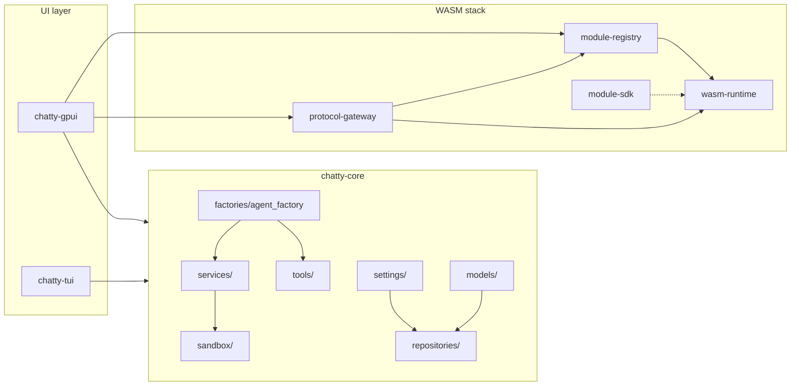
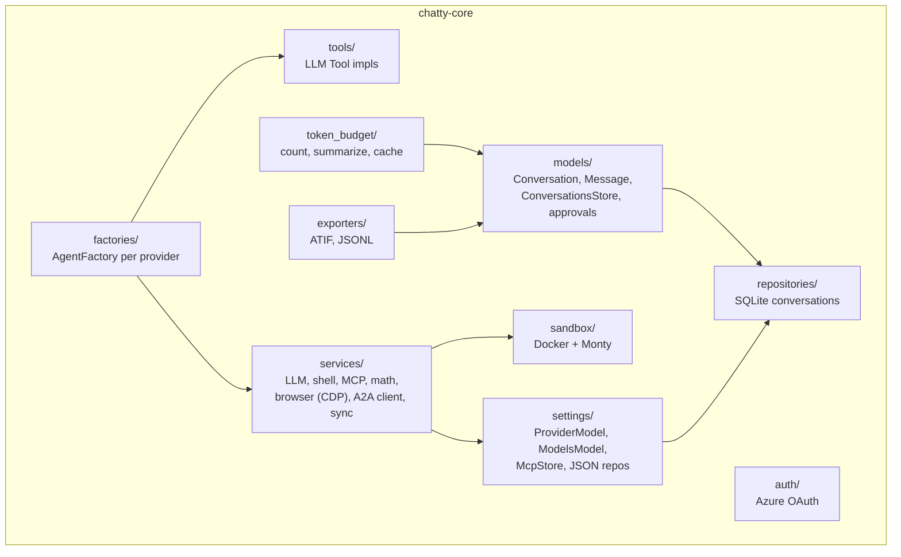
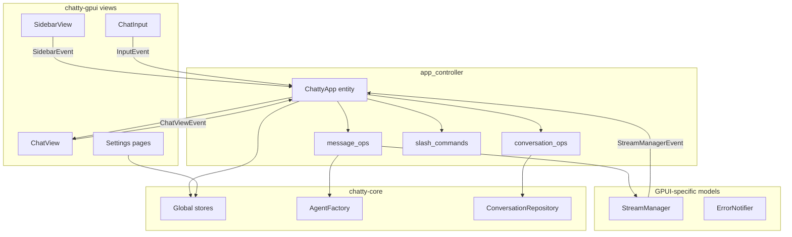
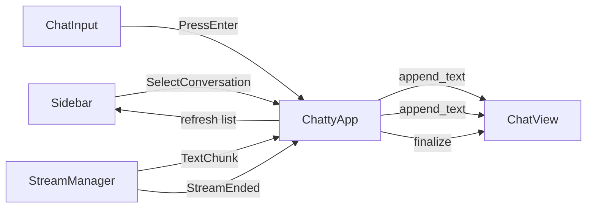
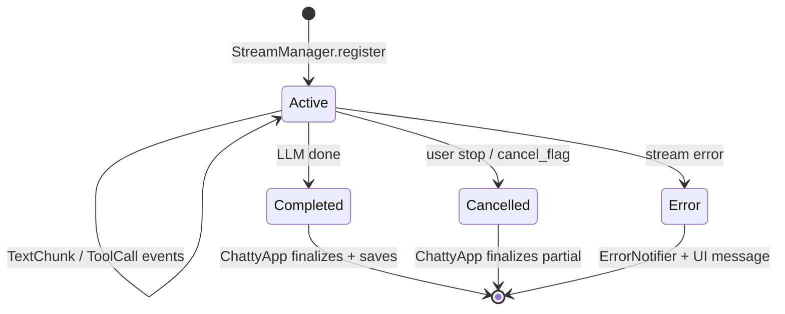
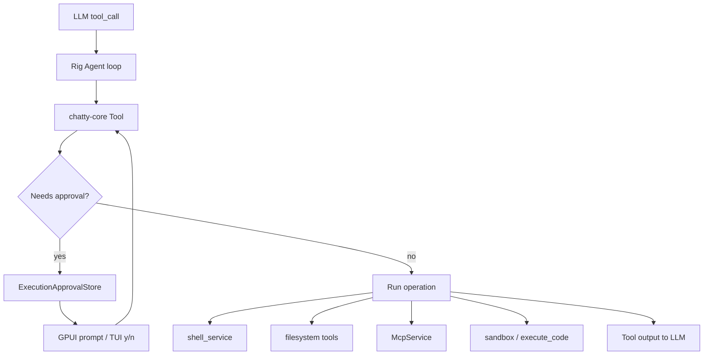
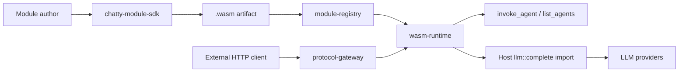

# Component map

**When to read this:** You need to see how runtime pieces connect — which entity owns
what, where events flow, and which module to open for a given concern.

## Workspace crate relationships

## chatty-core internal modules

Each box is a top-level module under `crates/chatty-core/src/`.

| Module | Responsibility | Does NOT contain |
|--------|----------------|------------------|
| `models/` | Pure data + in-memory stores | UI, disk I/O |
| `settings/` | Config models + JSON repositories | GPUI views |
| `repositories/` | SQLite + abstraction traits | Business rules |
| `factories/` | Build `AgentClient`, register tools | Stream UI updates |
| `services/` | Long-running / stateful logic | GPUI `Render` |
| `tools/` | LLM-callable tool definitions | Agent loop itself |
| `sandbox/` | Code execution isolation | Tool approval UI |
| `token_budget/` | Context window accounting | Chat rendering |

## GPUI desktop architecture

`ChattyApp` is the hub; views emit events upward; services live in core.

### Entity event bus (simplified)

Full topology: [entity-communication.md](entity-communication.md).

## Stream lifecycle ownership

The async stream loop **only** updates `Conversation` and `StreamManager` — never
GPUI views directly. See [stream-manager.md](stream-manager.md).

## Tool execution path

## WASM module stack

See [build-wasm-module guide](../docs-site/src/dev/guides/build-wasm-module.md)
(sequence diagrams) and [a2a-and-wasm-modules.md](a2a-and-wasm-modules.md).

## Research touchpoints

Production components above are where promoted research mechanisms land. For a
bidirectional map (memory → M4 ACE, token budget → M3/M4, sub-agents → M2 AFlow, …)
see [research/app-research-bridge.md](research/app-research-bridge.md).
