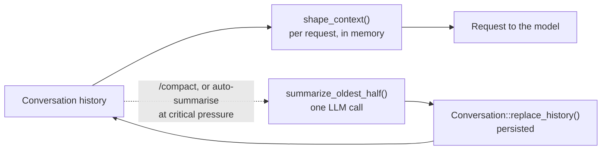

# Context compaction

**When to read this:** You need to know what Chatty does to a long conversation
history before it goes to the model, and what `/compact` and auto-summarise change.

Two mechanisms keep a conversation inside the model's context window: per-request
shaping, which never calls the model, and summarisation, which rewrites the persisted
history and runs only on demand or at critical pressure.



## Per-request shaping

Both frontends call `shape_context`
(`crates/chatty-core/src/services/context_shaper.rs`) on the history immediately
before `stream_prompt`, with `agent = None`. The result is what the model sees for
that request; the stored conversation is untouched. Stages run in order and the
pipeline stops as soon as the history fits under the next threshold. All thresholds
are character counts (`ContextShaperSettings::default()`), not tokens, and they do not
consult the model's `max_context_window`.

| # | Stage | Trigger | Effect |
|---|-------|---------|--------|
| 1 | Budget reduction | always | Truncate any single tool result above 8 KB to a stub |
| 2 | Snip | history > 80 000 chars | Keep the first 2 and last 8 messages, drop the middle |
| 3 | Micro-compact | still > 50 000 chars | Replace tool-result bodies in the middle band with one-liners |

Stages 4 and 5 (summarising with an LLM) need an `AgentClient`; neither call site
passes one, so shaping never calls the model. Because the last-8 window slides by one
message each turn, consecutive requests stop sharing a prompt-cache prefix once stage
2 fires.

## Summarisation

`summarize_oldest_half` (`crates/chatty-core/src/token_budget/summarizer.rs`) takes
the first `len / 2` messages, renders them as a plain-text transcript (non-text
content is described, not embedded), and asks the conversation's own agent for a
dense bullet summary that preserves decisions, code and paths, commands and
outcomes, and open items. The result replaces those messages with one user message:

```
[CONVERSATION SUMMARY — N messages compressed]

- …
```

followed by the untouched second half. `Conversation::replace_history(new_history,
midpoint)` persists it, carrying the kept tail's metadata (traces, attachments,
timestamps, feedback) across. Histories shorter than 4 messages are refused and a
failed LLM call leaves the conversation unchanged.

It is reached from two places:

- **`/compact`** in either frontend (`app_controller/slash_commands.rs`,
  `chatty-tui/src/engine/commands.rs`), which posts an info line with the number of
  messages summarised and the estimated tokens freed.
- **Auto-summarise** on the desktop: after a turn completes and the token snapshot has
  been patched with the provider's actual counts, `finalize_completed_stream` checks
  `TokenTrackingSettings.auto_summarize` (default `false`) and the snapshot's
  `CriticalPressure` status (default 90 % of `max_context_window − response_reserve`),
  and runs the summariser in the background. See
  [token-tracking.md](token-tracking.md) for how the snapshot is computed.

`TokenTrackingSettings.summarization_model_id` is stored but not honoured:
`summarize_with_model` is a stub that always errors, so summaries always use the
conversation's model.

> [!WARNING]
> The midpoint cut ignores exchange boundaries. Tool turns are persisted as rig
> produced them (assistant tool call, user tool result, final text), so a cut can land
> between a tool call and its result; OpenAI-compatible endpoints reject the orphaned
> call on the next request. Prefer `/compact` when the recent history is plain text.

## Planned

A generational compaction engine is designed but not implemented: a trigger on the
token estimate, cuts only at exchange boundaries with the most recent exchanges kept
whole, a structured summary rendered as a collapsible card, summarisation on a
cheaper utility model, compaction events on both frontends, and auto-summarise on by
default. It replaces the per-request shaper so consecutive requests share a stable
prompt-cache prefix.

## Related

- [token-tracking.md](token-tracking.md): the prompt-token estimate that drives the
  critical-pressure trigger.
- [Architecture Notes in CLAUDE.md](https://github.com/boersmamarcel/chatty2/blob/main/CLAUDE.md):
  prompt caching and persisted tool turns.
