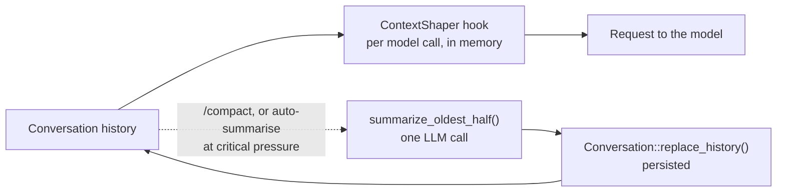

# Context compaction

**When to read this:** You need to know what Chatty does to a long conversation
history before it goes to the model, and what `/compact` and auto-summarise change.

Two mechanisms keep a conversation inside the model's context window: the
per-request guard, which never calls the model and runs before every model call of a
turn, and summarisation, which rewrites the persisted history and runs only on demand
or at critical pressure.



## The per-request guard

Every chat agent carries a `ContextShaper`
(`crates/chatty-core/src/services/context_shaper.rs`) as a rig `AgentHook`. Before each
model call of a run — the first one and every call after a tool round-trip — the hook
measures the history that call would send and, only when the request would not fit the
model's window, hands rig a shorter history for that one request
(`RequestPatch::history`). The stored conversation is untouched, and a request that fits
goes out byte for byte as recorded, so consecutive requests under budget share their
prompt-cache prefix.

The guard runs inside the tool loop because that is where a turn's context grows: a
headless task is one user turn and up to `max_agent_turns` model calls, each appending a
raw tool result. Before AGE-504 the shaper ran once per user turn, before the stream, and
62 of 165 GAIA trials died mid-loop on `maximum context length is 32768 tokens`.

**Budget.** In tokens, counted with the model's `TokenCounter` (a typed tool's JSON result
counts by its serialized text, which is what the provider bills):

```
context_window − headroom − response_reserve − base − prompt
```

- `context_window`: the model's `max_context_window`; an assumed **32 768** when the model
  has none configured (CLI-discovered and headless models).
- `headroom`: a tenth of the window, for what the count cannot see — the chat template's
  per-message wrapping and the gap between the tiktoken estimate and the model's own
  tokenizer (about 2k tokens on a 32k Qwen request with the full tool set).
- `response_reserve`: the model's `max_tokens`, or 4 096.
- `base`: the preamble plus the tool schemas, measured once when the agent is built
  (`calibrate_context_shaper` in `factories/agent_factory/mod.rs`). With the full native
  tool set this is around 16k tokens — the tool block alone is ~52 KB of JSON.
- `prompt`: the message the call is about to send (a user message or the latest tool
  results). It is never shaped.

**Stages.** Applied in order, cheapest information loss first, stopping as soon as the
history fits. The most recent 8 messages are what the model is working with and stay
whole for as long as possible.

| # | Stage | Effect |
|---|-------|--------|
| 1 | Cap | Stub every tool result over 8 KB outside the tail (`[tool result truncated — N chars]` plus a 200-char preview) |
| 2 | Compact | Replace every tool result outside the tail with a one-liner (`[compacted] …`, 120 chars) |
| 3 | Snip | Keep the first 2 and last 8 messages, replace the middle with one marker; both ends of the cut move off a tool round-trip first (see below) |
| 4 | Cap the tail | Stub, then one-line, tool results inside the tail, oldest first; the last message is never touched |

A history still over budget after stage 4 is sent as is (a warning is logged): without
summarising there is nothing left to take.

**Neither half of a tool round-trip is dropped alone.** Because the guard runs on every
model call of a run, stage 3's cut usually falls inside a live tool loop, where the
message at the tail boundary is a tool result and the one before it is the assistant
`tool_calls` message it answers. Splitting the two is a 400 from every OpenAI-compatible
provider — `messages with role 'tool' must be a response to a preceding message with
'tool_calls'` — on the *request the guard itself builds*. So the kept tail starts no
later than the assistant message issuing the calls it answers, and the kept head ends no
later than the last call the snip still answers; the boundaries only ever move backwards,
keeping a message or two more than asked. A result whose call is nowhere in the history
is left where it is: that history was already malformed, and moving the cut cannot repair
it (AGE-512; the companion repair at recording time is AGE-485).

**The one result that can never fit.** The prompt — the latest tool results — is never
shaped, and a single result can be larger than the whole budget (a 237 KB shell dump
was, in the AGE-500 rerun). That is caught where the result is recorded: the same hook's
`on_tool_result` cuts a result over **two fifths of the history budget** (floor 512
tokens) down to the cap, once, with a header saying how much was kept. The cut form is
what the transcript shows, what the conversation persists and what every later request
carries, so the append-only property holds for it too. On a 32k model with the full
tool set that cap is ~4k tokens (~16 KB); on a 200k model it is ~70k tokens and never
bites in practice. Once a run is over budget the tail boundary
moves by one message per call, so requests stop sharing a prefix until it fits again —
the price of not crashing, and what the planned engine below removes.

## Summarisation

`summarize_oldest_half` (`crates/chatty-core/src/token_budget/summarizer.rs`) takes
the first `len / 2` messages, renders them as a plain-text transcript (non-text
content is described, not embedded), and asks the conversation's own agent for a
dense bullet summary that preserves decisions, code and paths, commands and
outcomes, and open items. The result replaces those messages with one user message:

```
[CONVERSATION SUMMARY — N messages compressed]

- …
```

followed by the untouched second half. `Conversation::replace_history(new_history,
midpoint)` persists it, carrying the kept tail's metadata (traces, attachments,
timestamps, feedback) across. Histories shorter than 4 messages are refused and a
failed LLM call leaves the conversation unchanged.

It is reached from two places:

- **`/compact`** in either frontend (`app_controller/slash_commands.rs`,
  `chatty-tui/src/engine/commands.rs`), which posts an info line with the number of
  messages summarised and the estimated tokens freed.
- **Auto-summarise** on the desktop: after a turn completes and the token snapshot has
  been patched with the provider's actual counts, `finalize_completed_stream` checks
  `TokenTrackingSettings.auto_summarize` (default `false`) and the snapshot's
  `CriticalPressure` status (default 90 % of `max_context_window − response_reserve`),
  and runs the summariser in the background. See
  [token-tracking.md](token-tracking.md) for how the snapshot is computed.

`TokenTrackingSettings.summarization_model_id` is stored but not honoured:
`summarize_with_model` is a stub that always errors, so summaries always use the
conversation's model.

> [!WARNING]
> The midpoint cut ignores exchange boundaries. Tool turns are persisted as rig
> produced them (assistant tool call, user tool result, final text), so a cut can land
> between a tool call and its result; OpenAI-compatible endpoints reject the orphaned
> call on the next request. Prefer `/compact` when the recent history is plain text.

## Planned

A generational compaction engine is designed but not implemented (AGE-248): a trigger on
the token estimate, cuts only at exchange boundaries with the most recent exchanges kept
whole, a structured summary rendered as a collapsible card, summarisation on a
cheaper utility model, compaction events on both frontends, and auto-summarise on by
default. It persists its result, so consecutive requests share a stable prompt-cache
prefix even over budget; the per-request guard stays as the last line of defence
inside a turn.

## Related

- [token-tracking.md](token-tracking.md): the prompt-token estimate that drives the
  critical-pressure trigger.
- [Architecture Notes in CLAUDE.md](https://github.com/boersmamarcel/chatty2/blob/main/CLAUDE.md):
  prompt caching and persisted tool turns.
