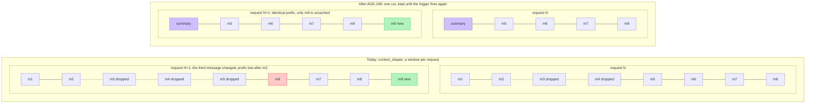
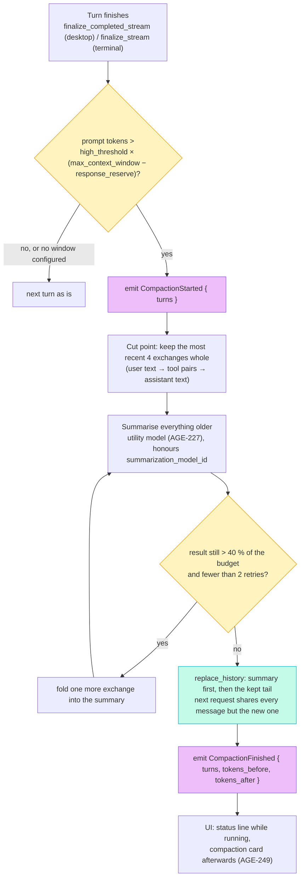
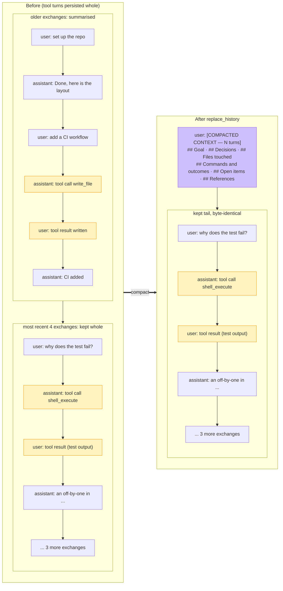

# Context compaction

How Chatty keeps a long agentic conversation inside the model's context
window without throwing the prompt cache away on every turn. This is the D2
decision recorded on AGE-233 and the plan carried by AGE-241 and its three
sub-issues: persist tool turns (AGE-247, done), the compaction engine
(AGE-248), and the compaction UX (AGE-249).

The diagrams are also checked in as editable Excalidraw scenes under
[`docs/diagrams/`](https://github.com/boersmamarcel/chatty2/tree/main/docs/diagrams);
open them at [excalidraw.com](https://excalidraw.com) to change them.

## The problem: a sliding window defeats the prompt cache

Until AGE-248 lands, both frontends run `shape_context`
(`crates/chatty-core/src/services/context_shaper.rs`) before every request.
Its thresholds are character counts, blind to the model's
`max_context_window`, and its only reachable stage keeps the first two and
the last N messages of *each request*. That tail is a sliding window: once
the history is long, the third message of every request is a different one
from the request before, so the prefix the previous request cached is never
hit again. This is exactly the regime, long tool-heavy sessions, where the
moving prompt-cache breakpoint (`prompt_cache_http.rs`, AGE-205) was meant
to pay off.



The fix has to be *generational*: decide a cut point when a token budget is
crossed, then keep that cut fixed until the next crossing, so consecutive
requests share a prefix. The character-based shaper goes away.

## Step 1: tool turns are persisted (AGE-247, done)

Compaction cuts at exchange boundaries, and an exchange only has boundaries
if the history holds what the model actually saw. Since AGE-247 a turn with
tool calls persists every message rig produced for it, in order: the
assistant tool-call message(s), the user tool-result message(s), then the
final assistant text. Payloads are kept whole at persist time (the D1
follow-up answer); bounding them is compaction's job, not persistence's.
`CLAUDE.md` > Architecture Notes > "Tool turns are persisted" has the code
map.

Two consequences matter here:

- An **exchange** is a user text message, every tool call/result pair after
  it, and the assistant text that answers. `services::exchange_count` counts
  them; readers that render or export skip the tool messages with
  `services::is_tool_message`.
- A cut that falls inside an exchange would split a tool call from its
  result, and OpenAI-compatible endpoints reject the orphan. So cuts fall
  on exchange boundaries only.

## Step 2: the engine (AGE-248)

Owner module: `crates/chatty-core/src/token_budget/`. It already owns
measurement (`TokenCounter`, `TokenBudgetSnapshot`); it gains the trigger
and the compaction itself. `services/context_shaper.rs` and its two call
sites (`message_ops_internals.rs`, `engine/mod.rs`) are deleted, together
with the `ContextShaperSettings` re-exports.



### Trigger (Q1 a)

`compaction::should_compact(history_tokens, model_config, settings) -> bool`
fires when the estimated prompt tokens (preamble, tools, history and the
latest message: the existing snapshot on the desktop; the terminal counts
with the same `TokenCounter` since it has no snapshot) exceed
`high_threshold × (max_context_window − response_reserve)`. It never fires
for a model with no `max_context_window`.

### Shape (Q2 a)

Runs in the post-turn path of both frontends, once per trigger:

1. Keep the most recent 4 exchanges whole.
2. Summarise everything older with `AgentClient::prompt()`, which after
   AGE-227 is the tool-less utility model. When
   `summarization_model_id` is set, the utility model is built for that
   model instead (this implements the stub at
   `token_budget/summarizer.rs`).
3. If the result is still above 40 % of the effective budget, fold one
   more exchange into the summary and re-summarise, at most twice.
4. Persist through `Conversation::replace_history`, summary first, then
   the kept tail. Metadata (traces, attachments, timestamps, feedback) on
   the kept tail is carried over.

Prefix stability is the property to test: after a compaction, two
consecutive requests share every message except the new user message.

### Summary shape

A structured document, not prose, inserted as the first *user* message of
the retained history and prefixed with `[COMPACTED CONTEXT — N turns]` so
the renderer can show it as a compaction card:

```
[COMPACTED CONTEXT — 12 turns]
## Goal
## Decisions
## Files touched        (paths)
## Commands and outcomes
## Open items
## References           (URLs, PR and issue numbers, paths mentioned)
```



### Events

`CompactionStarted { turns }` and
`CompactionFinished { turns, tokens_before, tokens_after }` go through the
existing frontend event paths (`StreamManagerEvent` on the desktop,
`AppEvent` on the terminal) so step 3 can render progress. Until step 3
lands they are logged only.

### Acceptance for the engine

- Unit tests: trigger arithmetic; cut-point selection keeps call/result
  pairs intact; the ratio loop stops after two retries; prefix stability
  over two consecutive turns after a compaction.
- A scripted long conversation compacts once, then not again until the
  threshold is crossed again.
- With `summarization_model_id` set, the summariser request goes to that
  model (mock).
- Goldens: the turn callback sequences are unchanged; if the compaction
  events appear in the frontend goldens, the diff is explained.
- `docs/token-tracking.md` and `docs/message-path-debt.md` (A4, C5)
  updated.

## Step 3: the UX and the default (AGE-249)

- **Desktop.** While `CompactionStarted … CompactionFinished` is in flight,
  an animated status line in the transcript ("Compacting context, N turns
  …"), using the streaming status header the turn already has, so it reads
  as part of the turn rather than a modal. On finish, the
  `[COMPACTED CONTEXT — N turns]` message renders as a **compaction card**:
  collapsed by default ("N turns → summary, X k → Y k tokens"), expandable
  to the summary document. One new block kind in `views/transcript/`. The
  footer token bar shows the drop.
- **Terminal.** Status-bar spinner text during compaction; one system line
  on finish with the same numbers; the summary message renders as a dimmed
  block.
- **Default (Q4 a).** `TokenTrackingSettings.auto_summarize` defaults to
  `true`; the settings copy says what happens and at what threshold. The
  manual Summarize button and `/compact` stay.

## Guardrails

- Do not change the moving-breakpoint layer (`prompt_cache_http.rs`).
- Do not touch follow-up scheduling (D3, AGE-190).
- No compaction inside AGE-247; no engine behaviour change inside AGE-249.

## Until AGE-248 lands

The existing `/compact` command and the desktop's auto-summarise still call
`summarize_oldest_half`, which cuts at `history.len() / 2` regardless of
exchange boundaries. Now that tool turns are persisted, a manual compaction
of a tool-heavy chat can split a tool call from its result, and the provider
will reject the next request. The engine above replaces that path.

## Related

- [`token-tracking.md`](token-tracking.md): how the prompt-token estimate
  the trigger reads is computed.
- [`message-path-debt.md`](message-path-debt.md): findings A4 (the shaper)
  and C5 (two overlapping context systems) that this design resolves.
- `CLAUDE.md` > Architecture Notes: prompt caching (AGE-205) and persisted
  tool turns (AGE-247).
