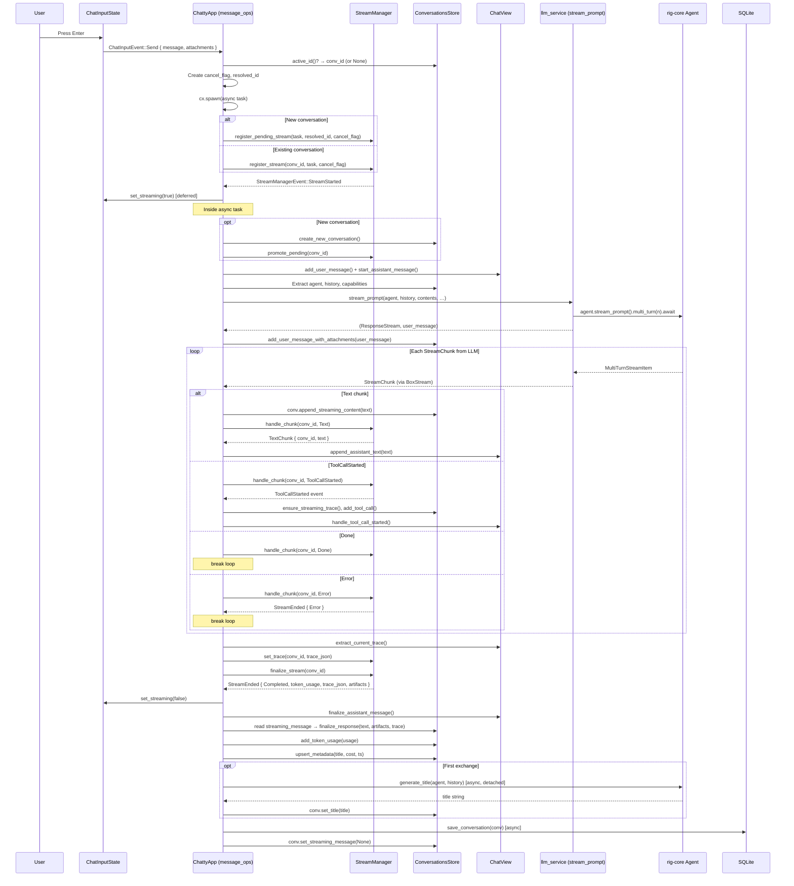

# Message Flow: Cradle to Grave

This document traces the complete lifecycle of a user message from keystroke to persisted
response. It covers every layer of the stack, the responsibility of each layer, the data
structures that cross layer boundaries, and the technical debt that has accumulated along
the way.

## Table of Contents

1. [Crate Map](#crate-map)
2. [Layer Overview](#layer-overview)
3. [Layer-by-Layer Detail](#layer-by-layer-detail)
   - [Layer 0 – User Input](#layer-0--user-input)
   - [Layer 1 – App Controller](#layer-1--app-controller)
   - [Layer 2 – LLM Service](#layer-2--llm-service)
   - [Layer 3 – Agent / Provider (rig-core)](#layer-3--agent--provider-rig-core)
   - [Layer 4 – Stream Processing Loop](#layer-4--stream-processing-loop)
   - [Layer 5 – StreamManager](#layer-5--streammanager)
   - [Layer 6 – Rendering Pipeline](#layer-6--rendering-pipeline)
   - [Layer 7 – Finalization](#layer-7--finalization)
   - [Layer 8 – Persistence](#layer-8--persistence)
4. [Cross-Cutting Data Structures](#cross-cutting-data-structures)
5. [End-to-End Sequence Diagram](#end-to-end-sequence-diagram)
6. [Technical Debt](#technical-debt)

---

## Crate Map

```
crates/
├── chatty-core/          # Domain logic, models, services, tools — no UI dependency
│   ├── factories/        # Agent construction (AgentClient enum, tool wiring, preamble)
│   ├── models/           # Domain models: Conversation, ConversationsStore, MessageEntry, …
│   ├── repositories/     # SQLite persistence (ConversationSqliteRepository)
│   └── services/
│       ├── llm_service.rs        # StreamChunk enum, stream_prompt(), provider macros
│       ├── stream_processor.rs   # StreamChunkHandler trait + run_stream_loop (shared)
│       └── title_generator.rs    # Async title generation
│
├── chatty-gpui/          # GPUI desktop frontend
│   └── src/chatty/
│       ├── controllers/
│       │   └── app_controller/
│       │       └── message_ops.rs  # send_message, run_llm_stream, finalize_*
│       ├── models/
│       │   └── stream_manager.rs   # StreamManager entity, StreamManagerEvent
│       └── views/
│           ├── chat_view.rs        # ChatView entity, DisplayMessage
│           ├── message_parsing.rs  # Parse + cache pipeline
│           ├── parsed_cache.rs     # CachedParseResult, ParsedContentCache
│           └── message_component.rs # render_message()
│
└── chatty-tui/           # Terminal UI (shares chatty-core, uses StreamChunkHandler)
    └── src/engine/
        └── streaming.rs  # TuiStreamHandler implementing StreamChunkHandler
```

---

## Layer Overview

| # | Name | Location | Responsibility |
|---|------|----------|----------------|
| 0 | **User Input** | `ChatInputState` (chatty-gpui) | Capture keystrokes, emit `ChatInputEvent::Send` |
| 1 | **App Controller** | `message_ops.rs` (chatty-gpui) | Orchestrate the full request: conversation setup, attachment filtering, task spawning, stream registration |
| 2 | **LLM Service** | `llm_service.rs` (chatty-core) | Call the provider, wrap raw rig stream into typed `StreamChunk` |
| 3 | **Agent/Provider** | rig-core (`AgentClient`) | HTTP SSE connection, multi-turn loop, tool dispatch |
| 4 | **Stream Loop** | `run_llm_stream()` in `message_ops.rs` (chatty-gpui) | Drive the stream, dual-write text to `ConversationsStore` and `StreamManager` |
| 5 | **StreamManager** | `stream_manager.rs` (chatty-gpui) | Lifecycle tracking, text batching (5 ms flush), event fan-out |
| 6 | **Rendering Pipeline** | `message_parsing.rs`, `parsed_cache.rs`, `message_component.rs` (chatty-gpui) | Parse markdown/math/code, syntax highlight, render to GPUI elements |
| 7 | **Finalization** | `finalize_completed_stream()` in `message_ops.rs` | Commit response to history, calculate cost, generate title, persist |
| 8 | **Persistence** | `ConversationSqliteRepository` (chatty-core) | WAL-mode SQLite write |

---

## Layer-by-Layer Detail

### Layer 0 – User Input

**File:** `crates/chatty-gpui/src/chatty/views/chat_input.rs`

`ChatInputState` is a GPUI entity that owns the text field, attachment list, and streaming
flag. When the user presses Enter (without Shift), it emits:

```rust
ChatInputEvent::Send { message: String, attachments: Vec<PathBuf> }
```

`ChattyApp` subscribes to this event via `cx.subscribe(&chat_input, …).detach()` and
routes it to `send_message()`.

No validation or transformation happens here — the raw text and file paths pass straight through.

---

### Layer 1 – App Controller

**File:** `crates/chatty-gpui/src/chatty/controllers/app_controller/message_ops.rs`

`send_message()` is the main entry point. It runs **synchronously on the GPUI thread**
before spawning anything async. Its phases:

#### 1a. Conversation Existence Check
Reads `ConversationsStore.active_id()`. If no conversation exists, the async task will
create one (see below). A shared `Arc<Mutex<Option<String>>>` called `resolved_id` is
created to communicate the new conversation ID back once it is known.

#### 1b. Cancel Flag & StreamManager Handle
Creates `Arc<AtomicBool>` for graceful cancellation. Reads `GlobalStreamManager` from
GPUI globals (a strong `Entity<StreamManager>` reference).

#### 1c. Async Task Spawn
`cx.spawn(async move |_weak, cx| { … })` spawns the heavy work. The task captures:
- `conv_id_for_task` / `resolved_id` for conversation identity
- `agent`, `history` extracted from `ConversationsStore`
- `cancel_flag_for_loop` for stream cancellation
- `chat_view` / `sidebar` entity handles for UI updates

Inside the task (**phases run sequentially in Tokio**):

| Sub-phase | What happens |
|-----------|-------------|
| **PHASE 1** | Ensure a conversation exists; create one if needed via `create_new_conversation()`, then call `mgr.promote_pending(&id)` to move the `"__pending__"` stream state to the real ID |
| **PHASE 2** | Call `chat_view.update(…)` to add a `DisplayMessage` for the user and start an empty assistant placeholder |
| **PHASE 3** | Build `Vec<UserContent>`: text + filtered attachments (images/PDFs filtered by `ModelConfig.supports_images` / `supports_pdf`) + recent assistant attachments for follow-up context |
| **PHASE 4** | Call `run_llm_stream()` — the shared streaming helper (see Layer 4) |

#### 1d. Stream Registration
After spawning (still synchronous), registers the `Task` with `StreamManager`:
- Known conversation → `mgr.register_stream(conv_id, task, cancel_flag, …)`
- New conversation → `mgr.register_pending_stream(task, resolved_id, cancel_flag, …)`

This is done **after** `cx.spawn` so the task handle is available to pass to `StreamManager`.

---

### Layer 2 – LLM Service

**File:** `crates/chatty-core/src/services/llm_service.rs`

`stream_prompt()` is the sole public API:

```rust
pub async fn stream_prompt(
    agent: &AgentClient,
    history: &[Message],
    contents: Vec<UserContent>,
    approval_rx: Option<mpsc::UnboundedReceiver<ApprovalNotification>>,
    resolution_rx: Option<mpsc::UnboundedReceiver<ApprovalResolution>>,
    max_agent_turns: usize,
) -> Result<(ResponseStream, Message)>
```

It dispatches on `AgentClient` variant (OpenRouter / Ollama / AzureOpenAI) and builds a
rig-core streaming multi-turn call:

```rust
agent.stream_prompt(user_message)
    .with_history(history_snapshot)
    .multi_turn(max_agent_turns)
    .await
```

The raw rig stream yields `MultiTurnStreamItem`. This is wrapped by one of two macros:

| Macro | Used when |
|-------|-----------|
| `process_agent_stream!(stream)` | No approval channels needed |
| `process_agent_stream_with_approvals!(stream, approval_rx, resolution_rx)` | Execution approval is active; uses `tokio::select!` to interleave approval notifications |

Both macros translate `MultiTurnStreamItem` variants into the internal `StreamChunk` enum:

| rig-core type | → StreamChunk |
|---------------|---------------|
| `StreamedAssistantContent::Text` | `Text(String)` |
| `StreamedAssistantContent::Reasoning` / `ReasoningDelta` | `ThinkingStarted` / `ThinkingDelta` / `ThinkingEnded` |
| `StreamedAssistantContent::ToolCall` | `ToolCallStarted { id, name }` + `ToolCallInput { id, arguments }` |
| `StreamUserItem::ToolResult` | `ToolCallResult { id, result }` or `ToolCallError { id, error }` |
| `FinalResponse` | `TokenUsage { input_tokens, output_tokens }` |
| `None` (stream end) | `Done` |
| `Err(e)` | `Error(msg)` — but `"EOF while parsing"` is treated as `Done` (graceful truncation) |

The function returns `(ResponseStream, Message)` where:
- `ResponseStream = BoxStream<'static, Result<StreamChunk>>`
- `Message` is the user message that was sent (for caller to add to history)

---

### Layer 3 – Agent / Provider (rig-core)

**Crate:** `rig-core` (upstream, 0.35.0)

rig-core owns:
- The HTTP SSE connection to the provider API
- JSON request serialization and response deserialization
- Multi-turn logic (tool call → tool result → next API call, up to `max_agent_turns`)
- Tool dispatch: when the LLM emits a tool call, rig invokes the registered `ToolDyn`
  implementation and feeds the result back in the next HTTP request

The agent is built in `AgentClient::from_model_config_with_tools()` via `AgentBuildContext`.
The build context assembles:
- Provider-specific client (API key, base URL, Azure token caching)
- Model config (temperature, max tokens, reasoning hints)
- Native tools (30+ built-in tools registered with rig's agent builder)
- MCP tool proxies (converted from rmcp `Tool` definitions)
- System preamble (built by `preamble_builder.rs`)

`AgentClient` is an enum (`OpenRouter`, `Ollama`, `AzureOpenAI`) to support multiple
providers without dynamic dispatch in the hot path.

---

### Layer 4 – Stream Processing Loop

**File:** `crates/chatty-gpui/src/chatty/controllers/app_controller/message_ops.rs`
**Function:** `run_llm_stream()` (lines ~1297–1697)

This is the core async loop that drives the stream. It runs inside the Tokio task spawned
in Layer 1. Structure:

```
run_llm_stream(params, cx)
  │
  ├── 1. Set up approval notification channels (mpsc)
  │      Set ExecutionApprovalStore notifiers
  │
  ├── 2. Read max_agent_turns and workspace_dir from globals
  │
  ├── 2b. Kick off token budget snapshot (parallel tokio::spawn, non-blocking)
  │
  ├── 3. Call stream_prompt() → (ResponseStream, _user_message)
  │
  ├── 4. Optionally add user message to ConversationsStore history
  │      (skipped for regeneration, where the user message is already there)
  │
  ├── 5. Install invoke_agent progress channel
  │      (mpsc channel for sub-agent InvokeAgentProgress events)
  │
  ├── 6. Main loop: tokio::select! { biased; progress_rx | stream.next() }
  │      ├── Cancel check at top of each iteration
  │      ├── progress branch: InvokeAgentProgress → ConversationsStore + ChatView
  │      └── stream branch: StreamChunk → per-chunk handling (see below)
  │
  ├── 7. Drain remaining progress events after loop exits
  │
  ├── 8. Clear progress slot sender
  │
  └── 9. Extract trace + call StreamManager.finalize_stream()
```

**Per-chunk handling in the stream branch:**

```
chunk_result = stream.next()
│
├── Text(text)      → conv.append_streaming_content(text)   [source-of-truth write]
│                     forwarded to StreamManager.handle_chunk() [event fan-out]
│
├── Done            → forward Done to StreamManager, break
│
├── Error(msg)      → log ERROR, detect 401/Azure refresh, forward Error to StreamManager
│
├── TokenUsage      → forwarded to StreamManager (stored in StreamState.token_usage)
│
├── ToolCall*       → forwarded to StreamManager (updates streaming_trace in ConversationsStore)
│
├── Approval*       → forwarded to StreamManager
│
└── Err(e)          → forward StreamChunk::Error to StreamManager, break
```

**Dual-write for Text chunks:**
- `ConversationsStore` is the **single source of truth** for the accumulated response text
  (needed for background stream restoration when the user switches conversations).
- `StreamManager` receives the same chunk for event fan-out to the UI.
  StreamManager does NOT store the text.

**Note on TUI divergence:** The TUI frontend uses the shared `StreamChunkHandler` trait
and `run_stream_loop` from `stream_processor.rs`. The GPUI frontend does NOT — it has
its own inline loop here. See [Technical Debt](#technical-debt).

---

### Layer 5 – StreamManager

**File:** `crates/chatty-gpui/src/chatty/models/stream_manager.rs`

`StreamManager` is a GPUI entity implementing `EventEmitter<StreamManagerEvent>`. It owns
a `HashMap<String, StreamState>` keyed by conversation ID.

**`StreamState` fields:**

| Field | Purpose |
|-------|---------|
| `status` | `Active / Completed / Cancelled / Error(msg)` |
| `token_usage` | `Option<(input_u32, output_u32)>` — updated by `TokenUsage` chunk |
| `trace_json` | `Option<Value>` — set before finalization by `set_trace()` |
| `task` | `Option<Task<…>>` — holds the Tokio task alive |
| `cancel_flag` | `Arc<AtomicBool>` — checked at loop top for graceful exit |
| `pending_artifacts` | `Option<PendingArtifacts>` — shared with `AddAttachmentTool` |
| `has_emitted_first_chunk` | Text batching: first chunk is always immediate |
| `pending_text` | Buffered text accumulated since last flush |
| `last_flush` | `Instant` of last TextChunk event emission |
| `api_turn_count` | Incremented on each `ToolCallResult/Error`, used for token normalization |

**Text batching strategy (5 ms interval):**
The first text chunk in any stream is emitted immediately (zero latency to first token).
Subsequent chunks are accumulated in `pending_text` and flushed as a single `TextChunk`
event every 5 ms (~200 fps). This avoids per-character layout thrashing while keeping
time-to-first-token fast.

**Event fan-out:** `handle_chunk()` translates each `StreamChunk` variant to a
`StreamManagerEvent` variant and emits it. `ChattyApp` subscribes to StreamManager and
routes events to `ChatView` (active conversation only) and `ConversationsStore`
(unconditionally — background streams keep the conversation model updated).

---

### Layer 6 – Rendering Pipeline

**Files:**
- `crates/chatty-gpui/src/chatty/views/message_parsing.rs` — pure parsing
- `crates/chatty-gpui/src/chatty/views/parsed_cache.rs` — cache + types
- `crates/chatty-gpui/src/chatty/views/message_component.rs` — GPUI rendering

When a `TextChunk` event arrives, `ChatView.append_assistant_text()` appends to the
current `DisplayMessage.content`. On the next GPUI render pass, `render_message()` is
called.

The rendering pipeline has three stages:

#### Stage 1 — Content Parsing (`parse_content_segments`)
Splits raw text into `ContentSegment::Text` and `ContentSegment::Thinking` (based on
`<think>...</think>` tags). Thinking blocks are extracted to render separately above the
main response.

#### Stage 2 — Markdown Parsing (`parse_markdown_segments`)
Splits each `Text` segment into:
- `MarkdownSegment::Text(String)` — plain text (may contain math)
- `MarkdownSegment::CodeBlock { language, code }` — fenced `` ``` `` blocks
- `MarkdownSegment::IncompleteCodeBlock` — unclosed `` ``` `` during streaming
- `MarkdownSegment::UnclosedCodeBlock` — unclosed after stream ends

#### Stage 3 — Cache Building (`build_cached_parse_result` / `build_streaming_parse_result`)
Requires GPUI `&App` (for theme colors, service access):
- `CachedMarkdownSegment::TextWithMath` — calls `parse_math_segments()` to detect LaTeX
- `CachedMarkdownSegment::CodeBlock` — runs syntax highlighter (tree-sitter / fallback)
- `CachedMarkdownSegment::MermaidDiagram` — triggers async SVG render

Results are stored in `ParsedContentCache`, keyed by `ContentCacheKey` (hash of content +
dark-mode flag). During streaming, `StreamingParseState` is used to reuse stable segments
and only re-parse the new tail, avoiding full reparse on every token.

---

### Layer 7 – Finalization

**File:** `message_ops.rs` — `finalize_completed_stream()` and `finalize_stopped_stream()`

Triggered by `StreamManagerEvent::StreamEnded { Completed }` or `{ Cancelled }`.

**Completed path (`finalize_completed_stream`):**

| Step | What |
|------|------|
| 1 | `ChatView.finalize_assistant_message()` — stops streaming animation |
| 2 | Read `conv.streaming_message()` (source of truth), call `conv.finalize_response(text, artifacts, trace_json)` — moves text into `MessageEntry` history |
| 3 | Token usage: compute `TokenUsage`, apply per-model pricing, write to `ConversationsStore`, update `GlobalTokenBudget` snapshot |
| 3c | Optional auto-summarize if token budget is critically full |
| 4 | `refresh_sidebar()` |
| 5 | If first exchange (`message_count == 2` and title is "New Chat"): spawn async title generation via `generate_title(agent, history)` |
| 6 | `persist_conversation()` — async SQLite write |
| 7 | Optional ATIF auto-export |
| 8 | Optional JSONL auto-export |

**Cancelled path (`finalize_stopped_stream`):**
- If partial text is non-empty: call `conv.finalize_response(partial_text, …)` and persist.
- If empty (cancelled before first token): roll back the user message from history to avoid
  leaving an orphaned user message with no assistant response.

---

### Layer 8 – Persistence

**File:** `crates/chatty-core/src/repositories/conversation_sqlite_repository.rs`

WAL-mode SQLite via `sqlx`. The `conversations` table columns:

| Column | Type | Content |
|--------|------|---------|
| `id` | TEXT PK | UUID |
| `title` | TEXT | Conversation title |
| `model_id` | TEXT | Model identifier |
| `message_history` | TEXT | JSON array of rig `Message` |
| `system_traces` | TEXT | JSON array of `Option<SystemTrace>` (parallel to messages) |
| `token_usage` | TEXT | JSON `ConversationTokenUsage` |
| `attachment_paths` | TEXT | JSON array of path arrays per message |
| `message_timestamps` | TEXT | JSON array of `Option<i64>` |
| `message_feedback` | TEXT | JSON array of `Option<MessageFeedback>` |
| `regeneration_records` | TEXT | JSON array of `RegenerationRecord` |
| `total_cost` | REAL | Cumulative USD cost |
| `created_at`, `updated_at` | INTEGER | Unix seconds |
| `working_dir` | TEXT | Optional per-conversation workspace override |

`ConversationMetadata` is a lightweight struct (id, title, total_cost, updated_at) loaded
at startup for the sidebar. Full `Conversation` objects are loaded lazily on selection
with LRU eviction (max 10 in memory).

---

## Cross-Cutting Data Structures

```
UserContent (rig-core)
  → stream_prompt() → MultiTurnStreamItem (rig-core)
      → process_agent_stream!() → StreamChunk (chatty-core)
          → run_llm_stream() loop
              ├── ConversationsStore.streaming_message  (source of truth for text)
              └── StreamManager.handle_chunk()
                      → StreamManagerEvent (chatty-gpui)
                          → handle_stream_manager_event()
                              ├── ChatView (DisplayMessage)
                              │       → message_parsing (CachedParseResult)
                              │           → render_message() (GPUI elements)
                              └── ConversationsStore (streaming_trace, etc.)
                                      → MessageEntry (on finalization)
                                          → SQLite (on persist)
```

---

## End-to-End Sequence Diagram



---

## Technical Debt

The following issues have been identified through code inspection. They are ordered roughly
by severity (impact × likelihood of causing bugs).

### TD-1 — Dual stream loops: GPUI doesn't use `StreamChunkHandler`

**Where:** `stream_processor.rs` (shared trait), `message_ops.rs` (GPUI inline loop), `chatty-tui/engine/streaming.rs` (TUI implementation)

`stream_processor.rs` defines `StreamChunkHandler` trait + `run_stream_loop()`, explicitly
designed to be shared between GPUI and TUI. The TUI uses it correctly via
`TuiStreamHandler`. The GPUI frontend has its own 200-line inline loop in `run_llm_stream`
that duplicates the `tokio::select!` / cancel-flag / progress-drain logic.

**Consequence:** Bug fixes in loop control (e.g., EOF handling, cancellation) must be
applied in two places. The shared abstraction provides no value if only one frontend uses it.

**Fix opportunity:** Implement `StreamChunkHandler` for a GPUI-side handler type and
migrate `run_llm_stream`'s loop to call `run_stream_loop`. The handler's `on_chunk()`
would dual-write to `ConversationsStore` and `StreamManager` instead of doing it inline.

---

### TD-2 — `process_agent_stream!` duplicated into two macros

**Where:** `llm_service.rs` lines ~60–195 (`process_agent_stream!`) and ~197–400 (`process_agent_stream_with_approvals!`)

The two macros differ only in whether they run a `tokio::select!` that also listens on
approval channels. The core `MultiTurnStreamItem` arm matching (Text, Reasoning, ToolCall,
ToolResult, FinalResponse, Err) is duplicated in full. Any change (e.g., the recently
added "EOF while parsing" grace handling) must be applied twice.

**Fix opportunity:** Unify into one macro or function that accepts optional approval
receivers as `Option<…>`. Alternatively, refactor using a stream combinator that
interleaves approval events with the LLM stream before the single processing pass.

---

### TD-3 — Sub-agent progress not routed through StreamManager

**Where:** `run_llm_stream()` lines ~1461–1517 (progress branch inside `tokio::select!`)

`InvokeAgentProgress` events are handled directly in the inline loop: they call
`cx.update_global::<ConversationsStore, _>` and `chat_view.update()` without going through
`StreamManager`. This couples sub-agent visualization to the active conversation view
(the `view.conversation_id() == conv_id` guard fails silently for background conversations).

**Consequence:** If a user switches conversations while a sub-agent is running in the
background, the sub-agent progress UI is lost — not restored when switching back, because
there's no StoredStreamManagerEvent mechanism for progress.

**Fix opportunity:** Add `SubAgentStarted`, `SubAgentText`, `SubAgentFinished` variants to
`StreamManagerEvent`. Route `InvokeAgentProgress` through `StreamManager` so the event bus
handles conversation filtering and background restoration consistently.

---

### TD-4 — Magic string `"__pending__"` as stream key

**Where:** `stream_manager.rs` throughout, `message_ops.rs` line ~307

The pending stream is stored under the literal key `"__pending__"` in the same
`HashMap<String, StreamState>` as real conversation IDs. String comparisons appear in
multiple places (`if conversation_id != "__pending__"`) to distinguish pending from real
streams.

**Fix opportunity:** Use a typed key enum:
```rust
enum StreamKey { Pending, Conversation(String) }
```
This makes the distinction explicit at the type level and eliminates string matching.

---

### TD-5 — Token usage normalization via `api_turn_count`

**Where:** `stream_manager.rs` (`api_turn_count` field), `finalize_completed_stream()` (`TokenUsage::with_turn_count`)

rig-core accumulates token counts across all turns (initial + each tool roundtrip). To
report per-exchange values, `api_turn_count` is incremented once per `ToolCallResult` or
`ToolCallError` (which implies another API call was made). Then `TokenUsage::with_turn_count`
divides the accumulated total by this count.

**Consequence:** The normalization is an approximation. If the model makes two tool calls
simultaneously in one turn (which some providers support), or if the token counts are not
linearly distributed, the per-turn estimate will be wrong. There is no way to know the
exact per-call costs without provider support for per-call usage reporting.

**Fix opportunity:** Accept the approximation as-is (document it more clearly), or switch
to tracking cumulative totals without normalization and display them as "total for this exchange".

---

### TD-6 — Trace with dual extraction path

**Where:** `run_llm_stream()` lines ~1661–1684

At the end of the stream, the trace is extracted with a fallback:
```rust
let trace = trace_from_view   // Try ChatView.extract_current_trace()
    .or_else(|| conv.streaming_trace().cloned()); // Fallback: Conversation model
```

Two parallel mechanisms accumulate the trace:
1. `StreamManagerEvent::ToolCallStarted / ThinkingStarted / …` → `ChatView` and
   `ConversationsStore.ensure_streaming_trace()` / `streaming_trace` (both updated in
   `handle_stream_manager_event`)
2. Direct `ChatView.extract_current_trace()` (reads the view's in-memory trace)

The fallback is necessary because `ChatView` may be showing a different conversation.
But having two trace-building paths that must stay in sync is fragile.

**Fix opportunity:** Make `ConversationsStore.streaming_trace` the single source of truth for
the in-progress trace, and remove `extract_current_trace()` from ChatView. The view would
read the trace from `ConversationsStore` rather than maintaining its own copy.

---

### TD-7 — Artifact drain with defensive fallback

**Where:** `handle_stream_manager_event` → `StreamEnded { Completed }` handler, lines ~665–685

```rust
// Primary: StreamState.pending_artifacts (set via set_pending_artifacts)
// Fallback: drain directly from conversation's pending_artifacts
let artifacts = pending_artifacts.clone().or_else(|| { /* fallback drain with warn! */ })
```

The fallback with `warn!(…, "Artifacts missing from event, recovered via fallback drain")`
indicates that the primary wiring path (`set_pending_artifacts`) is sometimes not called
(specifically for new conversations created during streaming, before `promote_pending`).

**Fix opportunity:** Ensure `set_pending_artifacts` is always called before the stream
loop starts for any conversation, eliminating the need for the fallback drain.

---

### TD-8 — 401 / Azure token refresh detection by string matching

**Where:** `run_llm_stream()` lines ~1555–1572

```rust
if err.contains("401") || err.contains("Unauthorized") {
    // refresh Azure token
}
```

Error classification is done at the consumer end by inspecting the error string produced
by rig-core. This is fragile: if rig-core changes its error message format, or if a
non-authentication message happens to contain "401", the detection fails silently or fires
incorrectly.

**Fix opportunity:** Classify errors at the `llm_service.rs` layer where rig-core's error
types are still structured (before `.to_string()`). Introduce a `StreamChunk::AuthError`
variant, or use a typed error in `Result<StreamChunk, ChattyError>` instead of
`Result<StreamChunk>` where `ChattyError` has an `Unauthorized` variant.

---

### TD-9 — Attachment conversion is GPUI-only

**Where:** `message_ops.rs` — `attachment_to_user_content()` function (~line 1738)

File attachment reading (`tokio::fs::read`, base64 encode, MIME detection) lives in
`message_ops.rs` inside `chatty-gpui`. The TUI has its own equivalent. This utility
should live in `chatty-core` (e.g., `services/attachment_service.rs`) so it can be
shared.

---

### TD-10 — `select_recent_assistant_attachments` heuristic

**Where:** `message_ops.rs` ~line 1704

The function walks `conv_entries` in reverse to find the last assistant message with
attachments and re-injects those files into the next user message. This is a workaround
for models that don't persist image context across turns — the images are re-sent on
every follow-up.

**Consequence:** For long conversations with many tool-generated images, this can silently
inflate the request size on every turn. There is no configurable limit on the number of
re-injected attachments.

**Fix opportunity:** Make this behavior opt-in per model, or cap the number of re-injected
attachments, or remove it and rely on models that maintain image context natively.
