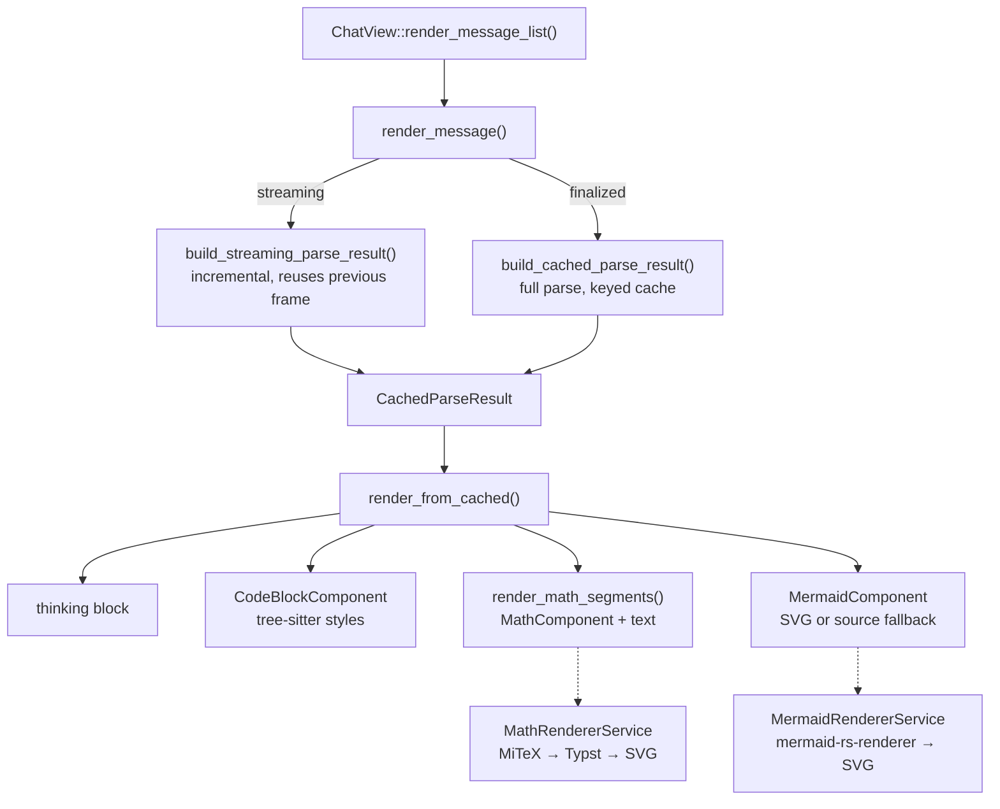

# Rendering system

**When to read this:** You are changing how assistant text becomes GPUI elements —
thinking blocks, code, math, mermaid — or debugging a re-parse on every frame.

## Architecture overview

The rendering pipeline is a multi-stage transformation:

```
Raw LLM text
  → parse_content_segments()     extract <think> blocks
  → parse_markdown_segments()    extract fenced code blocks
  → parse_math_segments()        extract LaTeX expressions
  → CachedParseResult            structured, cacheable IR
  → render_from_cached()         GPUI element tree
```

Every message passes through the pipeline once (or incrementally while streaming).
The result is cached as a `CachedParseResult`, so later GPUI frames read from the
cache instead of re-parsing.

**Key design principle:** parsing and rendering are separated. Parsing lives in
`views/message_parsing.rs` and `views/math_parser.rs` (pure functions, independently
testable); GPUI element construction lives in `views/message_component.rs` and
`views/message_math_render.rs`, with one component module per block kind
(`code_block_component.rs`, `math_renderer.rs`, `mermaid_component.rs`). The caches
are in `views/parsed_cache.rs`. All paths are under `crates/chatty-gpui/src/chatty/`.



## Pipeline stages

### Stage 1: content segment extraction

`parse_content_segments()` splits the message at `<think>`, `<thinking>` and
`<thought>` tag boundaries. An unclosed tag (common while streaming) is treated as an
incomplete thinking block.

```rust
enum ContentSegment {
    Text(String),
    Thinking(String),
}
```

### Stage 2: markdown segment extraction

`parse_markdown_segments(text, streaming)` uses `CODE_BLOCK_REGEX` to pull out fenced
code blocks. In streaming mode it also recognises an opening fence with no closing
fence yet (`detect_incomplete_code_block()`).

```rust
enum MarkdownSegment {
    Text(String),
    CodeBlock { language: Option<String>, code: String },
    IncompleteCodeBlock { language: Option<String>, code: String },  // streaming only
}
```

### Stage 3: math segment analysis

`parse_math_segments(text)` scans each text segment for LaTeX delimiters — inline
`$…$` and `\(…\)`; block `$$…$$`, `\[…\]`, ` ```math `, ` ```latex `; and
`\begin{equation}` / `align` / `cases` environments. It handles escaped dollars,
nested environments with depth tracking, and decides block-vs-inline for `$$` from
the surrounding blank lines.

```rust
enum MathSegment {
    Text(String),
    InlineMath(String),
    BlockMath(String),
}
```

### Stage 4: cache building

`build_cached_parse_result()` applies the expensive work once per message: tree-sitter
syntax highlighting for code blocks (`syntax_highlighter::highlight_code`), math
parsing for text segments, and `MermaidRendererService::render_to_svg_file()` for
` ```mermaid ` blocks.

```rust
struct CachedParseResult {
    segments: Vec<CachedContentSegment>,
}

enum CachedContentSegment {
    Text(Vec<CachedMarkdownSegment>),
    Thinking(String),
}

enum CachedMarkdownSegment {
    TextWithMath(Vec<MathSegment>),
    CodeBlock(CachedCodeBlock),           // language + code + pre-computed styles
    IncompleteCodeBlock { language, code },
    MermaidDiagram { source, svg_path: Option<PathBuf> },
}
```

### Stage 5: element construction

`render_from_cached()` dispatches each `CachedMarkdownSegment` to its component:
`CodeBlock` and `IncompleteCodeBlock` to `CodeBlockComponent` (the latter with no
highlight styles), `TextWithMath` to `render_math_segments()` (which interleaves
`MathComponent` images with text), and `MermaidDiagram` to `MermaidComponent`, which
falls back to the monospace source when no SVG was produced.

Math SVGs come from `MathRendererService` in chatty-core (LaTeX → MiTeX → Typst →
SVG, theme colour injected, cached on disk; see the Math Cache notes in
[CLAUDE.md](https://github.com/boersmamarcel/chatty2/blob/main/CLAUDE.md)). Mermaid SVGs come from `MermaidRendererService`
(`mermaid-rs-renderer`, in-process, output sanitised and cached on disk).

## Caching strategy

### Cache key

```rust
struct ContentCacheKey(u64);  // hash(content + is_dark_theme)
```

The key includes the theme mode because highlight styles are theme-dependent; a
message that is viewed in both themes gets two entries.

### Cache lifecycle

`ChatView` owns both caches and passes them into rendering through
`MessageRenderCaches`:

```rust
struct MessageRenderCaches<'a> {
    parsed: &'a mut ParsedContentCache,              // finalized messages
    streaming: &'a mut Option<StreamingParseState>,  // the current stream only
}
```

**Finalized messages** are looked up in `ParsedContentCache` by `ContentCacheKey`; on a
miss, `build_cached_parse_result()` runs once and the result is inserted.

**Streaming messages** use `StreamingParseState` (next section). When the stream
finalises, the streaming state is dropped and the finalized content enters the
persistent cache on its next render.

On each frame `render_message_list()` moves `streaming_parse_cache` out of `self`,
hands it only to the message that is actually streaming (every other message gets a
throwaway `&mut None`), and moves it back afterwards, so the incremental state is
never shared between messages.

### Eviction and invalidation

`ParsedContentCache` is bounded to `MAX_ENTRIES` (200) by insertion order.

| Event | Action |
|:---|:---|
| Conversation switch (`load_history`, `clear_messages`) | `parsed_cache.clear()`, `streaming_parse_cache = None` |
| Stream finalisation | `streaming_parse_cache = None` |
| Theme change | New `ContentCacheKey`; old entries age out |

## Streaming incremental reuse

While streaming, content only grows at the end. `build_streaming_parse_result()`
exploits that with two levels of reuse.

**Level 1 — content segments.** If the segment count is unchanged and the content only
grew, every segment except the last is cloned from the previous `StreamingParseState`;
only the last is re-parsed.

```
Previous: [Thinking("..."), Text("stable text"), Text("growing...")]
Current:  [Thinking("..."), Text("stable text"), Text("growing... more")]
                                                       ↑ only this re-parsed
```

**Level 2 — markdown segments.** Within that last text segment, if the markdown
segment count is unchanged, all but the last markdown segment are reused. Completed
code blocks are matched by `try_reuse_code_block()` (language + code equality) so
their tree-sitter styles are not recomputed.

```rust
struct StreamingParseState {
    result: CachedParseResult,
    content_len: usize,            // growth detection
    content_segment_count: usize,  // level-1 reuse
    last_text_md_count: usize,     // level-2 reuse
}
```

**Transition cost.** When a segment count changes — a fence closes, a think tag
completes — the affected segment is re-parsed from scratch
(`parse_content_segment_streaming_fresh()`) for that one frame, and incremental
reuse resumes on the next.
