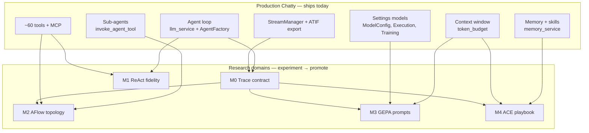

# App ↔ research bridge

**When to read this:** You know either the production Chatty app *or* a research module,
and need to see how they connect — memory, context window, agent loop, traces, sub-agents,
and where SOTA work lands.

Parent frame: [Paper → experiment → product](./paper-to-product-pipeline.md).

## Two views of the same system



**Read left → right** to find which research module touches a production component.
**Read right → left** to find where a promoted mechanism lands in the app.

## Master mapping

| App component | Code location | User-facing | Research module(s) | Promotion path |
|---------------|---------------|-------------|-------------------|----------------|
| **Agent loop** | `services/llm_service.rs`, `factories/agent_factory/` | Every chat turn | [M1 ReAct](./modules/m1-react.md) | Already **default**; strategy variants TBD |
| **LLM tools (~60)** | `tools/` | Tool calls in chat | M1 (action space), M2 (workflow nodes) | Tools ship; topology search offline |
| **Sub-agents** | `sub_agent_tool`, `invoke_agent_tool`, `list_agents_tool` | Agent delegation | [M2 AFlow](./modules/m2-aflow.md) | Winning IR → `FlowSettingsModel` (planned) |
| **Memory store** | `services/memory_service.rs`, `memory.mv2` | `remember` / `search_memory` | [M4 ACE](./modules/m4-ace.md) | Playbook on same store; scope TBD ([AGE-47](https://linear.app/agents-research/issue/AGE-47)) |
| **Skills** | `save_skill_tool`, `SKILL.md` files, `[SKILL]` prefix | Procedures in context | M4 ACE (facts vs procedures split) | Self-improving playbook vs manual skills |
| **Context window** | `token_budget/` + GPUI footer bar | Token fill indicator | M3 cost, M4 prefix-cache | Estimation ships; summarizer stub |
| **Model preamble** | `ModelConfig.preamble` | Settings → model system prompt | M1 few-shot block, [M3 GEPA](./modules/m3-gepa.md) | User-editable; GEPA optimizes offline |
| **Trace / ATIF** | `exporters/types.rs`, `StreamManager` | Training export toggle | [M0 Trace](./modules/m0-trace.md) | Export **setting**; full recorder TBD |
| **Token pricing** | `ModelConfig.cost_per_million_*` | Cost display (sidebar) | M3 GEPA, [cost model](./cost-model.md) | Ships; optimizer accounting uses it |
| **Code sandbox** | `sandbox/`, Monty bridge | Code execution setting | M2 Monty code mode (future `PythonRepr`) | Subprocess today; pause/resume deferred |
| **Conversation history** | `ConversationsStore`, SQLite | Chat threads | All modules (trace input) | Ships; compaction/summary future |
| **Training export** | `TrainingSettingsModel`, exporters | Opt-in ATIF/JSONL | M0 round-trip, M3/M4 offline | `atif_auto_export` **setting** |

Full settings field map: [settings integration map](./settings-integration-map.md).

---

## Agent loop & streaming

**Production today**

The ReAct-shaped loop runs in `chatty-core`: `AgentFactory` builds a `rig-agent` client,
`llm_service` streams multi-turn tool calls, and GPUI's `StreamManager` owns lifecycle
(cancel, token usage, trace JSON) without duplicating response text.

| Concern | Doc | Key files |
|---------|-----|-----------|
| Stream lifecycle | [stream-manager.md](../stream-manager.md) | `chatty-gpui/.../stream_manager.rs` |
| Entity wiring | [entity-communication.md](../entity-communication.md) | `app_controller/` |
| Provider agents | [architecture-overview.md](../architecture-overview.md) | `factories/agent_factory/` |

**Research touchpoints**

| Module | What changes | Status |
|--------|--------------|--------|
| [M1](./modules/m1-react.md) | Per-step `ModuleId` in trace; CoT/Act/SC variants for eval | Fidelity WIP |
| [M0](./modules/m0-trace.md) | Hook + rig-tap capture → `Trajectory`; no hand-rolled loop | Not started |
| [M2](./modules/m2-aflow.md) | Interpreter replaces flat loop with saved workflow IR | Not started |

**Reserved:** `Strategy` backoff rule ([`RESERVED.md`](../../RESERVED.md)) — affects loop
termination only; loop body is not rewritten.

---

## Memory, skills & playbook (M4)

**Production today**

Persistent memory uses memvid (`memory.mv2`). The agent gets `remember` and
`search_memory`; skills are stored with a `[SKILL]` title prefix or as filesystem
`SKILL.md` files. First message of each conversation triggers automatic recall.

| Concern | Doc | Key files |
|---------|-----|-----------|
| Memory architecture | [agent-memory.md](../agent-memory.md) | `memory_service.rs`, `remember_tool.rs` |
| Skill tools | — | `save_skill_tool.rs`, `search_memory_tool.rs` |
| Toggle | — | `ExecutionSettingsModel.memory_enabled` |

**Research touchpoints (ACE)**

| Paper concept | Production analogue | Gap |
|---------------|----------------------|-----|
| Sectioned playbook | Facts vs `[SKILL]` procedures | No Reflector/Curator yet |
| Delta ops + deterministic `apply` | Manual `remember` / `save_skill` | No execution-feedback merge |
| Grow-and-refine / de-dup | Unbounded memvid growth | **Production eviction policy needed** |
| Prompt-cache prefix stability | Stable skill ordering in search results | Byte-stable serialization TBD |

**Promotion:** playbook runtime likely a **setting** ([AGE-47](https://linear.app/agents-research/issue/AGE-47) scope: global / per-model / per-conversation).

---

## Context window & token budget

**Production today**

Before each LLM call, Chatty BPE-estimates preamble + tools + history against
`ModelConfig.max_context_window`. The footer bar shows fill level; actual token counts
patch in after the stream completes.

| Concern | Doc | Key files |
|---------|-----|-----------|
| Token tracking | [token-tracking.md](../token-tracking.md) | `token_budget/`, `GlobalTokenBudget` |
| Response reserve | — | `TokenTrackingSettings.response_reserve` (default 4096) |
| Summarization | — | `summarizer.rs` — **stub** |

**Research touchpoints**

| Module | Connection |
|--------|------------|
| [M3 GEPA](./modules/m3-gepa.md) | Shorter optimized preambles affect context headroom; cost formula uses same token counts |
| [M4 ACE](./modules/m4-ace.md) | Playbook growth competes for context; paper assumes prompt-cache prefix reuse |
| [M0](./modules/m0-trace.md) | `RolloutBudget` extends token accounting for train vs validation rollouts |

**Future product link:** conversation compaction (summarizer) is the natural place to
apply ACE grow-and-refine eviction when playbook + history exceed pressure thresholds —
not built yet.

---

## Model config & prompts (M1, M3)

**Production today**

Each model has a persisted `ModelConfig`: preamble (system prompt), temperature, context
limit, per-million token pricing, multimodal flags.

```rust
// crates/chatty-core/src/settings/models/models_store.rs
pub struct ModelConfig {
    pub preamble: String,
    pub temperature: f32,
    pub max_context_window: Option<i32>,
    pub cost_per_million_input_tokens: Option<f64>,
    pub cost_per_million_output_tokens: Option<f64>,
    // ...
}
```

**Research touchpoints**

| Field | M1 | M3 |
|-------|----|----|
| `preamble` | Few-shot exemplar stable prefix | GEPA optimization target |
| `temperature` | Paper regimes | Fixed during GEPA search |
| `cost_per_million_*` | — | Optimizer cost sheet ([cost-model.md](./cost-model.md)) |

**Promotion:** GEPA output → preamble per model (**setting**); apply via [AGE-45](https://linear.app/agents-research/issue/AGE-45).

---

## Traces, ATIF & training export (M0)

**Production today**

Conversations export to ATIF v1.6 (`exporters/types.rs`). `StreamManager` holds
`trace_json` per stream. `TrainingSettingsModel` toggles auto-export after each
assistant response.

| Setting | Default | Purpose |
|---------|---------|---------|
| `atif_auto_export` | off | Write ATIF JSON after completion |
| `jsonl_auto_export` | off | SFT/DPO JSONL export |

**Research touchpoints**

| Gap | Module | Why it matters |
|-----|--------|----------------|
| No `Deserialize` on ATIF types | M0 | Reflection must read traces back |
| No per-step `ModuleId` | M0 | GEPA credit assignment |
| No `FeedbackFn` | M0 | GEPA `µ_f`, ACE reflector input |
| Full vs no retention | M0 | `Recorder` trait; no-op in release builds |

Deep dive: [M0 Trace module page](./modules/m0-trace.md), [crate-promises-chatty-trace](./crate-promises-chatty-trace.md).

---

## Tools, sub-agents & workflow (M1, M2)

**Production today**

~60 native tools plus MCP integrations. Sub-agent tools compose other agents from the
registry. Execution settings control workspace path, approval mode, and sandbox.

| Tool cluster | Examples | Research use |
|--------------|----------|--------------|
| Search / fetch | `search_web`, `fetch` | M1 WikiEnv adapter (paper fidelity) |
| Code | `run_command`, sandbox | M2 Programmer operator |
| Agents | `invoke_agent`, `sub_agent` | M2 Ensemble / Review-and-Revise nodes |
| Memory | `remember`, `search_memory` | M4 playbook backing store |

**Research touchpoints (AFlow)**

| Production substrate | M2 uses it as |
|---------------------|---------------|
| `tool_registry` / `tool_collector` | Workflow node targets |
| `sub_agent_tool` | Ensemble branches |
| `IrRepr` interpreter (planned) | Executes saved topology |

Monty **code mode** (`sandbox/monty_bridge.rs`) could become `PythonRepr` for AFlow —
interface exists, VM not wired. See [monty-sandbox.md](../monty-sandbox.md).

---

## Optimizer & offline runs (M2, M3)

**Not in the request path.** Search runs via `chatty-optimize` (planned CLI:
`chatty-tui --optimize`, [AGE-44](https://linear.app/agents-research/issue/AGE-44)).

| Optimizer | Reads from app | Writes to app |
|-----------|----------------|---------------|
| GEPA (M3) | Traces, `ModelConfig`, cost fields | `preamble` candidates |
| AFlow (M2) | Traces, sub-agent registry | Workflow IR JSON |
| ACE offline (M4) | Traces, memory store | Playbook delta ops |

Stage B evals run in [`harbor-chatty`](../../../harbor-chatty), not inside the app binary.

---

## Quick lookup: research module → app landing

| Module | Lands in app at… | Architecture doc |
|--------|------------------|-------------------|
| [M0 Trace](./modules/m0-trace.md) | `exporters/`, `StreamManager`, future `Recorder` | [stream-manager.md](../stream-manager.md) |
| [M1 ReAct](./modules/m1-react.md) | `llm_service.rs`, `agent_factory/` | [architecture-overview.md](../architecture-overview.md) |
| [M2 AFlow](./modules/m2-aflow.md) | Sub-agent tools + future `FlowSettingsModel` | [component-map.md](../component-map.md) |
| [M3 GEPA](./modules/m3-gepa.md) | `ModelConfig.preamble` | [settings-integration-map](./settings-integration-map.md) |
| [M4 ACE](./modules/m4-ace.md) | `memory_service`, skill tools | [agent-memory.md](../agent-memory.md) |

## Related

- [Component map](../component-map.md) — crate/module/entity diagrams
- [System overview](../system-overview.md) — three-layer mental model
- [Module pages](./modules/index.md) — per-paper fidelity and eval protocol
- [Promotion log](./promotion-log.md) — Marcel's ship decisions
- [Experiment protocol](./experiment-protocol.md) — Stage A/B bar
