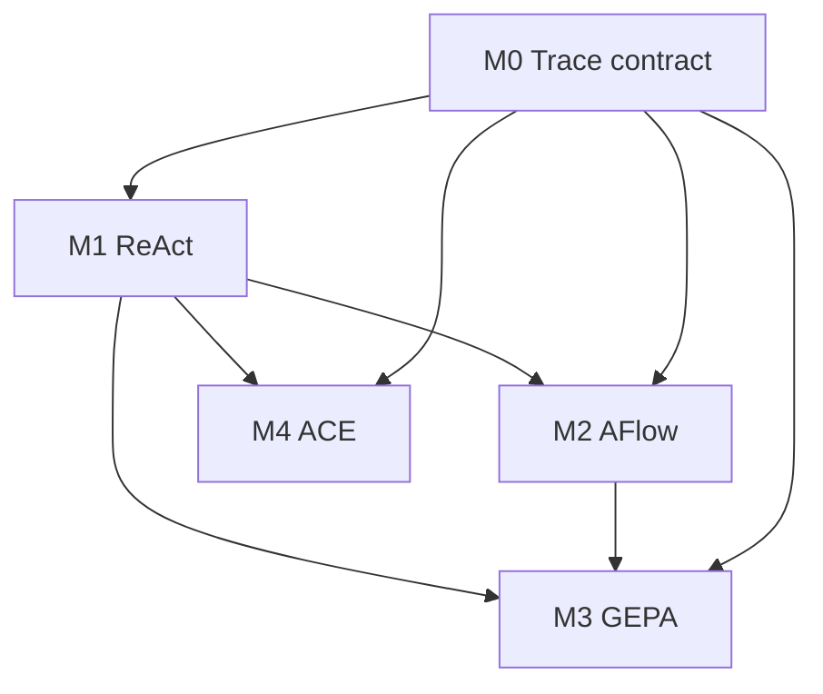

# Research modules (M0–M4)

**When to read this:** You need a per-paper view of what is being built, where it lands in
Chatty, and how far along the pipeline each module is.

Parent frame: [Paper → experiment → product](../paper-to-product-pipeline.md).

**App bridge:** [App ↔ research bridge](../app-research-bridge.md) — maps production
components (memory, context window, agent loop, …) to these modules.

| Module | Paper | Crate(s) | Stage | Promotion |
|--------|-------|----------|-------|-----------|
| [M0 Trace](./m0-trace.md) | — (contract layer) | `chatty-trace` | Not started | Pending |
| [M1 ReAct](./m1-react.md) | Yao et al. ICLR 2023 | `chatty-core`, `chatty-trace` | Loop ships; fidelity WIP | Loop = default |
| [M2 AFlow](./m2-aflow.md) | Zhang et al. ICLR 2025 Oral | `chatty-flow`, `chatty-optimize` | Not started | Pending |
| [M3 GEPA](./m3-gepa.md) | Agrawal et al. ICLR 2026 Oral | `chatty-optimize` | Not started | Pending |
| [M4 ACE](./m4-ace.md) | Zhang et al. ICLR 2026 | `chatty-playbook` | Not started | Pending |

**M5 (DGM)** lives in the separate `agenticloop` repo — not documented here. See
[`RESERVED.md`](../../../RESERVED.md).

## Status legend

| Field | Values |
|-------|--------|
| **Stage** | `not started` · `stage-a` · `stage-b` · `promotion-pending` |
| **Promotion** | `pending` · `rejected` · `setting` · `default` — filled in [promotion log](../promotion-log.md) by Marcel only |

## Cross-module work

Head-to-head comparisons (ACE vs GEPA rollout counts, combined workflows) belong in
[AGE-21](https://linear.app/agents-research/issue/AGE-21) — human interpretation only.
Agents build harness plumbing; Marcel runs and writes up results.
