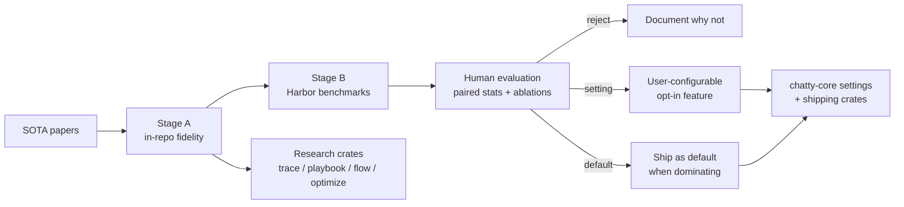
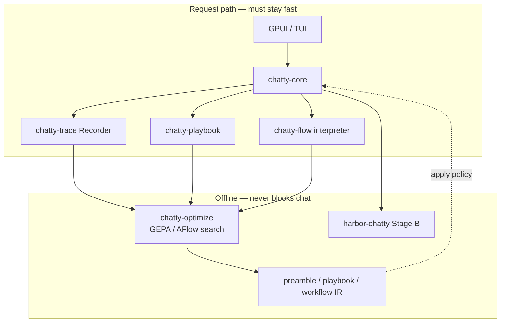

# Paper → experiment → product pipeline

**When to read this:** You need the end-to-end story of how SOTA agentic papers land in
Chatty — what gets experimented on, what Marcel decides, and what becomes production code
vs a user setting vs nothing.

This is the **organizing frame** for research documentation. Individual papers, crate
promises, and ADRs hang off it.

## The flow

**Rule:** papers inform the design; **experiments decide** what ships. Reproducing a paper
is necessary but not sufficient — cross-module results (AGE-21) and product constraints
(AGE-26) filter what becomes Chatty.

## Two experiment stages

| Stage | Where | Purpose | Who interprets results |
|-------|-------|---------|------------------------|
| **Stage A** | `chatty2` research crates | Fidelity to each paper's mechanism; trace contracts; in-process optimizers | Marcel (`owner:human` / `owner:pair` on reserved symbols) |
| **Stage B** | [`harbor-chatty`](../../../harbor-chatty) (Harbor) | Containerized coding/env benchmarks (HumanEval, Polyglot, AppWorld, …) | Marcel — agents build harness plumbing only |

Stage A answers *"did we implement the idea correctly?"* Stage B answers *"does it help on
tasks users care about?"* Neither stage auto-promotes to production.

See [Harbor pivot](./harbor-pivot.md) for why Stage B lives outside this repo.

## Three promotion outcomes

Every paper mechanism ends in exactly one bucket after experimentation:

| Outcome | Meaning | Example (illustrative — decided by experiment) |
|---------|---------|--------------------------------------------------|
| **Rejected** | Mechanism stays in research/optimizer tooling only; not exposed in the app | CoT-SC hybrid backoff as a user-facing strategy if ReAct + tools already wins for Chatty's workloads |
| **Setting** | Available but off by default; user picks per task/model/conversation | `workflow_enabled` + `active_workflow_id` (AFlow IR); ACE playbook scope; optimizer-launched preamble variants |
| **Default** | Becomes the normal path when evidence shows clear dominance | ReAct loop itself (already ships in `chatty-core`); ATIF export when trace retention is explicitly enabled |

**Dominance bar for defaults:** sustained gain on Stage B (or representative in-app tasks),
acceptable cost/latency, and no regression on the production bar (AGE-26). A paper win on
HotpotQA alone does not automatically become a Chatty default.

**Settings surface:** persisted models in `chatty-core` settings (`ModelConfig`, future
`FlowSettingsModel`, playbook storage — see product gate issues below). Optimizer output
(preamble, playbook bullets, workflow IR) lands through an apply policy Marcel must choose
(AGE-45).

## Paper → crate → product landing

| Module | Paper | Primary crate(s) | Ships in app? | Production landing site | Typical promotion |
|--------|-------|------------------|---------------|-------------------------|-------------------|
| **M1** | ReAct (ICLR 2023) | `chatty-core` loop + `chatty-trace` | Loop: yes; strategy variants: eval-only | Existing agent loop; per-step attribution in trace | Loop = **default**; Act/CoT/CoT-SC hybrids = **setting** or eval-only |
| **M2** | AFlow (ICLR 2025) | `chatty-flow` (runtime IR) + `chatty-optimize` (MCTS) | IR interpreter: yes; search: build-time only | Sub-agent composition via saved workflow | Search = offline; winning topology = **setting** (`FlowSettingsModel`) |
| **M3** | GEPA (ICLR 2026) | `chatty-optimize` | No (on-demand / CI) | `ModelConfig.preamble` | Optimized preamble = **setting** per model; apply via review/export (AGE-45) |
| **M4** | ACE (ICLR 2026) | `chatty-playbook` | Yes | Memory / `[SKILL]` store backing | Playbook merge/refine in runtime; grow bounds = production concern; scope = **setting** (AGE-47) |
| **—** | Trace / ATIF contract | `chatty-trace` | Yes (recorder opt-in) | ATIF export + reflection input | Full retention = **setting**; no-op recorder = **default** in release |
| **M5** | DGM | `agenticloop` (separate repo) | No | Never against `chatty2` itself | Stays research — see `RESERVED.md` |

Linear project: [Self-improving chatty2](https://linear.app/agents-research/project/self-improving-chatty2-landing-the-agentic-papers-in-a-real-agent-63694d44-a4d5-4b99-9a71-de31a2701c25).

## Inference path vs offline tooling

**Shipping crates** (`chatty-core`, `chatty-trace`, `chatty-playbook`, `chatty-flow`) are
held to the [production bar](./crate-promises-chatty-trace.md) (AGE-26). **Build-time
crates** (`chatty-optimize`) are held to *correct*, not latency-safe.

## What Marcel owns vs what agents build

| Marcel (human) | Agents |
|----------------|--------|
| Reserved type definitions in `RESERVED.md` (~200 lines containing the idea) | Everything around them (~2000 lines): wiring, tests, loaders, CI |
| Running and interpreting cross-module experiments (AGE-21) | Harness plumbing for those experiments |
| Answering `gate:product-decision` and `gate:reflection` issues | Implementing decided policy |
| Choosing reject / setting / default per mechanism | Documenting the decision in ADRs |
| Posting benchmark numbers before agents may cite them | Building cost sheets and paired-stats tooling |

Agents must not implement reserved symbols, close gate issues, or predict benchmark outcomes.

## Open product gates (block promotion UX)

These Marcel decisions define *how* optimized artifacts reach users:

| Issue | Question |
|-------|----------|
| [AGE-44](https://linear.app/agents-research/issue/AGE-44) | Where users start optimizer runs (GPUI vs `chatty-tui --optimize` vs CI) |
| [AGE-45](https://linear.app/agents-research/issue/AGE-45) | Auto-apply vs review-and-approve vs export-only for optimized artifacts |
| [AGE-46](https://linear.app/agents-research/issue/AGE-46) | Dataset bundling in the product binary |
| [AGE-47](https://linear.app/agents-research/issue/AGE-47) | Playbook scope: global vs per-model vs per-conversation |

Project: [Chatty agentic product integration](https://linear.app/agents-research/project/chatty-agentic-product-integration-d9e57d61-eae2-46c1-a6ee-d8e963741449).

## Documentation layers for this pipeline

Rigorous docs mirror the pipeline — each layer answers a different question:

| Layer | Question | Location | Status |
|-------|----------|----------|--------|
| **Pipeline** | Why does research exist and how does it become product? | This page | Active |
| **Architecture** | What runs where at runtime? | [`system-overview.md`](../system-overview.md), [`component-map.md`](../component-map.md) | Built |
| **Paper fidelity** | What did the paper actually claim? | [`research/modules/`](./modules/index.md) | Built (M0–M4) |
| **Crate promises** | What does each shipping crate guarantee? | [`crate-promises-*.md`](./crate-promises-chatty-trace.md) | Stubs until Stage A |
| **ADRs** | Why this fork (Harbor, AppWorld, cost model)? | [`docs/research/*.md`](./harbor-pivot.md) | Partial |
| **Promotion record** | What shipped, as what, with what evidence? | [`promotion-log.md`](./promotion-log.md) — Marcel updates | Template ready |
| **Settings map** | Which settings map to which mechanisms? | [`settings-integration-map.md`](./settings-integration-map.md) | Built (gates open) |
| **Experiment protocol** | How to run Stage A/B rigorously? | [`experiment-protocol.md`](./experiment-protocol.md) | Built |
| **Reference** | What can I configure today? | Generated tools/CLI/env pages | Partial |

### Completed doc layers

1. ~~**Per-paper module pages**~~ — [`modules/`](./modules/index.md)
2. ~~**Promotion log**~~ — [`promotion-log.md`](./promotion-log.md)
3. ~~**Settings integration map**~~ — [`settings-integration-map.md`](./settings-integration-map.md)
4. ~~**Experiment protocol**~~ — [`experiment-protocol.md`](./experiment-protocol.md)

### Still open

1. **Link checker CI** (DOC-50)
2. **README → `/user/` migration** (DOC-15, human review)

## Related reading

- [`RESERVED.md`](../../RESERVED.md) — symbols agents must not implement
- [Production bar (AGE-26)](https://linear.app/agents-research/issue/AGE-26) — shipping crate requirements
- [Cross-module experiments (AGE-21)](https://linear.app/agents-research/issue/AGE-21) — human-only interpretation
- [`cost-model.md`](./cost-model.md) — optimizer economics
- [`AGENTS.md`](../../AGENTS.md) — agent quick-start and workspace map
