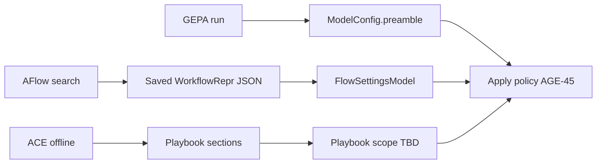

# Settings integration map

**When to read this:** You need to know which user-facing settings correspond to which
research mechanisms — and which are still blocked on product decisions.

Parent: [Paper → product pipeline](./paper-to-product-pipeline.md).

## Today (shipping)

| Settings model | Field(s) | Research link | Promotion today |
|----------------|----------|---------------|-----------------|
| `ModelConfig` | `preamble` | M1 few-shot block; M3 GEPA target | User-editable **default** |
| `ModelConfig` | `temperature`, `cost_per_million_*` | M3 cost accounting | Ships |
| `ModelConfig` | `supports_images`, `supports_pdf`, … | — | Ships (unrelated) |
| `TrainingSettingsModel` | `atif_auto_export` | M0 trace export toggle | **Setting** |

Location: `crates/chatty-core/src/settings/models/`.

## Planned (product integration project)

| Settings model | Field(s) | Research link | Gate issue | Status |
|----------------|----------|---------------|------------|--------|
| `FlowSettingsModel` | `workflow_enabled`, `active_workflow_id` | M2 AFlow IR | [AGE-54](https://linear.app/agents-research/issue/AGE-54) | Not implemented |
| Playbook storage | scope TBD | M4 ACE | [AGE-47](https://linear.app/agents-research/issue/AGE-47) | **Blocked — Marcel decides** |
| Optimizer launcher | CLI vs GPUI vs CI | M2, M3 offline runs | [AGE-44](https://linear.app/agents-research/issue/AGE-44) | **Blocked** |
| Artifact apply policy | auto / review / export | M2 IR, M3 preamble, M4 deltas | [AGE-45](https://linear.app/agents-research/issue/AGE-45) | **Blocked** |
| Dataset paths | bundled vs user-supplied | Stage A loaders | [AGE-46](https://linear.app/agents-research/issue/AGE-46) | **Blocked** |

## Optimizer artifacts → settings (when gates close)

## Ablation flags (research / CLI, not GPUI v1)

In `chatty-optimize` — for reproduction, not end-user settings until promoted:

| Flag area | Purpose | Module |
|-----------|---------|--------|
| `SelectBestCandidate` vs Pareto | GEPA ablation | M3 |
| Merge on/off | GEPA+Merge | M3 |
| Strategy enum | ReAct / CoT / CoT-SC / hybrids | M1 |
| DGM archive disable | M5 in agenticloop | — |

See `crates/chatty-optimize/src/ablation.rs`.

## Persistence paths

| Data | Typical path |
|------|--------------|
| Models + preambles | JSON via `models_repository` |
| General settings | JSON via `general_settings_repository` |
| Conversations | SQLite |
| Agent memory / skills | memvid via `memory_service` |
| Playbook (future) | TBD — [AGE-47](https://linear.app/agents-research/issue/AGE-47) |

## Related

- [Promotion log](./promotion-log.md) — verdict when a mechanism ships as setting vs default
- [Module pages](./modules/index.md)
- [Chatty agentic product integration (Linear)](https://linear.app/agents-research/project/chatty-agentic-product-integration-d9e57d61-eae2-46c1-a6ee-d8e963741449)
