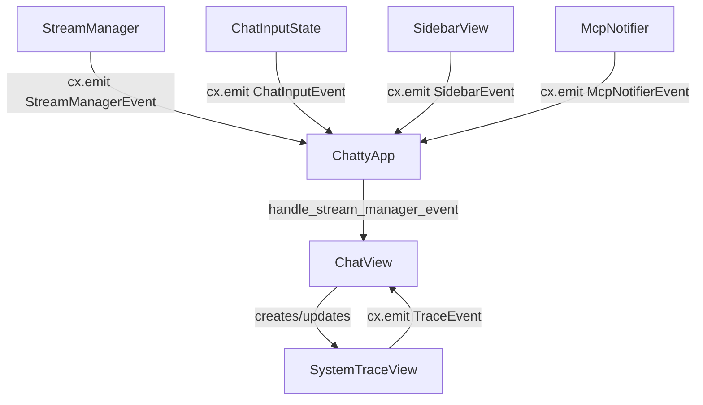
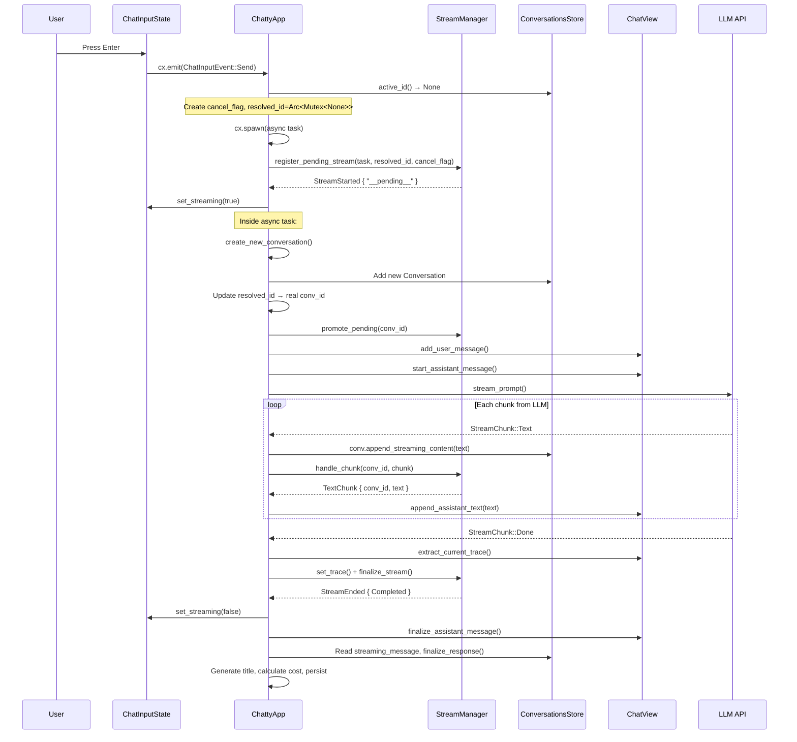
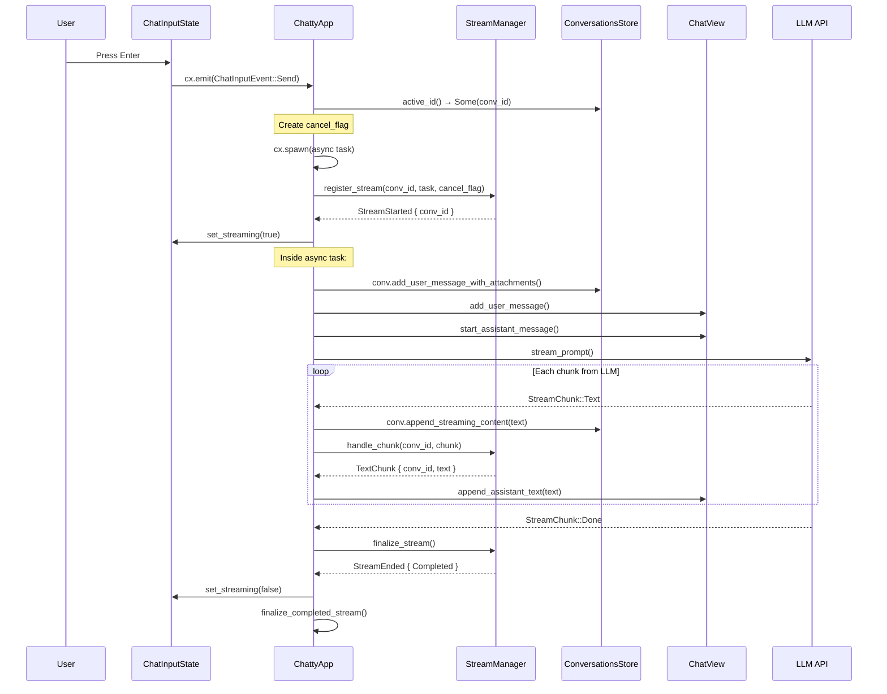
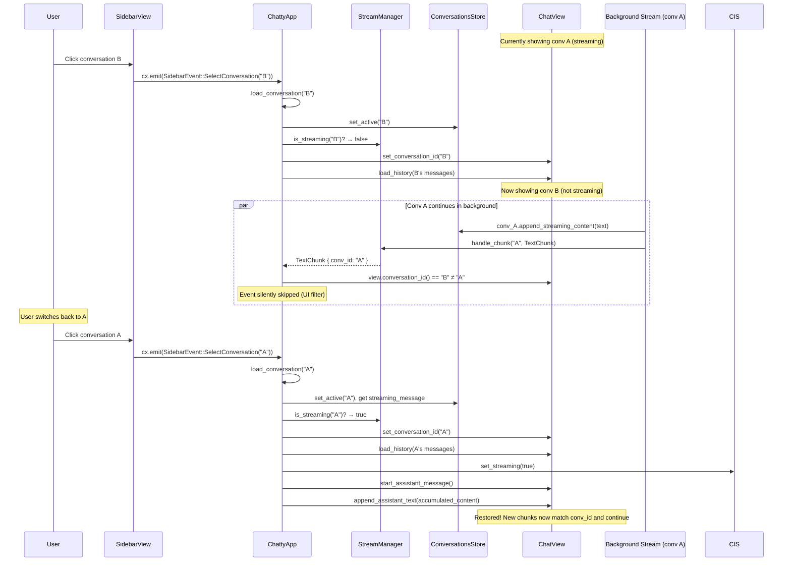
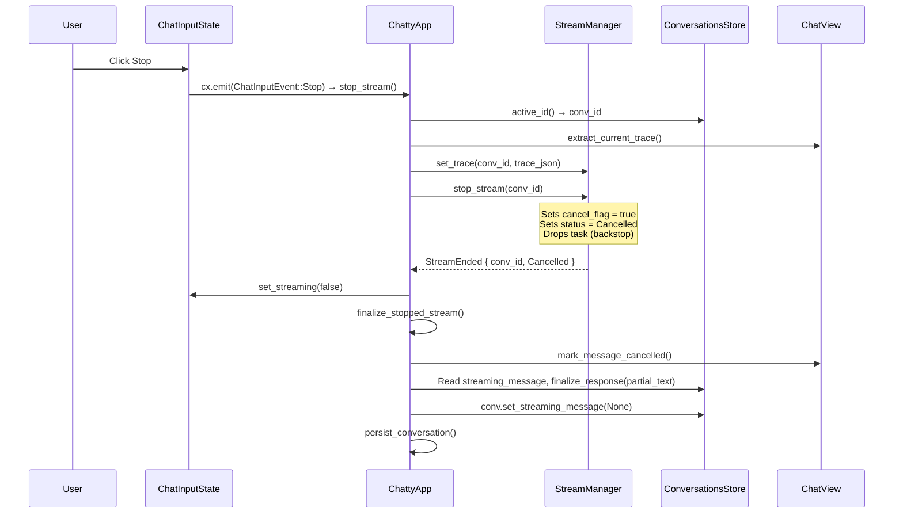
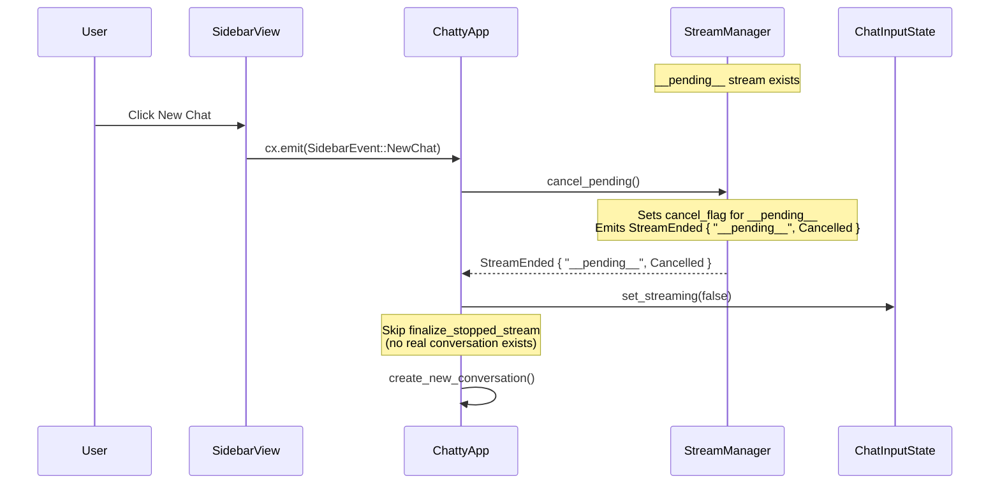

# StreamManager Architecture

The StreamManager is a centralized GPUI entity that manages stream lifecycle (status, cancellation, token usage, trace), emits typed events for decoupled UI updates, and uses cancellation tokens for graceful shutdown. It enables concurrent multi-conversation streaming where background streams continue accumulating data even when the UI is showing a different conversation.

**Key design principle:** StreamManager does NOT accumulate response text. Text accumulation is the sole responsibility of `ConversationsStore.streaming_message`, ensuring a single source of truth and avoiding dual-write divergence.

## Entity Ownership

```
GlobalStreamManager (GPUI Global)
  └── Entity<StreamManager>
        └── HashMap<String, StreamState>   (one entry per active stream)
              ├── status: StreamStatus
              ├── token_usage: Option<(u32, u32)>
              ├── trace_json: Option<Value>
              ├── task: Option<Task>
              └── cancel_flag: Arc<AtomicBool>

ConversationsStore (GPUI Global)
  └── HashMap<String, Conversation>
        ├── history: Vec<Message>
        ├── streaming_message: Option<String>   ← single source of truth for streaming text
        ├── agent: AgentClient
        ├── model_id, title, token_usage, ...
        └── system_traces: Vec<Option<Value>>

ChattyApp (GPUI Entity, window root)
  ├── Entity<ChatView>
  │     ├── messages: Vec<DisplayMessage>
  │     ├── conversation_id: Option<String>   ← which conversation the UI is showing
  │     ├── pending_approval: Option<PendingApprovalInfo>
  │     └── Entity<ChatInputState>
  │           ├── is_streaming: bool
  │           ├── selected_model_id, attachments
  │           └── emits: ChatInputEvent (Send, ModelChanged, Stop)
  └── Entity<SidebarView>
        ├── conversations list
        └── emits: SidebarEvent (NewChat, OpenSettings, SelectConversation, ...)
```

## Event Subscription Chain



All entity-to-entity communication uses `EventEmitter`/`cx.subscribe()`. The 4 subscriptions are set up in `ChattyApp::setup_callbacks()`:

```rust
cx.subscribe(&manager, |app, _mgr, event: &StreamManagerEvent, cx| {
    app.handle_stream_manager_event(event, cx);
}).detach();
```

## StreamManagerEvent Variants

| Event | Emitted by | Handler action |
|-------|-----------|----------------|
| `StreamStarted` | `register_stream`, `register_pending_stream` | Sets `ChatInputState.is_streaming = true` (deferred) |
| `TextChunk` | `handle_chunk` | `ChatView.append_assistant_text()` |
| `ToolCallStarted` | `handle_chunk` | `ChatView.handle_tool_call_started()` |
| `ToolCallInput` | `handle_chunk` | `ChatView.handle_tool_call_input()` |
| `ToolCallResult` | `handle_chunk` | `ChatView.handle_tool_call_result()` |
| `ToolCallError` | `handle_chunk` | `ChatView.handle_tool_call_error()` |
| `ApprovalRequested` | `handle_chunk` | `ChatView.handle_approval_requested()` |
| `ApprovalResolved` | `handle_chunk` | `ChatView.handle_approval_resolved()` |
| `TokenUsage` | `handle_chunk` | No-op (processed during finalization) |
| `StreamEnded` | `finalize_stream`, `stop_stream`, `cancel_pending`, `stop_all` | Resets streaming state; dispatches to `finalize_completed_stream` or `finalize_stopped_stream`; clears `Conversation.streaming_message` |

All events carry a `conversation_id`. The handler checks `view.conversation_id() == Some(conversation_id)` before forwarding to ChatView -- events for non-displayed conversations are silently skipped at the UI level, while data-level operations (finalize, persist) always execute.

## Text Accumulation: Single Source of Truth

During streaming, text is accumulated in **one** location only:

```
StreamChunk::Text("hello")
    │
    ├──► ConversationsStore: conv.append_streaming_content("hello")
    │    Single source of truth for streaming text.
    │    - Used for background stream restoration when switching conversations
    │    - Read at finalization to save the complete response to history
    │
    └──► StreamManager: handle_chunk() emits TextChunk event (pass-through only)
         StreamManager does NOT store the text. It only forwards the event
         to the UI subscription for real-time display.
```

At finalization, `finalize_completed_stream` / `finalize_stopped_stream` reads the accumulated text from `Conversation.streaming_message`, calls `conv.finalize_response()` to move it into history, then clears `streaming_message`.

This design avoids dual-write divergence where two copies of the same text could fall out of sync due to independent error handling paths.

## Sequence Diagrams

### Send message (new conversation)



### Send message (existing conversation)



### Switch conversation during active stream



### Stop stream



### Cancel pending (New Chat while stream starting)



## Cancellation Mechanism

StreamManager uses `Arc<AtomicBool>` cancellation tokens rather than dropping tasks:

```
cancel_flag = Arc<AtomicBool::new(false)>
    │
    ├── Shared with stream loop (cancel_flag_for_loop)
    │   Checked at top of each iteration:
    │     if cancel_flag_for_loop.load(Relaxed) { break; }
    │
    └── Owned by StreamState
        Set by stop_stream / cancel_pending:
          state.cancel_flag.store(true, Relaxed);
```

The stream exits cleanly on the next iteration rather than being abruptly terminated mid-chunk. The task `drop()` in `stop_stream` is a backstop in case the loop doesn't check the flag in time.

## Pending Stream Promotion

When sending a message creates a new conversation, there's a window where the stream starts before the conversation ID is known:

```
1. register_pending_stream()     → stored under "__pending__" key
2. Async: create_new_conversation() → returns real conv_id
3. promote_pending(conv_id)      → moves entry from "__pending__" to conv_id
```

The `pending_resolved_ids` map tracks the `Arc<Mutex<Option<String>>>` so that `stop_stream` and `is_streaming` can match a pending stream to its resolved conversation ID even before `promote_pending` is called.

## Lifecycle: Init and Shutdown

**Init** (`main.rs`): StreamManager is created as a GPUI entity and stored as a **strong** `Entity<StreamManager>` reference in `GlobalStreamManager`. Using a strong reference (not `WeakEntity`) prevents garbage collection after the initialization closure returns.

**Shutdown** (Quit action): Calls `StreamManager.stop_all()` which iterates all active streams, sets their cancel flags, emits `StreamEnded` for each, and clears the HashMap.
