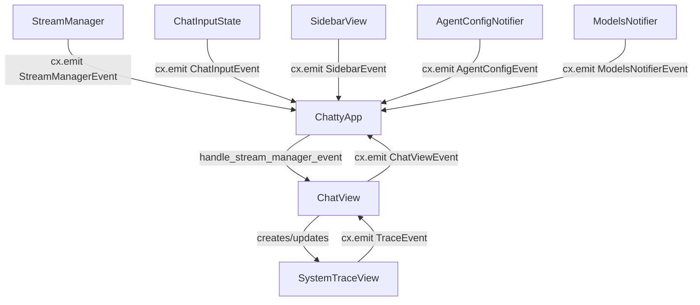
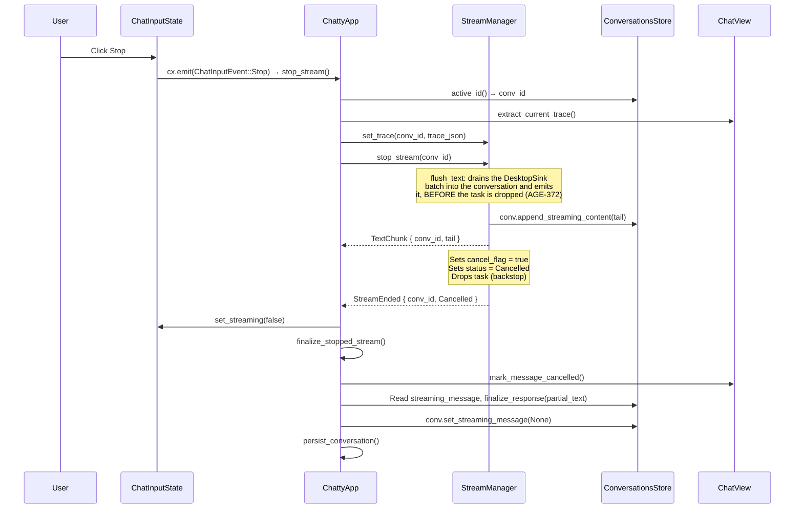
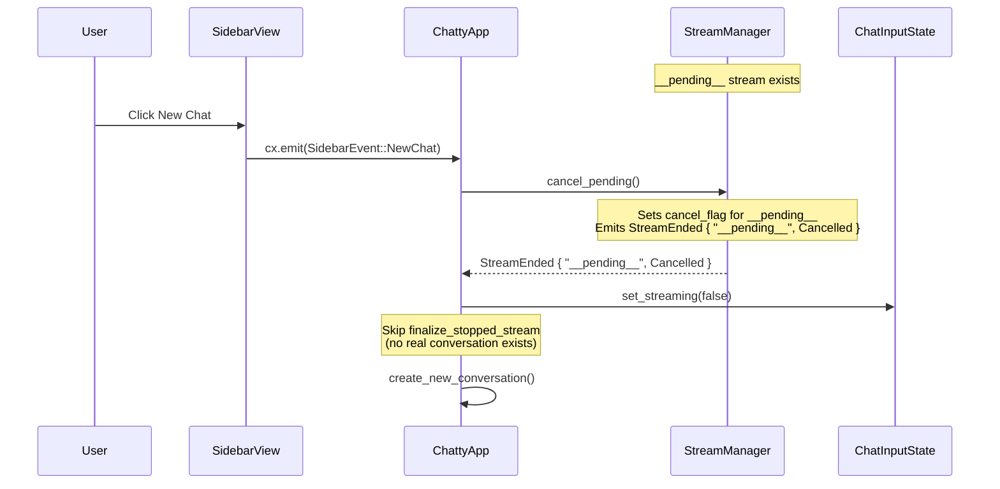

# StreamManager

**When to read this:** You are changing how a desktop LLM turn starts, streams, stops
or finalises, and need to know which entity owns which piece of that lifecycle.

`StreamManager` (`crates/chatty-gpui/src/chatty/models/stream_manager.rs`) is a GPUI
entity that owns the lifecycle of every in-flight LLM stream — status, cancellation,
per-request token usage, trace — emits typed events for decoupled UI updates, and uses
cancellation tokens for graceful shutdown. Because it is conversation-keyed, several
conversations can stream at once: a background stream keeps accumulating while the UI
shows a different conversation.

**Key design principle:** StreamManager does not accumulate response text. Streaming
text lives only in `Conversation.streaming_message` inside `ConversationsStore`, so
there is a single source of truth and no dual-write divergence.

## Entity ownership

```
GlobalStreamManager (GPUI global, strong reference)
  └── Entity<StreamManager>
        ├── streams: HashMap<String, StreamState>   (one entry per active stream)
        │     ├── epoch: u64                       ← distinguishes re-registrations
        │     ├── status: StreamStatus
        │     ├── token_usage: Option<TokenUsage>  ← built from the per-request records
        │     ├── calls: Vec<ApiCallUsage>         ← one per provider request
        │     ├── trace_json: Option<Value>
        │     ├── task: Option<Task>
        │     ├── cancel_flag: Arc<AtomicBool>
        │     ├── pending_artifacts: Option<PendingArtifacts>
        │     ├── text batching buffer (pending_text, last_flush)
        │     └── text_batch: Option<SharedTextBatch>  ← the DesktopSink buffer
        │                                                 one layer upstream
        ├── pending_resolved_ids: HashMap<String, Arc<Mutex<Option<String>>>>
        ├── current_epoch: HashMap<String, u64>
        └── flush_timer: Option<Task<()>>          ← background flush, see below

ConversationsStore (GPUI global)
  └── HashMap<String, Conversation>
        ├── history, agent, model_id, title, token_usage, …
        ├── streaming_message: Option<String>   ← single source of truth for streaming text
        └── system_traces: Vec<Option<Value>>

ChattyApp (GPUI entity, window root)
  ├── Entity<ChatView>
  │     ├── messages: Vec<DisplayMessage>
  │     ├── conversation_id: Option<String>   ← which conversation the UI is showing
  │     ├── pending_approval: Option<PendingApprovalInfo>
  │     └── Entity<ChatInputState>            ← is_streaming; emits ChatInputEvent
  └── Entity<SidebarView>                     ← emits SidebarEvent
```

## Event subscription chain


```mermaid
graph TD
    SM[StreamManager] -->|cx.emit StreamManagerEvent| CA[ChattyApp]
    CA -->|handle_stream_manager_event| CV[ChatView]
    CV -->|creates/updates| STV[SystemTraceView]
    STV -->|cx.emit TraceEvent| CV

    CIS[ChatInputState] -->|cx.emit ChatInputEvent| CA
    SB[SidebarView] -->|cx.emit SidebarEvent| CA
    CV -->|cx.emit ChatViewEvent| CA
    ACN[AgentConfigNotifier] -->|cx.emit AgentConfigEvent| CA
    MN[ModelsNotifier] -->|cx.emit ModelsNotifierEvent| CA
```

All entity-to-entity communication uses `EventEmitter`/`cx.subscribe()`; the
subscriptions are wired in `ChattyApp::setup_callbacks()`:

```rust
cx.subscribe(&manager, |app, _mgr, event: &StreamManagerEvent, cx| {
    app.handle_stream_manager_event(event, cx);
}).detach();
```

## `StreamManagerEvent` variants

| Event | Emitted by | Handler action |
|-------|-----------|----------------|
| `StreamStarted` | `register_stream`, `register_pending_stream` | Marks the conversation as streaming; sets `ChatInputState.is_streaming = true` (deferred) |
| `TextChunk` | `handle_chunk` (batched; first chunk immediate, then at most every `FLUSH_INTERVAL` = 20ms, backstopped by a background timer — see [Text accumulation](#text-accumulation-two-batched-sinks-not-a-pass-through) below) | `ChatView.append_assistant_text()` |
| `ToolCallStarted` / `ToolCallInput` / `ToolCallResult` / `ToolCallError` | `handle_chunk` | `ChatView.handle_tool_call_*()` |
| `ApprovalRequested` / `ApprovalResolved` | `handle_chunk` | `ChatView.handle_approval_*()` |
| `ClarificationRequested` | `handle_chunk` | Records the block on the conversation's streaming trace (so it survives a switch), then `ChatView.handle_clarification_requested()` |
| `TokenUsage` | `handle_chunk` | No-op (usage is processed at finalisation) |
| `StreamEnded` | `finalize_stream`, `stop_stream`, `cancel_pending`, `stop_all` | Resets streaming state; dispatches to `finalize_completed_stream` or `finalize_stopped_stream`; clears `Conversation.streaming_message` |

Every event carries a `conversation_id`. The handler checks
`view.conversation_id() == Some(conversation_id)` before forwarding to `ChatView`, so
events for a conversation that is not on screen are skipped at the UI level while the
data-level work (finalise, persist) always runs.

`StreamEnded` also carries the stream's `epoch`. A protocol follow-up registers the
next stream synchronously right after `finalize_stream` returns, but the event is
delivered on the next effect flush; the handler ignores a `StreamEnded` whose epoch is
not the conversation's current one, so turn N's end cannot tear down turn N+1.

## Text accumulation: two buffering layers, one drained by the other

`Conversation.streaming_message` (inside `ConversationsStore`) is still the single
source of truth for the accumulated response text — that part of the design is
unchanged. What changed (AGE-166) is that *neither* sink is fed one raw LLM chunk
at a time any more, because a raw stream can yield far faster than any display
repaints. There are two buffers, and it matters which timer drains which:

```
raw SessionEvent::Text chunks, arriving as fast as the provider sends them
    │
    ▼
LAYER 1 — TextBatch, shared by DesktopSink and StreamState.text_batch
    Defined in stream_manager.rs; created per turn by run_llm_stream and
    handed to the manager with `attach_text_batch`. `DesktopSink` fills it
    with every raw chunk and flushes the whole accumulated batch as ONE
    SessionEvent::Text when `should_flush_text` says so — the turn's first
    chunk immediately (protects time-to-first-token), then at most once per
    FLUSH_INTERVAL. A non-text event (tool call, approval, TurnEnded, …)
    flushes first, unconditionally, before it is applied/forwarded.
    │
    │  one coalesced batch, not one call per raw chunk
    ▼
    ├──► ConversationsStore (one `update_global`), inside `TextBatch::drain`:
    │    conv.append_streaming_content(batch). Read when switching back to a
    │    background conversation, and at finalisation to move the full
    │    response into history.
    │
    └──► StreamManager.handle_chunk() (one entity update)
             LAYER 2 — StreamState.pending_text: buffers again and emits
             TextChunk when `should_flush_text` says so. Any non-text chunk
             flushes pending text first, so a tool-start row can never
             appear before the sentence that preceded it.
```

Both layers apply the *same* flush policy (`should_flush_text` in
`stream_manager.rs`, `pub(crate)` so `message_ops_internals.rs` can share it)
rather than two independently-tuned ones. Layer 1 exists to cut how often the
hot path pays for an `update_global` + a `StreamManager` entity update; layer 2
is what still governs the UI-facing `TextChunk` emission rate.

**Which timer drains which (AGE-372).** `StreamManager` owns the only timer —
`flush_timer`, spawned lazily by `ensure_flush_timer` and ticking every
FLUSH_INTERVAL until no stream remains. It, and every other flush inside the
manager, goes through one function, `StreamManager::flush_text`, which drains
*layer 1 first* (into `pending_text`) and then emits layer 2. That is why the
manager holds a handle on the sink's batch at all: layer 1 is the layer that
actually buffers, it lives inside the turn's future, and

* a pause after a burst leaves the tail in layer 1 with no further event to
  push it out — only the timer reaching into layer 1 paints it; and
* `stop_stream`, `cancel_pending` and both `register_*_stream` supersede paths
  `drop` the turn's task, taking `DesktopSink` and anything still in layer 1
  with it. Each of them calls `flush_text` *before* the drop, so the tail
  reaches `Conversation.streaming_message` — which is exactly what
  `finalize_stopped_stream` persists — instead of being lost.

`TextBatch::drain` is the single path buffered text takes into the
conversation, so a drain driven by the manager and a flush driven by the sink
cannot disagree about what was applied.

At finalisation, `finalize_completed_stream` / `finalize_stopped_stream` read the
accumulated text from `Conversation.streaming_message`, call
`conv.finalize_response()` to move it into history, then clear `streaming_message`.

## Sequence diagrams

### Send message

```mermaid
sequenceDiagram
    participant U as User
    participant CIS as ChatInputState
    participant CA as ChattyApp
    participant SM as StreamManager
    participant CS as ConversationsStore
    participant CV as ChatView
    participant LLM as LLM API

    U->>CIS: Press Enter
    CIS->>CA: cx.emit(ChatInputEvent::Send)
    CA->>CS: active_id()

    Note over CA: Create cancel_flag

    CA->>CA: cx.spawn(async task)
    CA->>SM: register_stream(conv_id, task, cancel_flag)
    SM-->>CA: StreamStarted { conv_id }
    CA->>CIS: set_streaming(true)

    Note over CA: Inside async task:
    CA->>CS: conv.add_user_message_with_attachments()
    CA->>CV: add_user_message()
    CA->>CV: start_assistant_message()
    CA->>LLM: stream_prompt()

    loop Each raw chunk from LLM
        LLM-->>CA: SessionEvent::Text
        CA->>CA: DesktopSink.text_batch.push(text)
        Note over CA: buffered; only flushed per<br/>should_flush_text (first chunk,<br/>then every FLUSH_INTERVAL)
    end
    Note over CA,SM: On flush (first chunk, every FLUSH_INTERVAL,<br/>or before a non-text event):
    CA->>CS: conv.append_streaming_content(batch)
    CA->>SM: handle_chunk(conv_id, Text(batch))
    SM-->>CA: TextChunk { conv_id, text } (own batching)
    Note over SM: flush_timer ticks every FLUSH_INTERVAL and<br/>drains the sink's batch first, so a stall<br/>after a burst still paints (AGE-372)
    CA->>CV: append_assistant_text(text)

    LLM-->>CA: StreamChunk::Done
    CA->>CV: extract_current_trace()
    CA->>SM: set_trace() + finalize_stream()
    SM-->>CA: StreamEnded { Completed }
    CA->>CIS: set_streaming(false)
    CA->>CV: finalize_assistant_message()
    CA->>CS: session.finish_turn() — commits the reply, prices the usage (AGE-351)
    CA->>CA: Generate title, persist
```

> [!NOTE]
> When no conversation is active yet, the same flow runs with three differences:
> the stream is registered with `register_pending_stream(task, resolved_id, cancel_flag)`
> under the key `"__pending__"`, `StreamStarted` is emitted for `"__pending__"`, and
> the async task first calls `create_new_conversation()`, writes the real id into
> `resolved_id`, and calls `promote_pending(conv_id)` before adding the user message.
> See [Pending stream promotion](#pending-stream-promotion).

### Switch conversation during an active stream

```mermaid
sequenceDiagram
    participant U as User
    participant SB as SidebarView
    participant CA as ChattyApp
    participant SM as StreamManager
    participant CS as ConversationsStore
    participant CV as ChatView
    participant BG as Background stream (conv A)

    Note over CV: Currently showing conv A (streaming)

    U->>SB: Click conversation B
    SB->>CA: cx.emit(SidebarEvent::SelectConversation("B"))
    CA->>CA: load_conversation("B")
    CA->>CS: set_active("B")
    CA->>SM: is_streaming("B")? → false
    CA->>CV: set_conversation_id("B")
    CA->>CV: load_history(B's messages)

    Note over CV: Now showing conv B (not streaming)

    par Conv A continues in background
        BG->>CS: conv_A.append_streaming_content(text)
        BG->>SM: handle_chunk("A", TextChunk)
        SM-->>CA: TextChunk { conv_id: "A" }
        CA->>CV: view.conversation_id() == "B" ≠ "A"
        Note over CA: Event skipped (UI filter)
    end

    Note over U: User switches back to A

    U->>SB: Click conversation A
    SB->>CA: cx.emit(SidebarEvent::SelectConversation("A"))
    CA->>CA: load_conversation("A")
    CA->>CS: set_active("A"), get streaming_message
    CA->>SM: is_streaming("A")? → true
    CA->>CV: set_conversation_id("A")
    CA->>CV: load_history(A's messages)
    CA->>CIS: set_streaming(true)
    CA->>CV: start_assistant_message()
    CA->>CV: append_assistant_text(accumulated_content)

    Note over CV: Restored; new chunks match conv_id again
```

### Stop stream


```mermaid
sequenceDiagram
    participant U as User
    participant CIS as ChatInputState
    participant CA as ChattyApp
    participant SM as StreamManager
    participant CS as ConversationsStore
    participant CV as ChatView

    U->>CIS: Click Stop
    CIS->>CA: cx.emit(ChatInputEvent::Stop) → stop_stream()
    CA->>CS: active_id() → conv_id
    CA->>CV: extract_current_trace()
    CA->>SM: set_trace(conv_id, trace_json)
    CA->>SM: stop_stream(conv_id)

    Note over SM: flush_text: drains the DesktopSink<br/>batch into the conversation and emits<br/>it, BEFORE the task is dropped (AGE-372)
    SM->>CS: conv.append_streaming_content(tail)
    SM-->>CA: TextChunk { conv_id, tail }

    Note over SM: Sets cancel_flag = true<br/>Sets status = Cancelled<br/>Drops task (backstop)

    SM-->>CA: StreamEnded { conv_id, Cancelled }
    CA->>CIS: set_streaming(false)
    CA->>CA: finalize_stopped_stream()
    CA->>CV: mark_message_cancelled()
    CA->>CS: Read streaming_message, finalize_response(partial_text)
    CA->>CS: conv.set_streaming_message(None)
    CA->>CA: persist_conversation()
```

### Cancel pending (New Chat while a stream is starting)


```mermaid
sequenceDiagram
    participant U as User
    participant SB as SidebarView
    participant CA as ChattyApp
    participant SM as StreamManager
    participant CIS as ChatInputState

    Note over SM: __pending__ stream exists

    U->>SB: Click New Chat
    SB->>CA: cx.emit(SidebarEvent::NewChat)
    CA->>SM: cancel_pending()

    Note over SM: Sets cancel_flag for __pending__<br/>Emits StreamEnded { "__pending__", Cancelled }

    SM-->>CA: StreamEnded { "__pending__", Cancelled }
    CA->>CIS: set_streaming(false)

    Note over CA: Skip finalize_stopped_stream<br/>(no real conversation exists)

    CA->>CA: create_new_conversation()
```

## Cancellation mechanism

StreamManager uses `Arc<AtomicBool>` cancellation tokens rather than dropping tasks:

```
cancel_flag = Arc<AtomicBool::new(false)>
    │
    ├── Shared with the stream loop, checked at the top of each iteration:
    │     if cancel_flag.load(Relaxed) { break; }
    │
    └── Owned by StreamState; set by stop_stream / cancel_pending / stop_all:
          state.cancel_flag.store(true, Relaxed);
```

The stream exits cleanly on its next iteration instead of being cut off mid-chunk.
The `task` drop in `stop_stream` is a backstop for a loop that does not observe the
flag in time.

## Pending stream promotion

When sending a message creates a new conversation, the stream starts before the
conversation id is known:

```
1. register_pending_stream()        → stored under the "__pending__" key
2. Async: create_new_conversation() → returns the real conv_id
3. promote_pending(conv_id)         → moves the entry from "__pending__" to conv_id
```

`pending_resolved_ids` keeps the `Arc<Mutex<Option<String>>>` so that `stop_stream`
and `is_streaming` can match a pending stream to its resolved conversation id even
before `promote_pending` runs.

## Lifecycle: init and shutdown

**Init** (`main.rs`): StreamManager is created as a GPUI entity and stored as a
**strong** `Entity<StreamManager>` in `GlobalStreamManager` (a `GlobalStrongEntity`);
a weak reference would let the entity be dropped once the initialisation closure
returns.

**Shutdown** (the Quit action): `StreamManager.stop_all()` sets every cancel flag,
emits `StreamEnded` for each active stream, and clears the map.

## Research connection (M0 Trace)

`StreamState.trace_json` and ATIF export (`exporters/types.rs`) are the production
trace surface. M0 adds per-module attribution, round-trip `Deserialize`, and an
opt-in `Recorder` — see
[app ↔ research bridge](research/app-research-bridge.md#traces-atif--training-export-m0).
