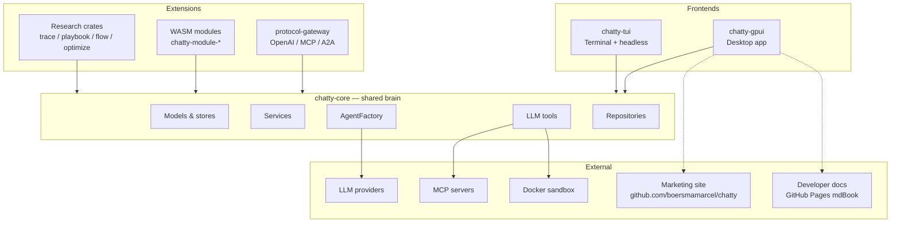
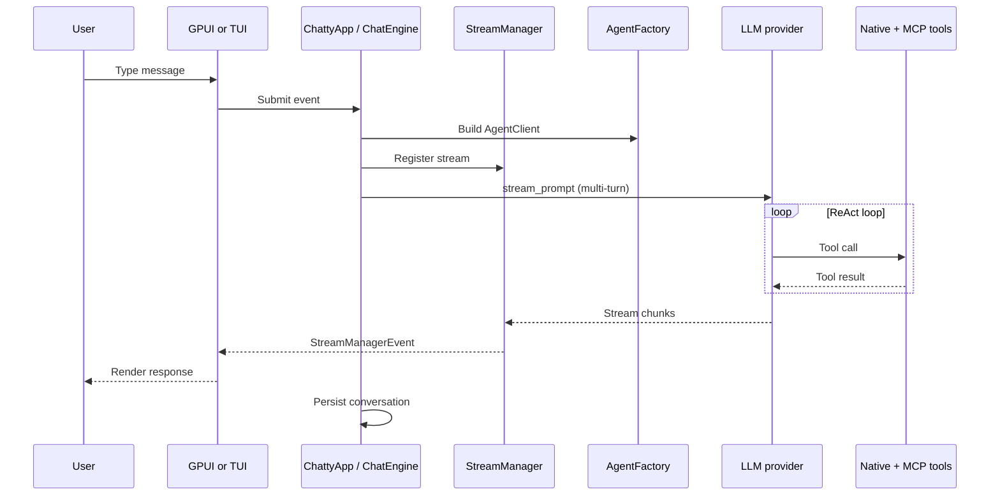

# System overview

**When to read this:** You need a one-page mental model of Chatty before diving into
crate-level or file-level docs.

Chatty is a Rust agent framework with two user-facing frontends (desktop GPUI and
terminal TUI) sharing one UI-agnostic core. Optional WASM modules and an HTTP
gateway extend the same tool and conversation model to external protocols.

## Three layers

## Role of each major crate

| Crate | Role in the system |
|-------|-------------------|
| **chatty-core** | Single source of business logic: conversations, tools, LLM agents, settings persistence, sandbox, MCP, memory |
| **chatty-gpui** | Desktop shell: renders UI, owns `StreamManager`, routes entity events through `ChattyApp` |
| **chatty-tui** | Terminal shell + headless/pipe mode for scripting; also the worker process behind every delegation and, with `--broker` / `--team`, a leader of its own |
| **chatty-wasm-runtime** | Wasmtime host for agent modules (`wasm32-wasip2`) |
| **chatty-module-registry** | Discovers, validates, and loads WASM module manifests |
| **chatty-protocol-gateway** | HTTP façade so external clients can call modules via standard APIs, and the ADR-0011 broker: local participants and named virtual agents (`local-agent`, a declared team) served at the same `/a2a/{name}` routes |
| **chatty-module-sdk** | Authoring SDK for third-party WASM agents |
| **chatty-trace / playbook / flow / optimize** | Research crates (self-improvement papers); see [`RESERVED.md`](https://github.com/boersmamarcel/chatty2/blob/main/RESERVED.md) |
| **hive-client / hive-billing-sdk** | Hive registry and billing integration |

Dependency rule: **frontends → core**. Core never depends on GPUI or Ratatui.
See [workspace-crate-split.md](workspace-crate-split.md) for the feature flag that
lets core types act as GPUI globals.

## Startup sequence (desktop)

`chatty-gpui/src/main.rs` runs, in order:

1. Create the Tokio runtime and enter it for the whole process lifetime.
2. Initialise the settings repositories (`RepositoryRegistry`) and resolve — but do
   not open — the SQLite conversation database path (`ConversationSqliteRepository::deferred`).
3. Start the GPUI `Application`; inside `run`, do only what the first frame needs:
   `gpui_component::init`, the theme registry (baked-in default applied now, theme
   pack loaded later), and every global the root view reads, registered with defaults
   (`GeneralSettingsModel`, `ProviderModel`, `ModelsModel`, `McpServersModel`,
   `ExecutionSettingsModel`, `TokenTrackingSettings`, `GlobalStreamManager`,
   approval stores, …). No I/O happens here.
4. Open the window and create the `ChattyApp` entity; `open_window` paints the first
   frame synchronously.
5. Only then spawn the async tasks that load settings JSON, conversation metadata
   (the first query opens the SQLite pool), token-tracking settings, the memory
   service, the skills listing and enabled MCP servers from disk, overwriting the
   defaults as they arrive. The updater poll and the MCP update channel start here too.

Since AGE-161 the rule is: anything that reads a file, touches the network or spawns a
task belongs *after* `open_window`. Nothing on the UI thread waits for disk or network;
each loader updates its global and refreshes the windows when done.
`boot_timing::checkpoint` marks each stage (`main_to_run`, `run_to_open_window`, …) and
`log_summary` prints the timeline at info level once the conversation list has loaded and the app is ready to send.

## End-to-end message path

## Key design decisions

1. **Central controller.** `ChattyApp` (`chatty-gpui/src/chatty/controllers/app_controller/`)
   owns the top-level view entities, subscribes to their events and coordinates
   services, stores and views. It is deliberately a "fat controller" so the event
   flow stays traceable in one place; the module is split by concern
   (`message_ops`, `conversation_ops`, `slash_commands`, `export_ops`).
2. **Event-driven communication.** Entities talk only through `EventEmitter` /
   `cx.subscribe()`; there are no `Arc<dyn Fn>` callbacks between entities. See
   [entity-communication.md](entity-communication.md).
3. **`StreamManager` owns the stream lifecycle.** The stream loop never touches a
   view; it updates the `Conversation` and forwards chunks to `StreamManager`, which
   emits typed events that handlers route to views. Cancellation is a shared
   `AtomicBool`. See [stream-manager.md](stream-manager.md).
4. **Global state via GPUI.** App-wide state implements `Global` and is reached with
   `cx.global()`; entity references inside globals default to `WeakEntity<T>` so
   globals do not keep entities alive by accident.
5. **Provider abstraction.** `ProviderType::default_capabilities()` seeds a new
   model, `ModelConfig` persists per-model capabilities, and `AgentFactory` builds
   the provider-specific client.
6. **Tools are rig `Tool` implementations** registered by `AgentFactory`; side-effecting
   tools (shell, file writes) go through the approval stores first. The full list
   is the [tools catalog](../docs-site/src/dev/reference/tools-catalog.md).

## Where to go next

| Question | Document |
|----------|----------|
| Crate boundaries and the `gpui-globals` feature | [workspace-crate-split.md](workspace-crate-split.md) |
| Component relationships & diagrams | [component-map.md](component-map.md) |
| **App components ↔ research modules** | [research/app-research-bridge.md](research/app-research-bridge.md) |
| Entity events between GPUI components | [entity-communication.md](entity-communication.md) |
| LLM stream lifecycle | [stream-manager.md](stream-manager.md) |
| Agent memory & skills | [agent-memory.md](agent-memory.md) |
| Context window / token budget | [token-tracking.md](token-tracking.md) |
| Agent quick-start | [AGENTS.md](../AGENTS.md) |
