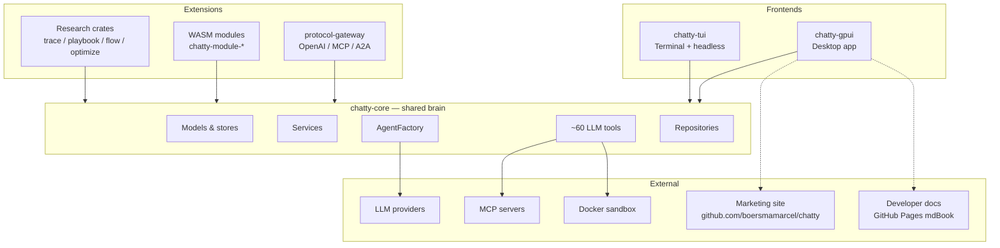
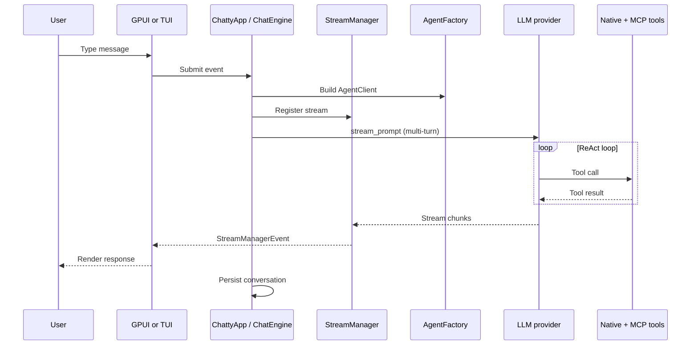

# System overview

**When to read this:** You need a one-page mental model of Chatty before diving into
crate-level or file-level docs.

Chatty is a Rust agent framework with two user-facing frontends (desktop GPUI and
terminal TUI) sharing one UI-agnostic core. Optional WASM modules and an HTTP
gateway extend the same tool and conversation model to external protocols.

## Three layers

## Role of each major crate

| Crate | Role in the system |
|-------|-------------------|
| **chatty-core** | Single source of business logic: conversations, tools, LLM agents, settings persistence, sandbox, MCP, memory |
| **chatty-gpui** | Desktop shell: renders UI, owns `StreamManager`, routes entity events through `ChattyApp` |
| **chatty-tui** | Terminal shell + headless/pipe mode for scripting and sub-agents |
| **chatty-wasm-runtime** | Wasmtime host for agent modules (`wasm32-wasip2`) |
| **chatty-module-registry** | Discovers, validates, and loads WASM module manifests |
| **chatty-protocol-gateway** | HTTP façade so external clients can call modules via standard APIs |
| **chatty-module-sdk** | Authoring SDK for third-party WASM agents |
| **chatty-trace / playbook / flow / optimize** | Research crates (self-improvement papers); see `RESERVED.md` |
| **hive-client / hive-billing-sdk** | Hive registry and billing integration |

Dependency rule: **frontends → core**. Core never depends on GPUI or Ratatui.

## End-to-end message path

## Where to go next

| Question | Document |
|----------|----------|
| Crate/module layout | [architecture-overview.md](architecture-overview.md) |
| Component relationships & diagrams | [component-map.md](component-map.md) |
| Entity events between GPUI components | [entity-communication.md](entity-communication.md) |
| LLM stream lifecycle | [stream-manager.md](stream-manager.md) |
| Agent quick-start | [AGENTS.md](../AGENTS.md) |
